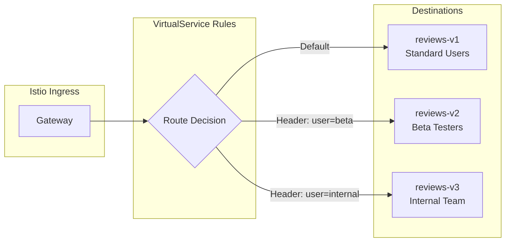

# Request Routing with Istio

## Overview
Route traffic based on HTTP headers, paths, or query parameters. This is the foundation of advanced traffic management in Istio.

## Architecture



## Use Cases
- **A/B Testing**: Route specific users to new features
- **Beta Programs**: Give beta testers early access
- **Header-based routing**: Route by user-agent, cookies, custom headers
- **Path-based routing**: Different versions for different API paths

## Quick Start

```bash
# Deploy
./deploy-all.sh

# Test header-based routing
./test.sh

# Cleanup
./cleanup.sh
```

## Files

| File | Description |
|------|-------------|
| `deployment.yaml` | v1, v2, v3 app deployments |
| `service.yaml` | Kubernetes service |
| `destination-rule.yaml` | Subset definitions |
| `virtual-service.yaml` | Routing rules |
| `gateway.yaml` | Ingress gateway config |

## Testing

```bash
# Default route (v1)
curl -H "Host: reviews.example.com" $GATEWAY_URL/version

# Beta users (v2)
curl -H "Host: reviews.example.com" -H "x-user-type: beta" $GATEWAY_URL/version

# Internal team (v3)
curl -H "Host: reviews.example.com" -H "x-user-type: internal" $GATEWAY_URL/version
```

## Key Concepts

### VirtualService Match Rules
```yaml
http:
  - match:
      - headers:
          x-user-type:
            exact: beta    # Exact header match
    route:
      - destination:
          host: reviews-svc
          subset: v2
```

### Match Priority
1. Rules are evaluated **top to bottom**
2. First match wins
3. Always include a **default route** at the bottom
