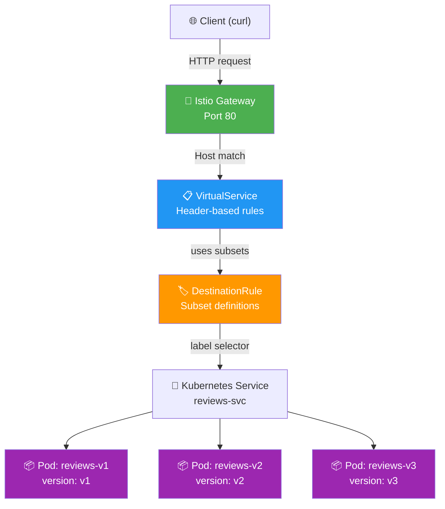
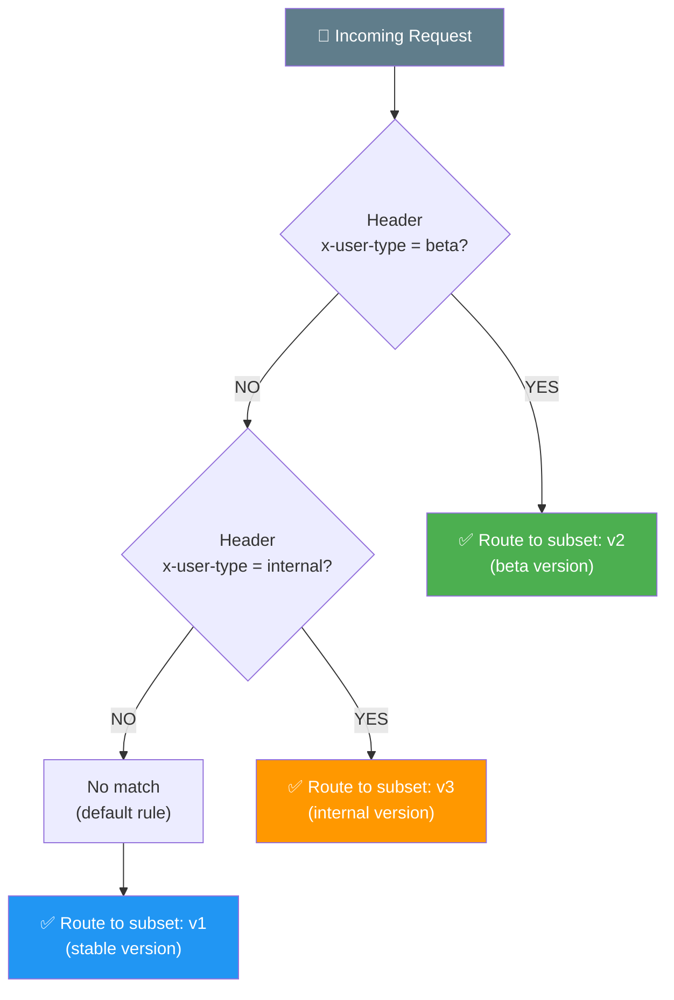
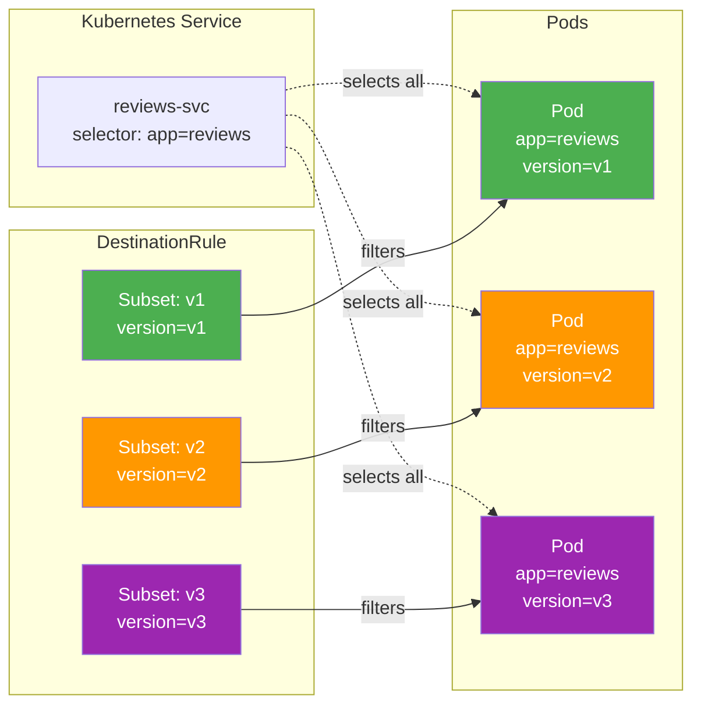
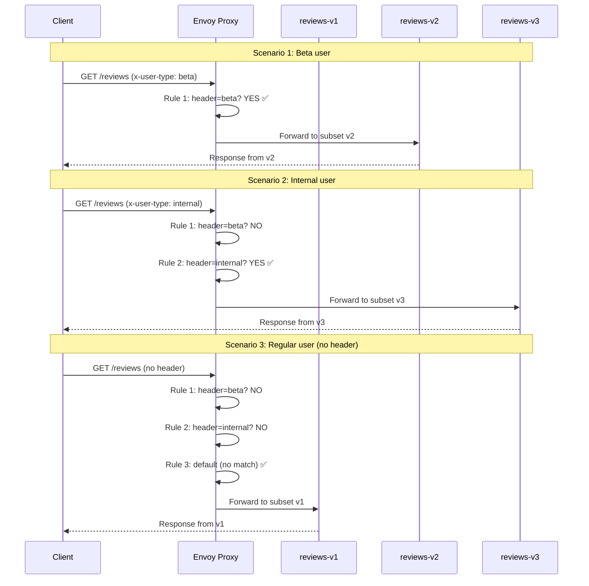
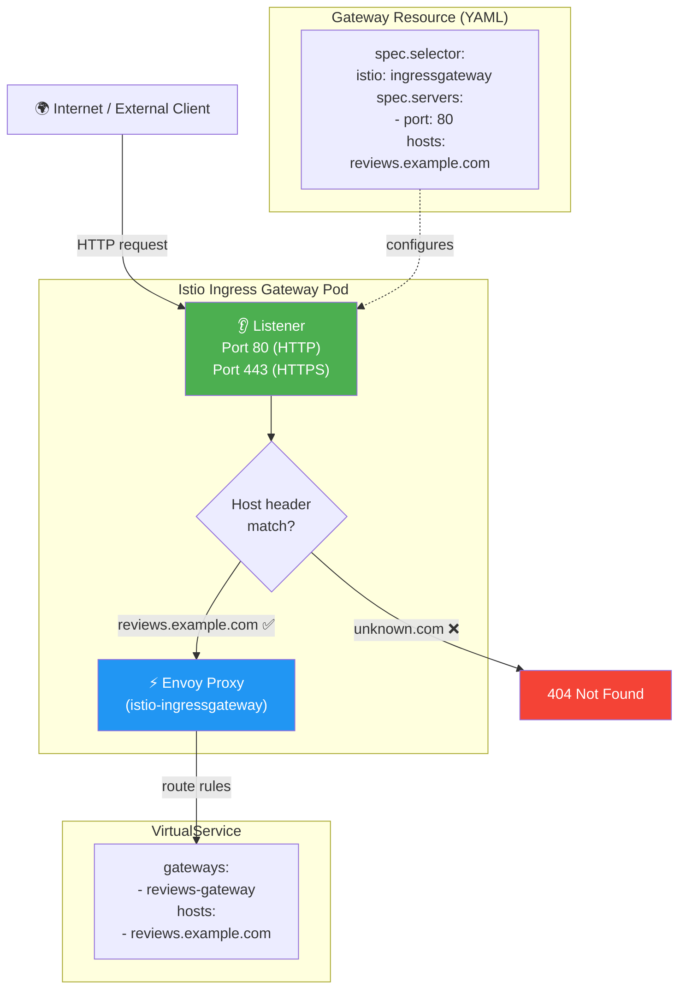
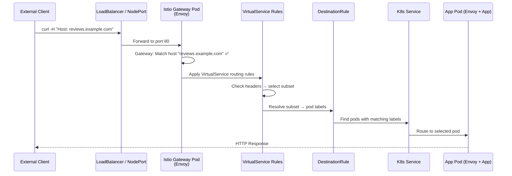
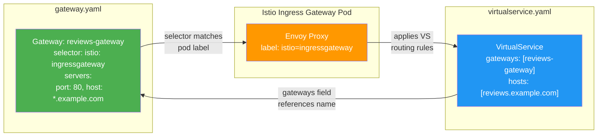

# Request Routing — Diagrams

## Overall Architecture

## Request Flow — Header-Based Routing Decision

## Label Matching — How Subsets Find Pods

## VirtualService Rule Evaluation Order

## Gateway — External Traffic Entry Point

## Full Ingress Traffic Path (End-to-End)

## Gateway YAML ↔ VirtualService Binding

