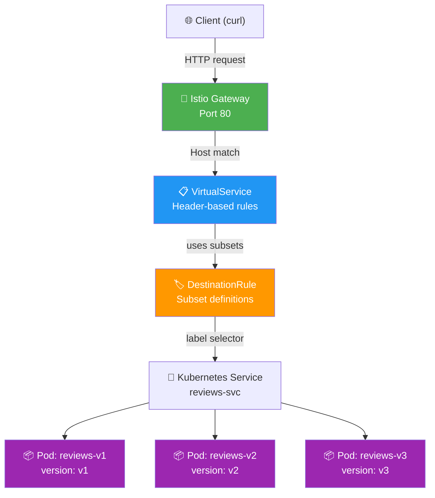
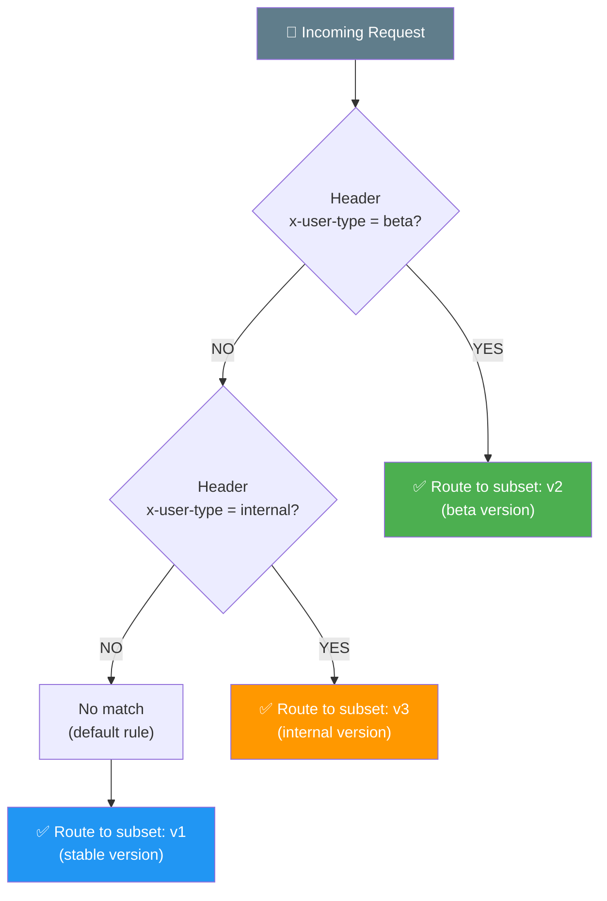
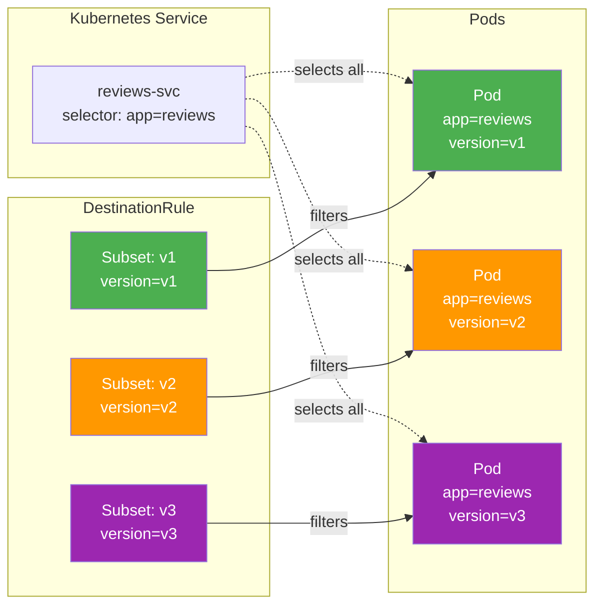
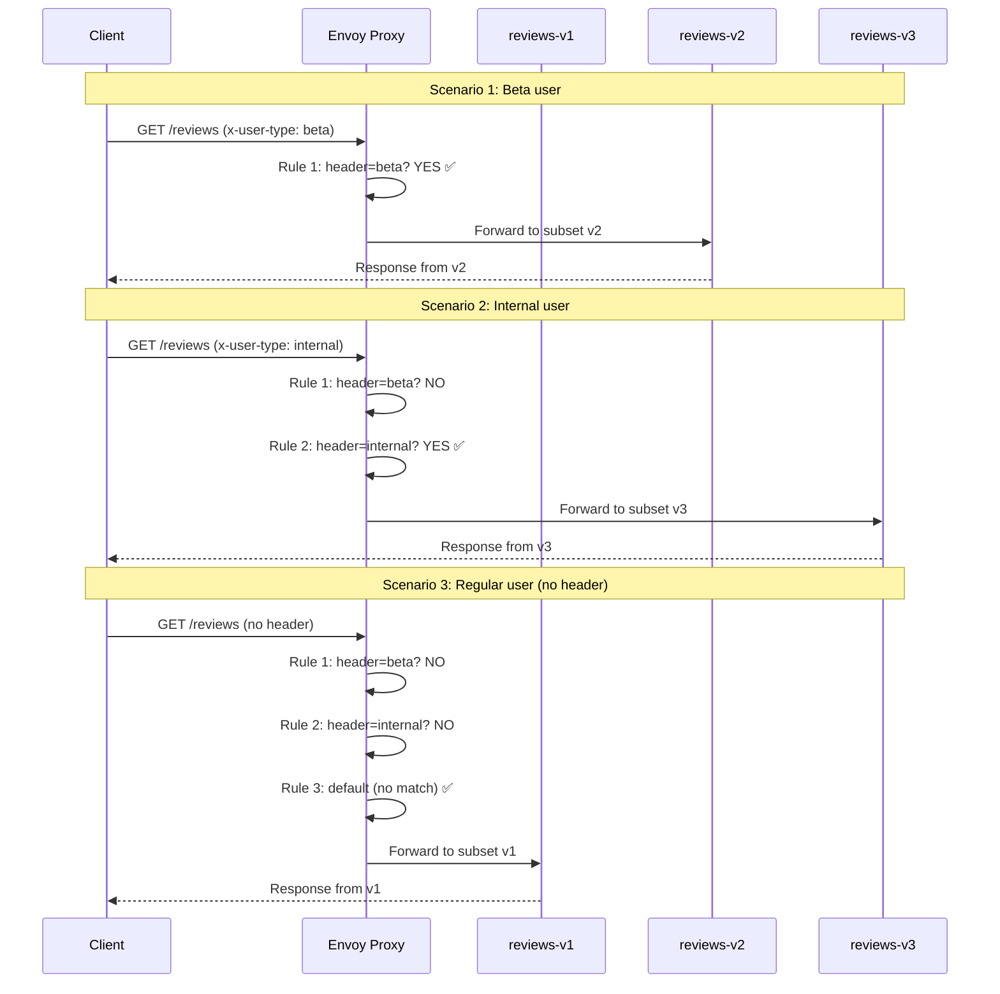

# Request Routing — Diagrams

## Overall Architecture

```mermaid
graph TB
    Client["🌐 Client (curl)"]
    GW["🚪 Istio Gateway<br/>Port 80"]
    VS["📋 VirtualService<br/>Header-based rules"]
    DR["🏷️ DestinationRule<br/>Subset definitions"]
    SVC["🔗 Kubernetes Service<br/>reviews-svc"]
    V1["📦 Pod: reviews-v1<br/>version: v1"]
    V2["📦 Pod: reviews-v2<br/>version: v2"]
    V3["📦 Pod: reviews-v3<br/>version: v3"]

    Client -->|"HTTP request"| GW
    GW -->|"Host match"| VS
    VS -->|"uses subsets"| DR
    DR -->|"label selector"| SVC
    SVC --> V1
    SVC --> V2
    SVC --> V3

    style GW fill:#4CAF50,color:#fff
    style VS fill:#2196F3,color:#fff
    style DR fill:#FF9800,color:#fff
    style V1 fill:#9C27B0,color:#fff
    style V2 fill:#9C27B0,color:#fff
    style V3 fill:#9C27B0,color:#fff
```

## Request Flow — Header-Based Routing Decision

```mermaid
flowchart TD
    REQ["📨 Incoming Request"]
    H1{"Header<br/>x-user-type = beta?"}
    H2{"Header<br/>x-user-type = internal?"}
    DEFAULT["No match<br/>(default rule)"]
    R1["✅ Route to subset: v2<br/>(beta version)"]
    R2["✅ Route to subset: v3<br/>(internal version)"]
    R3["✅ Route to subset: v1<br/>(stable version)"]

    REQ --> H1
    H1 -->|"YES"| R1
    H1 -->|"NO"| H2
    H2 -->|"YES"| R2
    H2 -->|"NO"| DEFAULT
    DEFAULT --> R3

    style REQ fill:#607D8B,color:#fff
    style R1 fill:#4CAF50,color:#fff
    style R2 fill:#FF9800,color:#fff
    style R3 fill:#2196F3,color:#fff
```

## Label Matching — How Subsets Find Pods

```mermaid
graph LR
    subgraph DestinationRule
        S1["Subset: v1<br/>version=v1"]
        S2["Subset: v2<br/>version=v2"]
        S3["Subset: v3<br/>version=v3"]
    end

    subgraph Kubernetes Service
        SVC["reviews-svc<br/>selector: app=reviews"]
    end

    subgraph Pods
        P1["Pod<br/>app=reviews<br/>version=v1"]
        P2["Pod<br/>app=reviews<br/>version=v2"]
        P3["Pod<br/>app=reviews<br/>version=v3"]
    end

    SVC -.->|"selects all"| P1
    SVC -.->|"selects all"| P2
    SVC -.->|"selects all"| P3
    S1 -->|"filters"| P1
    S2 -->|"filters"| P2
    S3 -->|"filters"| P3

    style S1 fill:#4CAF50,color:#fff
    style S2 fill:#FF9800,color:#fff
    style S3 fill:#9C27B0,color:#fff
    style P1 fill:#4CAF50,color:#fff
    style P2 fill:#FF9800,color:#fff
    style P3 fill:#9C27B0,color:#fff
```

## VirtualService Rule Evaluation Order

```mermaid
sequenceDiagram
    participant C as Client
    participant E as Envoy Proxy
    participant V1 as reviews-v1
    participant V2 as reviews-v2
    participant V3 as reviews-v3

    Note over C,V3: Scenario 1: Beta user
    C->>E: GET /reviews (x-user-type: beta)
    E->>E: Rule 1: header=beta? YES ✅
    E->>V2: Forward to subset v2
    V2-->>C: Response from v2

    Note over C,V3: Scenario 2: Internal user
    C->>E: GET /reviews (x-user-type: internal)
    E->>E: Rule 1: header=beta? NO
    E->>E: Rule 2: header=internal? YES ✅
    E->>V3: Forward to subset v3
    V3-->>C: Response from v3

    Note over C,V3: Scenario 3: Regular user (no header)
    C->>E: GET /reviews (no header)
    E->>E: Rule 1: header=beta? NO
    E->>E: Rule 2: header=internal? NO
    E->>E: Rule 3: default (no match) ✅
    E->>V1: Forward to subset v1
    V1-->>C: Response from v1
```
