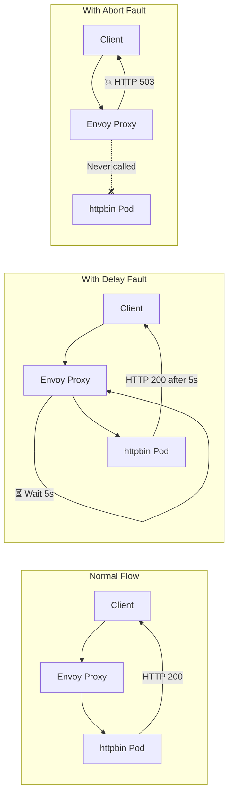

# Fault Injection with Istio

## Overview
Inject faults (delays, HTTP errors) to test service resilience **without modifying application code**. This is **chaos engineering** for microservices — Istio's Envoy sidecar proxies inject the faults at the network level.

## How Fault Injection Works

```
                    ┌─────────────────────────────────────────┐
  Client Request    │         Envoy Sidecar Proxy             │
  ───────────────▶  │                                         │
                    │  1. Receive incoming request             │
                    │  2. Check VirtualService fault rules     │
                    │  3. Roll dice against percentage         │
                    │                                         │
                    │  ┌─ Abort? ──▶ Return HTTP error        │
                    │  │             (request never reaches    │
                    │  │              the backend pod)         │
                    │  │                                       │
                    │  └─ Delay? ──▶ Hold request for N sec   │
                    │                then forward to pod      │
                    │                                         │
                    │  No fault? ──▶ Forward immediately      │
                    └─────────────────────────────────────────┘
```

> **Key Insight**: The application (httpbin) is completely healthy. All faults are injected by the Envoy proxy sitting in front of the application container. This means you can test failure scenarios without deploying broken code.

## Architecture



## Types of Fault Injection

| Type | What Happens | Simulates | Use Case |
|------|-------------|-----------|----------|
| **Delay** | Request is held for N seconds, then forwarded | Slow database, overloaded API | Test timeout handling, loading states |
| **Abort** | HTTP error returned immediately, backend never called | Service outage, connection refused | Test error handling, fallbacks |
| **Combined** | Both delay AND abort applied independently | Degraded service (slow + failing) | Test realistic failure scenarios |

## Quick Start

```bash
# 1. Deploy everything (namespace, httpbin, gateway, default delay fault)
./deploy-all.sh

# 2. Run tests to observe fault injection in action
./test.sh

# 3. Switch between fault types
kubectl apply -f fault-delay.yaml      # Delay only
kubectl apply -f fault-abort.yaml      # Abort only
kubectl apply -f fault-combined.yaml   # Both delay + abort

# 4. Clean up when done
./cleanup.sh
```

## Files

| File | Description |
|------|-------------|
| `namespace.yaml` | Creates `fault-demo` namespace with Istio sidecar injection enabled |
| `deployment.yaml` | Deploys httpbin app (Deployment + Service) |
| `gateway.yaml` | Gateway API Gateway + HTTPRoute for external access |
| `fault-delay.yaml` | Injects 5s delay on 50% of requests |
| `fault-abort.yaml` | Returns HTTP 503 on 50% of requests |
| `fault-combined.yaml` | 30% delayed (3s) + 20% aborted (503) |
| `deploy-all.sh` | One-click deployment script |
| `test.sh` | Sends test requests and measures results |
| `cleanup.sh` | Removes all demo resources |

## Testing

```bash
# Get Gateway API URL
GATEWAY_IP=$(kubectl get gateway httpbin-gateway -n fault-demo \
  -o jsonpath='{.status.addresses[0].value}')
GATEWAY_URL="http://$GATEWAY_IP"

# Test delay (some requests should take ~5s)
for i in $(seq 1 10); do
  time curl -s -o /dev/null -H "Host: httpbin.example.com" $GATEWAY_URL/get
done

# Test abort (some requests should return HTTP 503)
for i in $(seq 1 10); do
  curl -s -o /dev/null -w "HTTP %{http_code}\n" \
    -H "Host: httpbin.example.com" $GATEWAY_URL/get
done
```

## Key Concepts

### Delay Injection
Adds artificial latency before forwarding the request to the backend:
```yaml
fault:
  delay:
    percentage:
      value: 50        # 50% of requests get delayed
    fixedDelay: 5s     # Hold for exactly 5 seconds
```

### Abort Injection
Returns an HTTP error immediately without contacting the backend:
```yaml
fault:
  abort:
    percentage:
      value: 50        # 50% of requests get aborted
    httpStatus: 503    # Return "503 Service Unavailable"
```

### Combined Faults (Percentage Math)
When both are configured, abort is evaluated **first**:
```yaml
fault:
  delay:
    percentage:
      value: 30      # 30% of surviving requests get delayed
    fixedDelay: 3s
  abort:
    percentage:
      value: 20      # 20% of ALL requests aborted first
    httpStatus: 503
```
**Result for 100 requests**: ~20 aborted, ~24 delayed (80% × 30%), ~56 normal

### Conditional Faults (Header-Based)
Only inject faults when a specific header is present — useful for targeted testing in production:
```yaml
match:
  - headers:
      x-test-fault:
        exact: "true"  # Only inject when this header is sent
fault:
  delay:
    fixedDelay: 5s
```

## Real-World Use Cases

1. **Test Timeouts**: Verify your app handles slow dependencies gracefully
2. **Test Retries**: Ensure retry logic works correctly with transient failures
3. **Test Circuit Breakers**: Trigger circuit breaker patterns with repeated failures
4. **Resilience Testing**: Validate graceful degradation under mixed failure conditions
5. **SLA Validation**: Verify your service meets SLAs even when dependencies are degraded
6. **Pre-Production Chaos**: Run fault injection in staging before deploying to production
