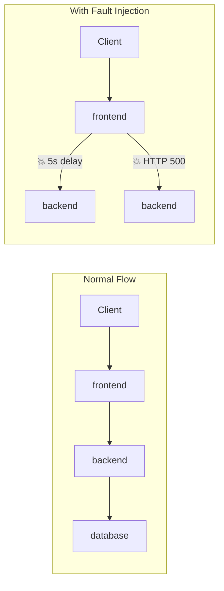

# Fault Injection with Istio

## Overview
Inject faults (delays, HTTP errors) to test service resilience. This is **chaos engineering** for microservices.

## Architecture



## Types of Fault Injection

| Type | Description | Use Case |
|------|-------------|----------|
| **Delay** | Add latency to requests | Test timeout handling |
| **Abort** | Return HTTP error codes | Test error handling |

## Quick Start

```bash
./deploy-all.sh
./test.sh
./cleanup.sh
```

## Files

| File | Description |
|------|-------------|
| `fault-delay.yaml` | Inject 5s delay on 50% of requests |
| `fault-abort.yaml` | Return HTTP 503 on 50% of requests |
| `fault-combined.yaml` | Both delay and abort |

## Testing

```bash
# Test delay (should take ~5s for some requests)
time curl -H "Host: httpbin.example.com" $GATEWAY_URL/delay

# Test abort (should get HTTP 503 sometimes)
curl -v -H "Host: httpbin.example.com" $GATEWAY_URL/abort
```

## Key Concepts

### Delay Injection
```yaml
fault:
  delay:
    percentage:
      value: 50        # 50% of requests
    fixedDelay: 5s     # 5 second delay
```

### Abort Injection
```yaml
fault:
  abort:
    percentage:
      value: 50        # 50% of requests
    httpStatus: 503    # Return 503 Service Unavailable
```

### Conditional Faults
```yaml
match:
  - headers:
      x-test-fault:
        exact: "true"  # Only inject when header present
fault:
  delay:
    fixedDelay: 5s
```

## Real-World Use Cases

1. **Test Timeouts**: Verify your app handles slow dependencies
2. **Test Retries**: Ensure retry logic works with failures
3. **Test Circuit Breakers**: Trigger circuit breaker patterns
4. **Resilience Testing**: Validate graceful degradation
