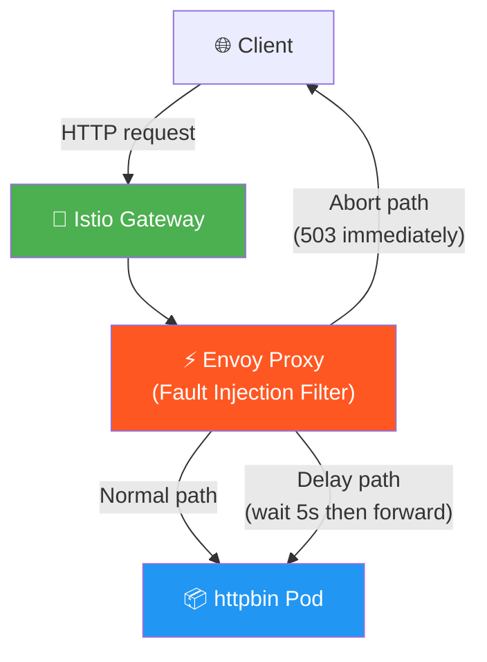
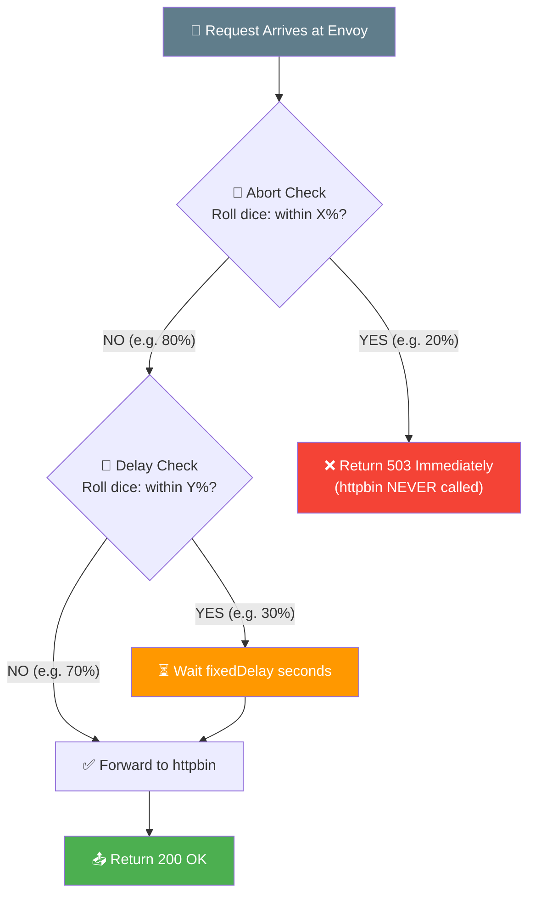
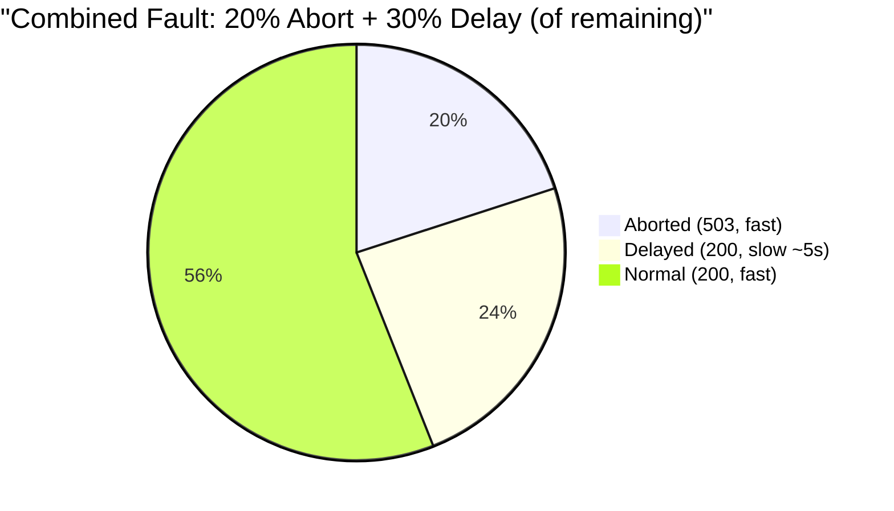
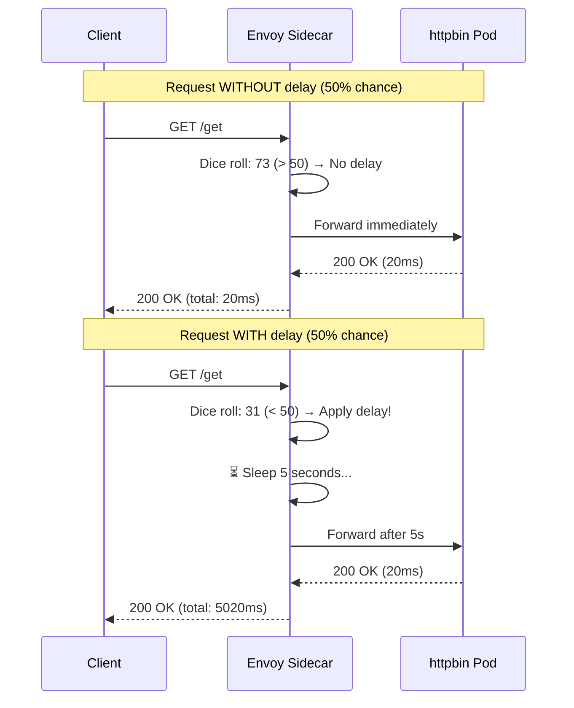
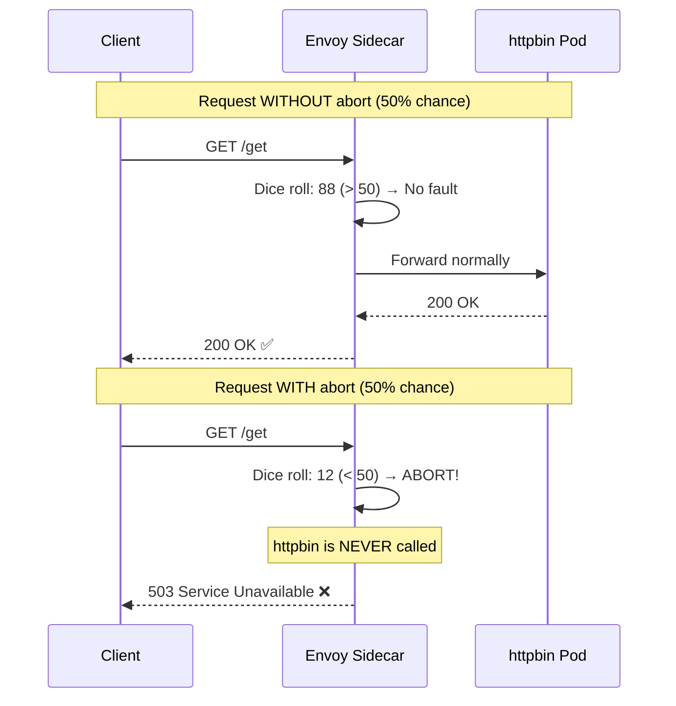
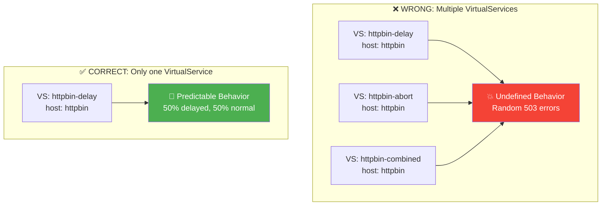
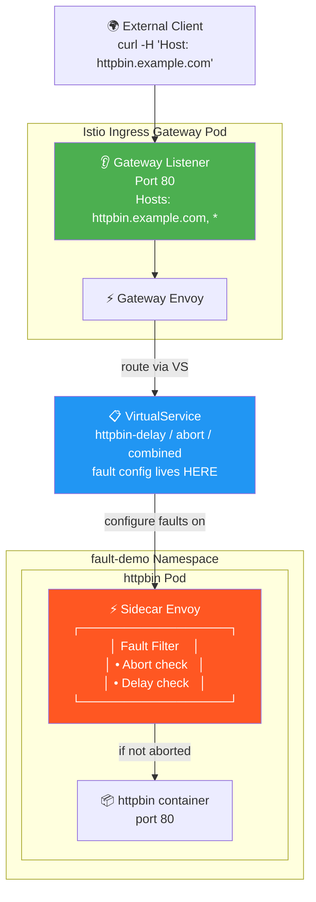
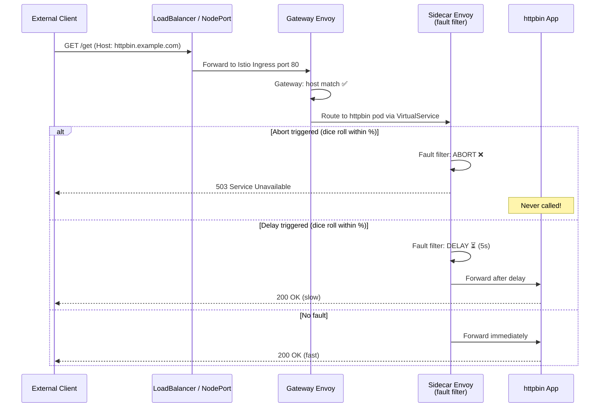

# Fault Injection — Diagrams

## Overall Architecture

## Fault Decision Flow

## Combined Fault — Traffic Distribution

## Delay Injection — Sequence

## Abort Injection — Sequence

## Multiple VirtualService Conflict

## Gateway — How External Traffic Reaches the Fault Filter

## Full Fault Injection Path — End-to-End

