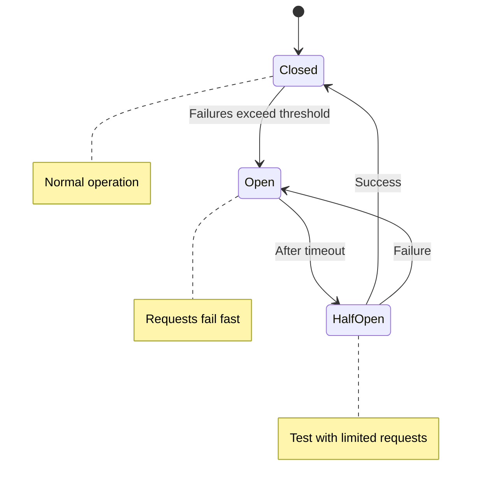

# Circuit Breaker with Istio

## Overview
Prevent cascading failures by stopping requests to failing services. The circuit "opens" when errors exceed threshold.

## Architecture



## Quick Start

```bash
./deploy-all.sh
./test.sh
./cleanup.sh
```

## How It Works

| State | Behavior |
|-------|----------|
| **Closed** | Normal operation, requests pass through |
| **Open** | Requests fail immediately (no backend call) |
| **Half-Open** | Limited requests to test if service recovered |

## Configuration

```yaml
trafficPolicy:
  outlierDetection:
    consecutive5xxErrors: 3    # Open after 3 errors
    interval: 30s              # Analysis window
    baseEjectionTime: 30s      # Time in Open state
    maxEjectionPercent: 100    # Max % of hosts to eject
```

## Key Concepts

### Outlier Detection (Circuit Breaking)
Istio uses **outlier detection** to implement circuit breaking:

- **consecutive5xxErrors**: Number of 5xx errors before ejection
- **interval**: How often to analyze hosts
- **baseEjectionTime**: Minimum ejection duration
- **maxEjectionPercent**: Max percentage of hosts to eject

### Connection Pool Settings
Control connection limits:

```yaml
trafficPolicy:
  connectionPool:
    tcp:
      maxConnections: 100
    http:
      http1MaxPendingRequests: 100
      http2MaxRequests: 1000
      maxRequestsPerConnection: 10
```

## Real-World Use Cases

1. **Prevent Cascading Failures**: Stop calling failing services
2. **Protect Resources**: Limit connections to slow services
3. **Fast Failure**: Return errors immediately instead of waiting
4. **Automatic Recovery**: Re-enable traffic when service recovers
