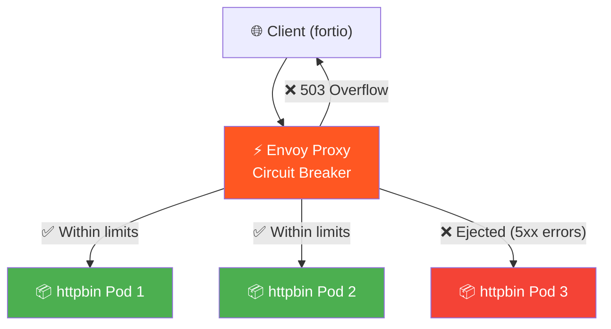
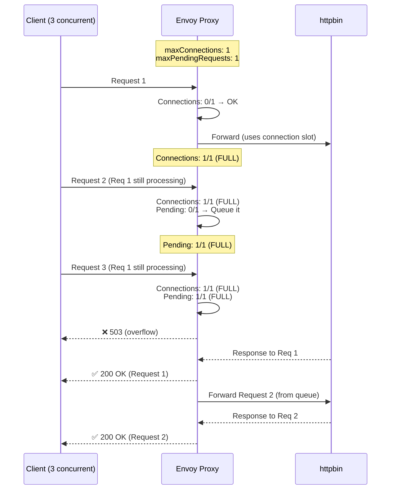
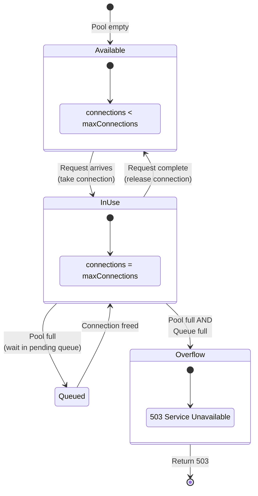
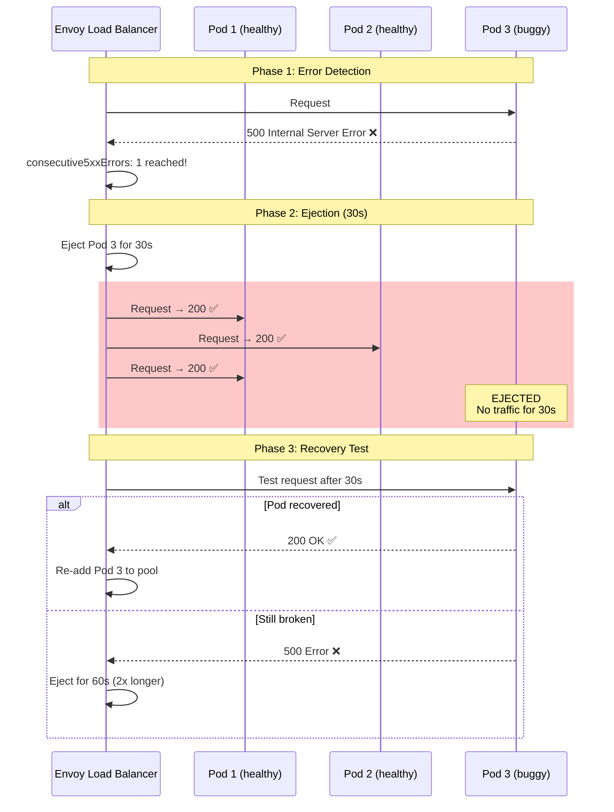
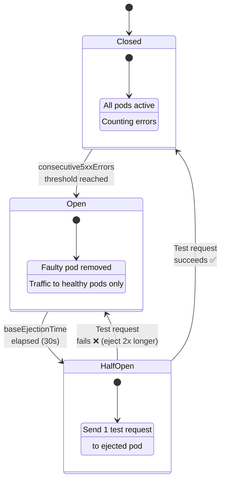
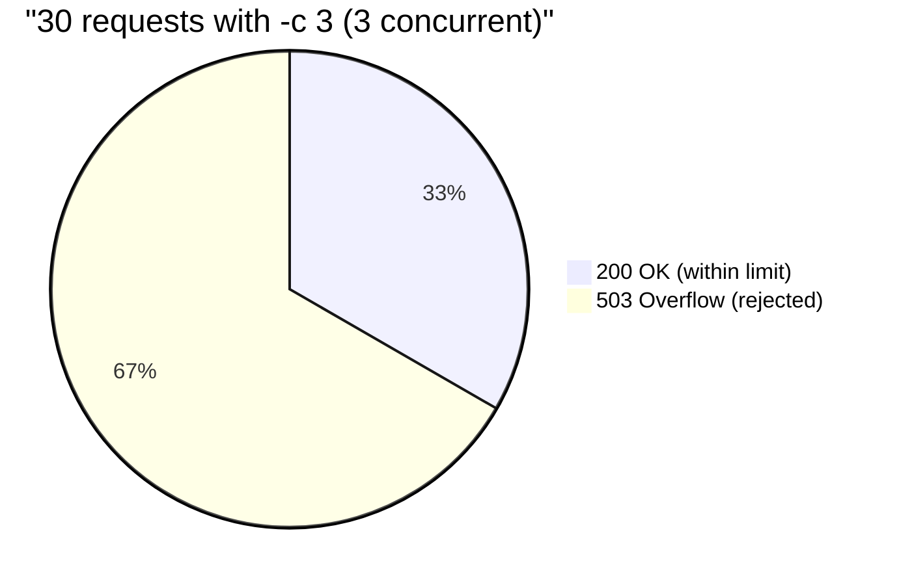
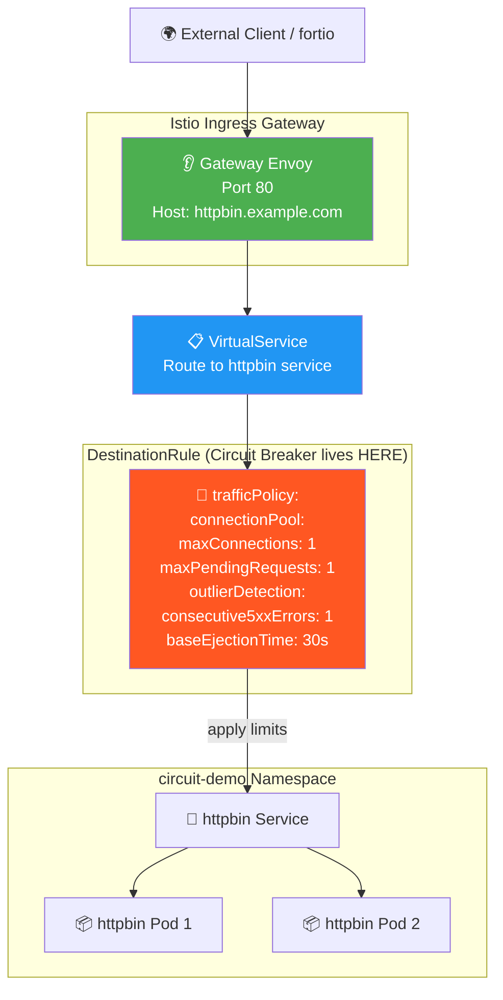
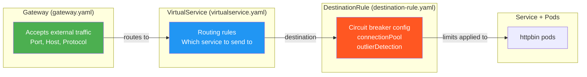

# Circuit Breaker — Diagrams

## Overall Architecture

## Connection Pool Overflow

## Connection Pool State Machine

## Outlier Detection — Pod Ejection

## Circuit Breaker State Diagram

## Traffic Distribution During Overflow Test

## Gateway + Full Resource Chain

## Where Each Config Lives

