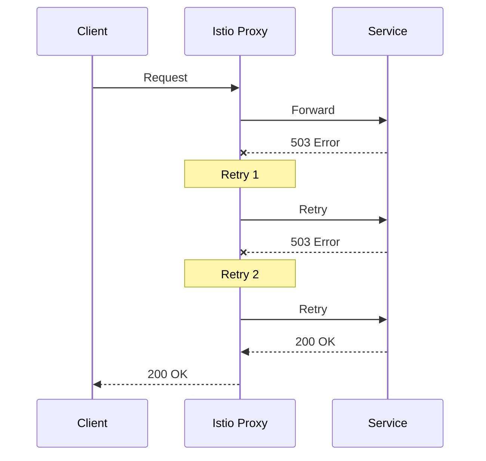

# Retries and Timeouts with Istio

## Overview
Configure automatic retries for transient failures and timeouts to fail fast when services are slow.

## Architecture



## Quick Start

```bash
./deploy-all.sh
./test.sh
./cleanup.sh
```

## Configuration

### Retries
```yaml
http:
  - route:
      - destination:
          host: my-service
    retries:
      attempts: 3              # Number of retries
      perTryTimeout: 2s        # Timeout per attempt
      retryOn: 5xx,reset,connect-failure
```

### Timeouts
```yaml
http:
  - route:
      - destination:
          host: my-service
    timeout: 10s               # Total request timeout
```

## Retry Conditions

| Condition | Description |
|-----------|-------------|
| `5xx` | All 5xx response codes |
| `gateway-error` | 502, 503, 504 |
| `reset` | Connection reset |
| `connect-failure` | Connection failure |
| `retriable-4xx` | 409 Conflict |
| `refused-stream` | REFUSED_STREAM error |

## Key Concepts

### Timeout Types
- **Request timeout**: Total time for the entire request
- **Per-try timeout**: Timeout for each retry attempt

### Backoff Strategy
Istio uses exponential backoff between retries (25ms base).

## Files

| File | Description |
|------|-------------|
| `virtual-service.yaml` | Retry and timeout configuration |
| `flaky-service.yaml` | Simulated unstable service |
