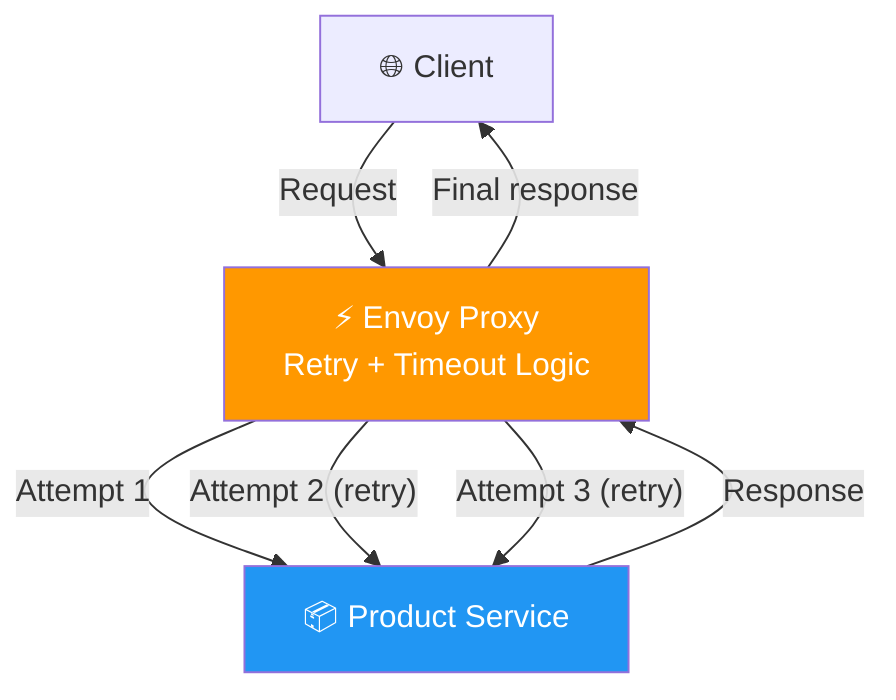
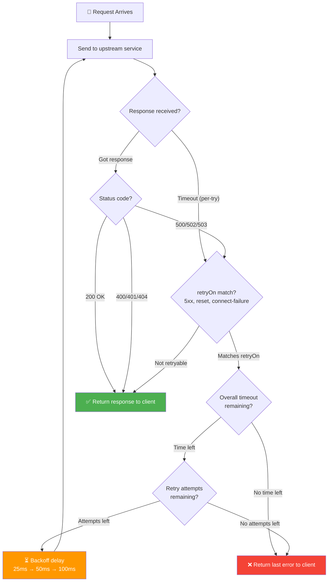
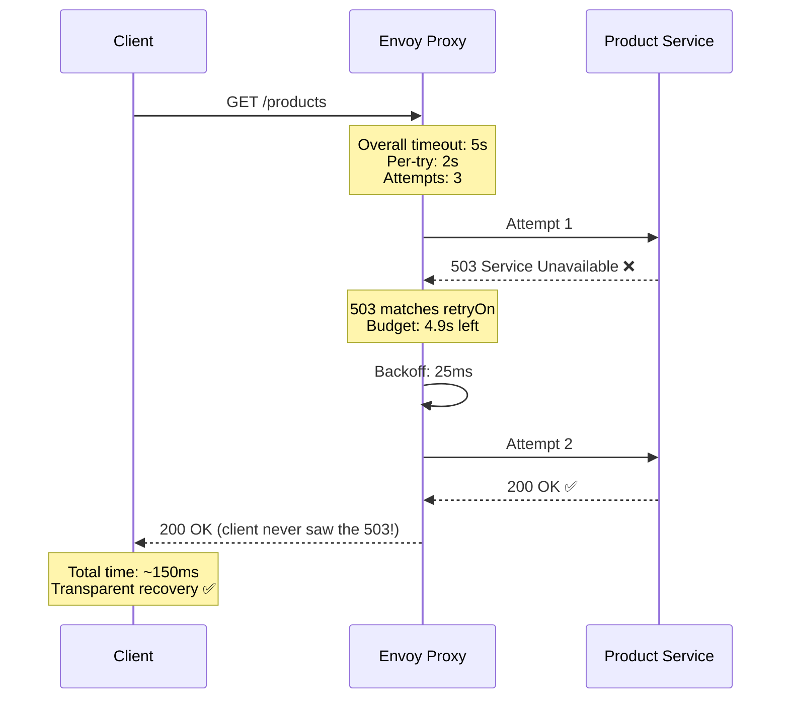
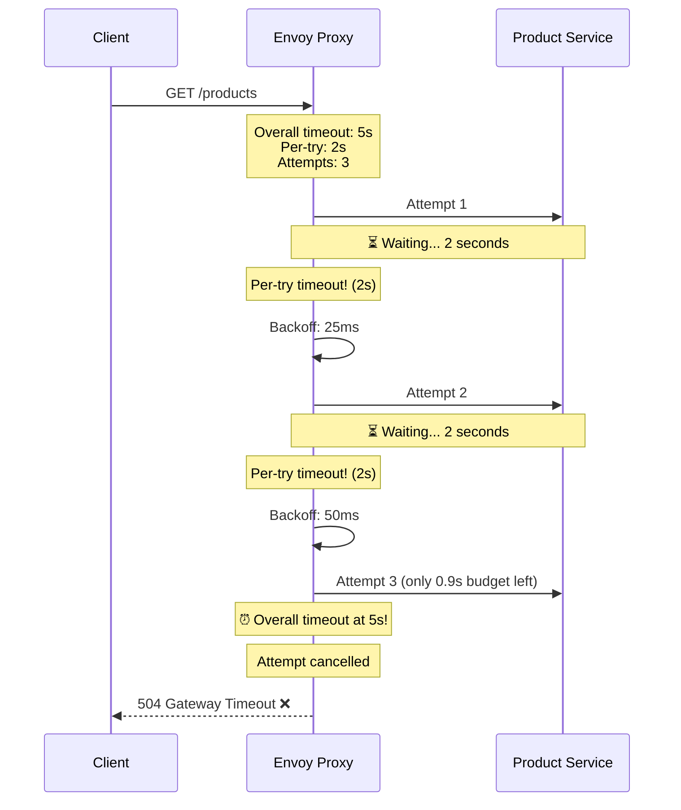
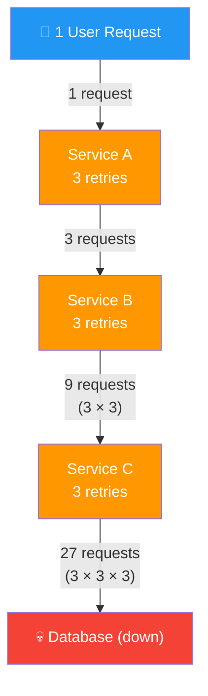
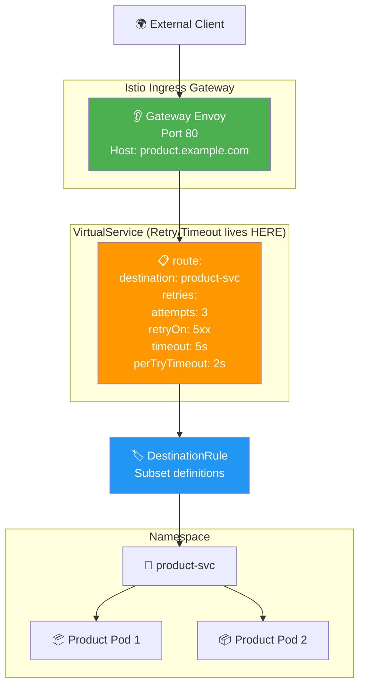
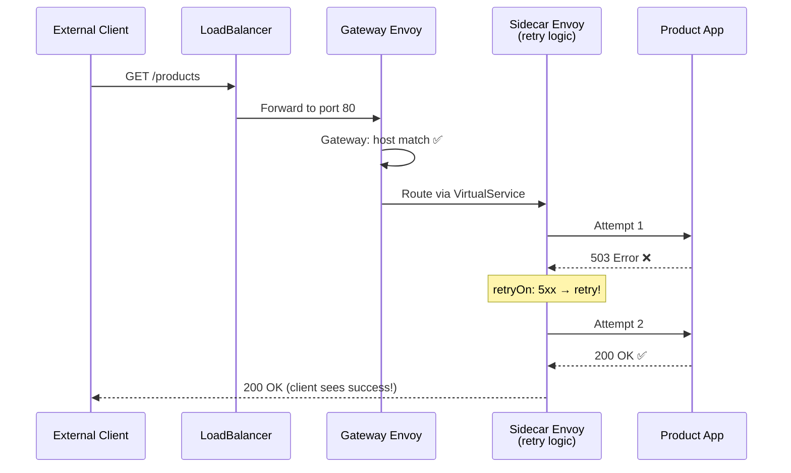

# Retries & Timeouts — Diagrams

## Overall Architecture

## Timeout Budget Diagram

```mermaid
gantt
    title Timeout Budget: 5s overall, 2s per-try, 3 attempts
    dateFormat X
    axisFormat %s

    section Attempt 1
    Try 1 (timeout at 2s)    :crit, t1, 0, 2

    section Attempt 2
    Try 2 (timeout at 2s)    :crit, t2, 2, 4

    section Attempt 3
    Try 3 (budget runs out at 5s) :crit, t3, 4, 5

    section Overall
    Overall Timeout (5s)      :active, ot, 0, 5
```

## Retry Decision Flow

## Scenario: Retry Succeeds on 2nd Attempt

## Scenario: All Retries Fail

## Retry Amplification Danger

## Exponential Backoff Between Retries

```mermaid
gantt
    title Exponential Backoff Timing
    dateFormat X
    axisFormat %sms

    section Retries
    Attempt 1          :a1, 0, 100
    Backoff 25ms       :crit, b1, 100, 125
    Attempt 2          :a2, 125, 225
    Backoff 50ms       :crit, b2, 225, 275
    Attempt 3          :a3, 275, 375
    Backoff 100ms      :crit, b3, 375, 475
    Attempt 4 (final)  :a4, 475, 575
```

## Gateway + Full Resource Chain

## End-to-End Request with Retries

