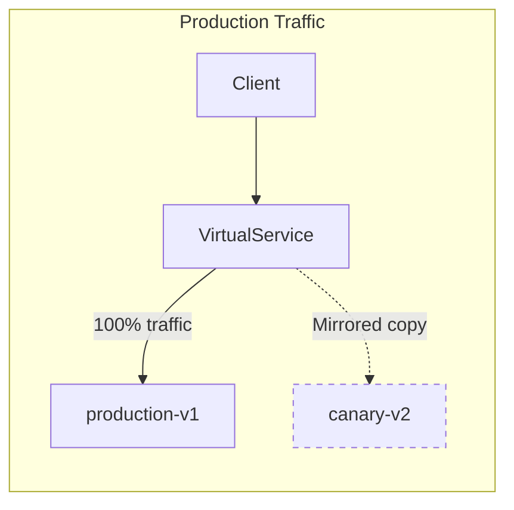

# Traffic Mirroring (Shadow Traffic)

## Overview
Mirror production traffic to a test/canary service without affecting production. Also called "shadow traffic" or "dark launch".

## Architecture



## Use Cases

- **Test new versions** with real traffic
- **Performance testing** in production
- **Validate changes** before switching traffic
- **Debug issues** in shadow environment

## Quick Start

```bash
./deploy-all.sh
./test.sh
./cleanup.sh
```

## Configuration

```yaml
http:
  - route:
      - destination:
          host: myapp
          subset: v1
        weight: 100
    mirror:
      host: myapp
      subset: v2
    mirrorPercentage:
      value: 100.0    # Mirror 100% of traffic
```

## Key Points

| Feature | Description |
|---------|-------------|
| **Fire-and-forget** | Mirrored requests don't wait for response |
| **No impact** | Mirror failures don't affect production |
| **Headers added** | `-shadow` suffix added to Host header |
| **Percentage control** | Can mirror partial traffic |

## Files

| File | Description |
|------|-------------|
| `virtual-service.yaml` | Mirroring configuration |
| `deployment.yaml` | v1 (prod) and v2 (canary) |
