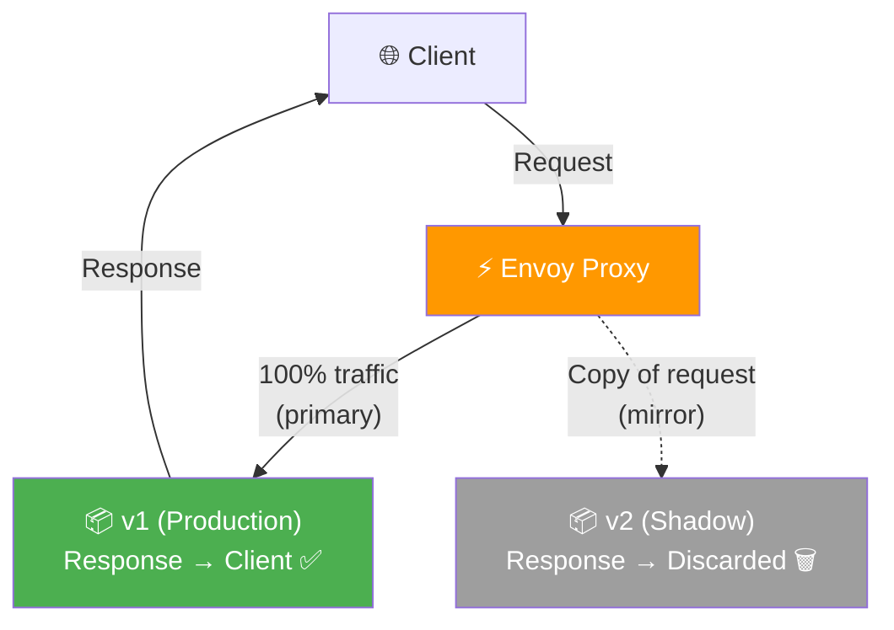
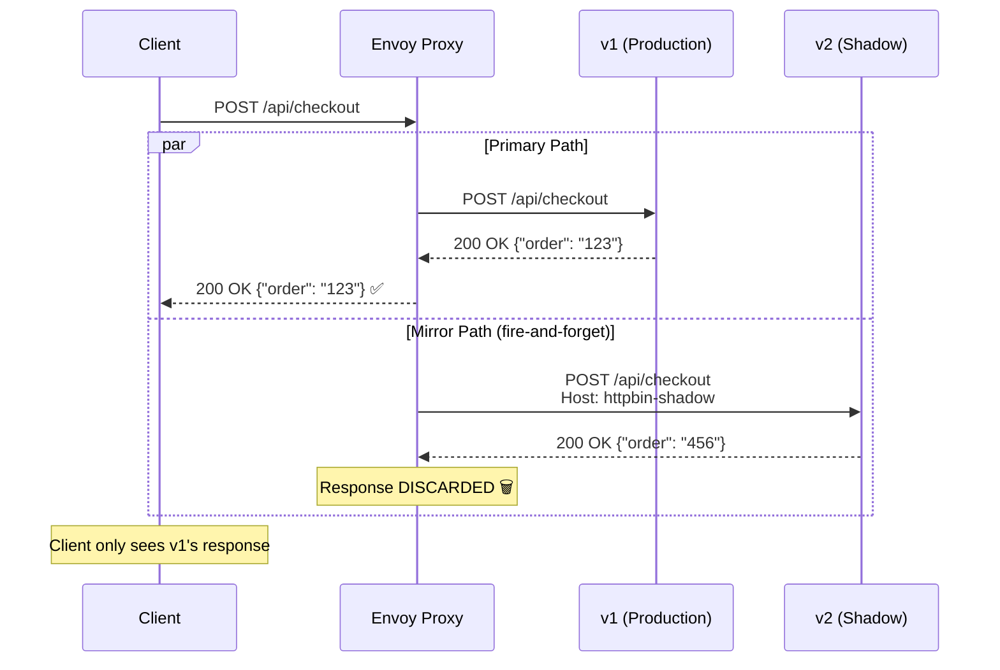
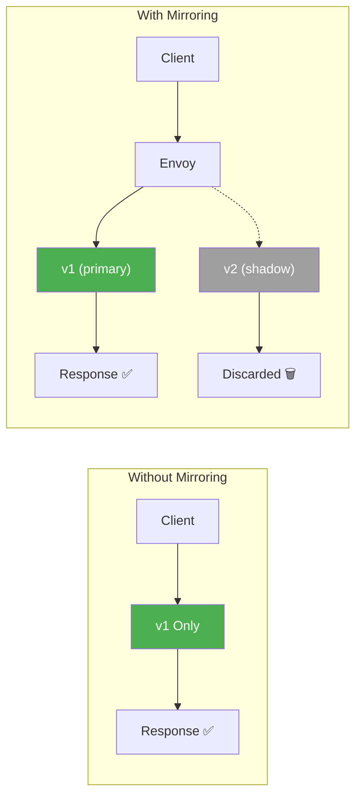
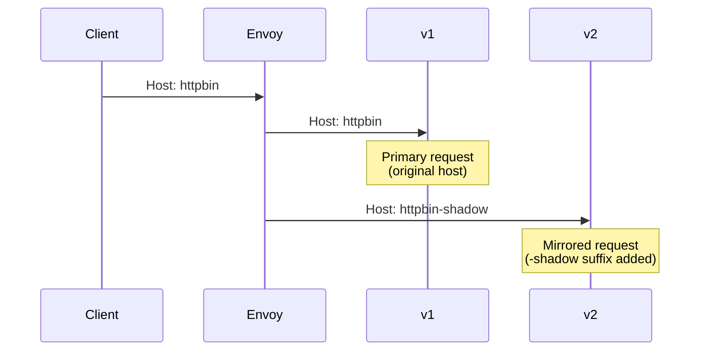
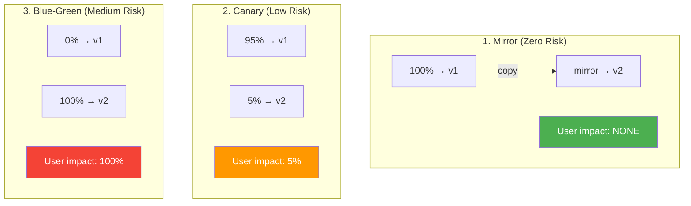

# Traffic Mirroring — Diagrams

## Overall Architecture

```mermaid
graph TB
    Client["🌐 Client"]
    EP["⚡ Envoy Proxy"]
    V1["📦 v1 (Production)<br/>Response → Client ✅"]
    V2["📦 v2 (Shadow)<br/>Response → Discarded 🗑️"]

    Client -->|"Request"| EP
    EP -->|"100% traffic<br/>(primary)"| V1
    EP -.->|"Copy of request<br/>(mirror)"| V2
    V1 -->|"Response"| Client

    style V1 fill:#4CAF50,color:#fff
    style V2 fill:#9E9E9E,color:#fff
    style EP fill:#FF9800,color:#fff
```

## Request Flow — Sequence

```mermaid
sequenceDiagram
    participant C as Client
    participant E as Envoy Proxy
    participant V1 as v1 (Production)
    participant V2 as v2 (Shadow)

    C->>E: POST /api/checkout
    
    par Primary Path
        E->>V1: POST /api/checkout
        V1-->>E: 200 OK {"order": "123"}
        E-->>C: 200 OK {"order": "123"} ✅
    and Mirror Path (fire-and-forget)
        E->>V2: POST /api/checkout<br/>Host: httpbin-shadow
        V2-->>E: 200 OK {"order": "456"}
        Note over E: Response DISCARDED 🗑️
    end

    Note over C: Client only sees v1's response
```

## Mirror vs No Mirror

```mermaid
graph LR
    subgraph "Without Mirroring"
        C1["Client"] --> V1a["v1 Only"]
        V1a --> R1["Response ✅"]
    end

    subgraph "With Mirroring"
        C2["Client"] --> EP2["Envoy"]
        EP2 --> V1b["v1 (primary)"]
        EP2 -.-> V2b["v2 (shadow)"]
        V1b --> R2["Response ✅"]
        V2b --> R3["Discarded 🗑️"]
    end

    style V1a fill:#4CAF50,color:#fff
    style V1b fill:#4CAF50,color:#fff
    style V2b fill:#9E9E9E,color:#fff
```

## Host Header Modification

```mermaid
sequenceDiagram
    participant C as Client
    participant E as Envoy
    participant V1 as v1
    participant V2 as v2

    C->>E: Host: httpbin

    E->>V1: Host: httpbin
    Note over V1: Primary request<br/>(original host)

    E->>V2: Host: httpbin-shadow
    Note over V2: Mirrored request<br/>(-shadow suffix added)
```

## Deployment Strategy Comparison

```mermaid
graph TD
    subgraph "1. Mirror (Zero Risk)"
        M1["100% → v1"] -.->|"copy"| M2["mirror → v2"]
        M3["User impact: NONE"]
    end

    subgraph "2. Canary (Low Risk)"
        CN1["95% → v1"]
        CN2["5% → v2"]
        CN3["User impact: 5%"]
    end

    subgraph "3. Blue-Green (Medium Risk)"
        BG1["0% → v1"]
        BG2["100% → v2"]
        BG3["User impact: 100%"]
    end

    style M3 fill:#4CAF50,color:#fff
    style CN3 fill:#FF9800,color:#fff
    style BG3 fill:#f44336,color:#fff
```
