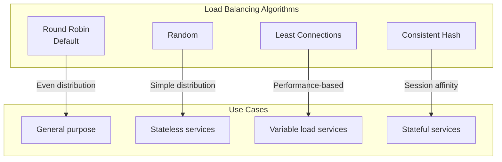

# Load Balancing with Istio

## Overview
Configure different load balancing algorithms: Round Robin, Random, Least Connections, and Consistent Hashing.

## Algorithms



## Quick Start

```bash
./deploy-all.sh
./test.sh
./cleanup.sh
```

## Configuration

### Round Robin (Default)
```yaml
trafficPolicy:
  loadBalancer:
    simple: ROUND_ROBIN
```

### Random
```yaml
trafficPolicy:
  loadBalancer:
    simple: RANDOM
```

### Least Connections
```yaml
trafficPolicy:
  loadBalancer:
    simple: LEAST_CONN
```

### Consistent Hash (Session Affinity)
```yaml
trafficPolicy:
  loadBalancer:
    consistentHash:
      httpHeaderName: x-user-id   # Hash by header
      # OR
      httpCookie:
        name: session
        ttl: 3600s                # Cookie TTL
      # OR
      useSourceIp: true           # Hash by source IP
```

## Algorithm Comparison

| Algorithm | Best For | Session Affinity |
|-----------|----------|------------------|
| Round Robin | General use | No |
| Random | Stateless apps | No |
| Least Conn | Variable load | No |
| Consistent Hash | Stateful apps | Yes |
