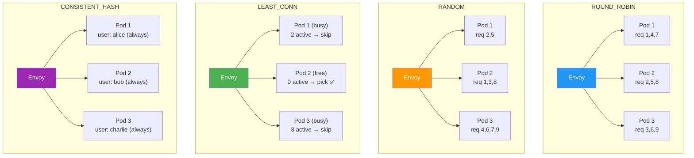
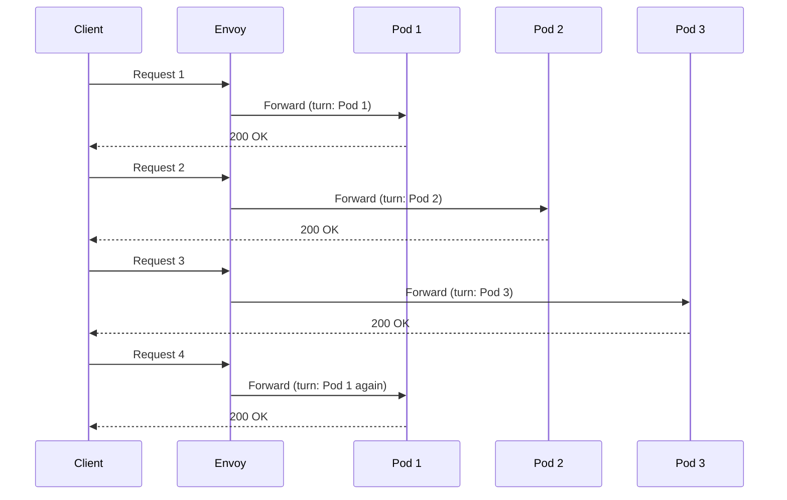
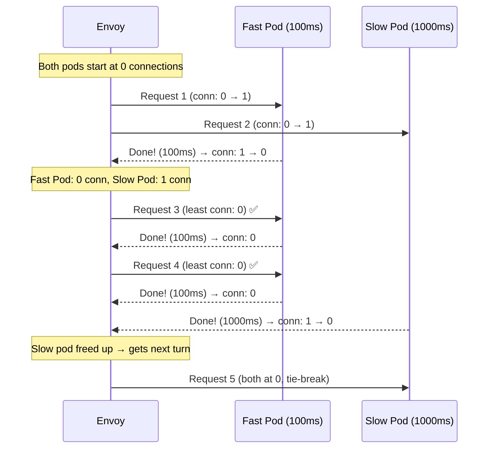
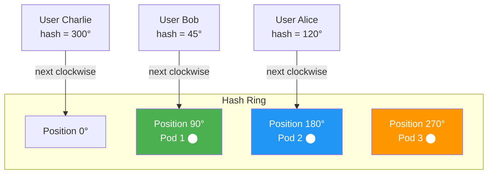
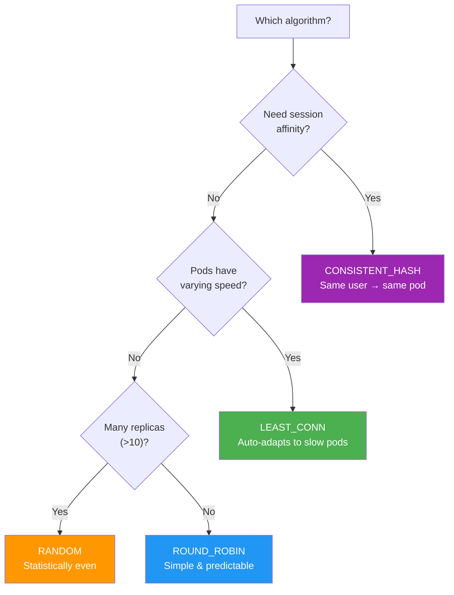

# Load Balancing — Diagrams

## Four Algorithms Visualized

```mermaid
graph TB
    subgraph "ROUND_ROBIN"
        RR["Envoy"] --> RR1["Pod 1<br/>req 1,4,7"]
        RR --> RR2["Pod 2<br/>req 2,5,8"]
        RR --> RR3["Pod 3<br/>req 3,6,9"]
    end

    subgraph "RANDOM"
        RND["Envoy"] --> RND1["Pod 1<br/>req 2,5"]
        RND --> RND2["Pod 2<br/>req 1,3,8"]
        RND --> RND3["Pod 3<br/>req 4,6,7,9"]
    end

    subgraph "LEAST_CONN"
        LC["Envoy"] --> LC1["Pod 1 (busy)<br/>2 active → skip"]
        LC --> LC2["Pod 2 (free)<br/>0 active → pick ✅"]
        LC --> LC3["Pod 3 (busy)<br/>3 active → skip"]
    end

    subgraph "CONSISTENT_HASH"
        CH["Envoy"] --> CH1["Pod 1<br/>user: alice (always)"]
        CH --> CH2["Pod 2<br/>user: bob (always)"]
        CH --> CH3["Pod 3<br/>user: charlie (always)"]
    end

    style RR fill:#2196F3,color:#fff
    style RND fill:#FF9800,color:#fff
    style LC fill:#4CAF50,color:#fff
    style CH fill:#9C27B0,color:#fff
```

## Round Robin — Sequence

```mermaid
sequenceDiagram
    participant C as Client
    participant E as Envoy
    participant P1 as Pod 1
    participant P2 as Pod 2
    participant P3 as Pod 3

    C->>E: Request 1
    E->>P1: Forward (turn: Pod 1)
    P1-->>C: 200 OK

    C->>E: Request 2
    E->>P2: Forward (turn: Pod 2)
    P2-->>C: 200 OK

    C->>E: Request 3
    E->>P3: Forward (turn: Pod 3)
    P3-->>C: 200 OK

    C->>E: Request 4
    E->>P1: Forward (turn: Pod 1 again)
    P1-->>C: 200 OK
```

## Least Connections — Self-Balancing

```mermaid
sequenceDiagram
    participant E as Envoy
    participant Fast as Fast Pod (100ms)
    participant Slow as Slow Pod (1000ms)

    Note over E: Both pods start at 0 connections

    E->>Fast: Request 1 (conn: 0 → 1)
    E->>Slow: Request 2 (conn: 0 → 1)

    Fast-->>E: Done! (100ms) → conn: 1 → 0
    Note over E: Fast Pod: 0 conn, Slow Pod: 1 conn

    E->>Fast: Request 3 (least conn: 0) ✅
    Fast-->>E: Done! (100ms) → conn: 0

    E->>Fast: Request 4 (least conn: 0) ✅
    Fast-->>E: Done! (100ms) → conn: 0

    Slow-->>E: Done! (1000ms) → conn: 1 → 0
    Note over E: Slow pod freed up → gets next turn

    E->>Slow: Request 5 (both at 0, tie-break)
```

## Consistent Hash — Ring Diagram

```mermaid
graph TD
    subgraph "Hash Ring"
        direction TB
        H0["Position 0°"]
        H90["Position 90°<br/>Pod 1 ⬤"]
        H180["Position 180°<br/>Pod 2 ⬤"]
        H270["Position 270°<br/>Pod 3 ⬤"]
    end

    UA["User Alice<br/>hash = 120°"]
    UB["User Bob<br/>hash = 45°"]
    UC["User Charlie<br/>hash = 300°"]

    UA -->|"next clockwise"| H180
    UB -->|"next clockwise"| H90
    UC -->|"next clockwise"| H0

    style H90 fill:#4CAF50,color:#fff
    style H180 fill:#2196F3,color:#fff
    style H270 fill:#FF9800,color:#fff
```

## Algorithm Decision Guide

```mermaid
flowchart TD
    START["Which algorithm?"]
    Q1{"Need session<br/>affinity?"}
    Q2{"Pods have<br/>varying speed?"}
    Q3{"Many replicas<br/>(>10)?"}
    
    CH["CONSISTENT_HASH<br/>Same user → same pod"]
    LC["LEAST_CONN<br/>Auto-adapts to slow pods"]
    RND["RANDOM<br/>Statistically even"]
    RR["ROUND_ROBIN<br/>Simple & predictable"]

    START --> Q1
    Q1 -->|"Yes"| CH
    Q1 -->|"No"| Q2
    Q2 -->|"Yes"| LC
    Q2 -->|"No"| Q3
    Q3 -->|"Yes"| RND
    Q3 -->|"No"| RR

    style CH fill:#9C27B0,color:#fff
    style LC fill:#4CAF50,color:#fff
    style RND fill:#FF9800,color:#fff
    style RR fill:#2196F3,color:#fff
```
