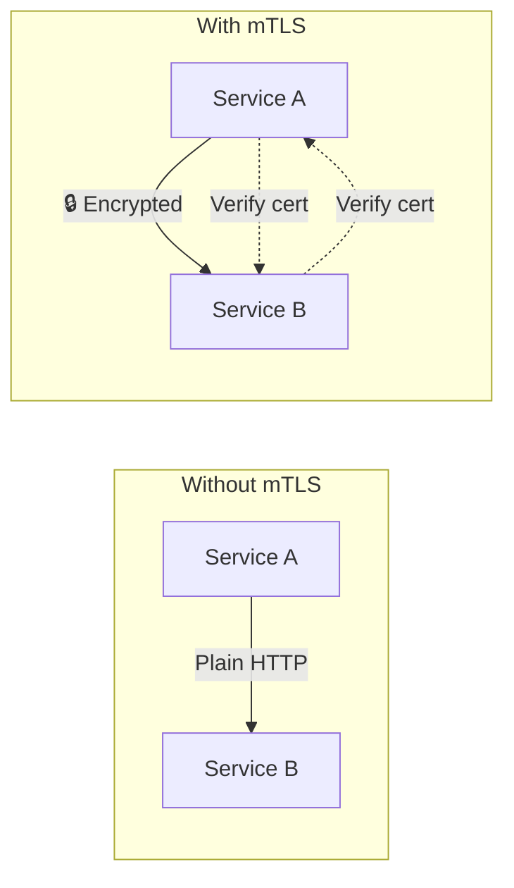

# Mutual TLS (mTLS) with Istio

## Overview
Automatically encrypt traffic between services with mutual TLS. Both client and server verify each other's certificates.

## Architecture



## mTLS Modes

| Mode | Description |
|------|-------------|
| **DISABLE** | No mTLS |
| **PERMISSIVE** | Accept both HTTP and mTLS (default) |
| **STRICT** | Only mTLS allowed |

## Quick Start

```bash
./deploy-all.sh
./test.sh
./cleanup.sh
```

## Configuration

### Namespace-wide mTLS
```yaml
apiVersion: security.istio.io/v1
kind: PeerAuthentication
metadata:
  name: default
  namespace: my-namespace
spec:
  mtls:
    mode: STRICT
```

### Mesh-wide mTLS
```yaml
apiVersion: security.istio.io/v1
kind: PeerAuthentication
metadata:
  name: default
  namespace: istio-system    # Applies to whole mesh
spec:
  mtls:
    mode: STRICT
```

### Per-workload mTLS
```yaml
apiVersion: security.istio.io/v1
kind: PeerAuthentication
metadata:
  name: httpbin-mtls
  namespace: my-namespace
spec:
  selector:
    matchLabels:
      app: httpbin
  mtls:
    mode: STRICT
```

## Verification

```bash
# Check if mTLS is enabled
istioctl x describe pod <pod-name>

# Check certificates
istioctl proxy-config secret <pod-name>
```
