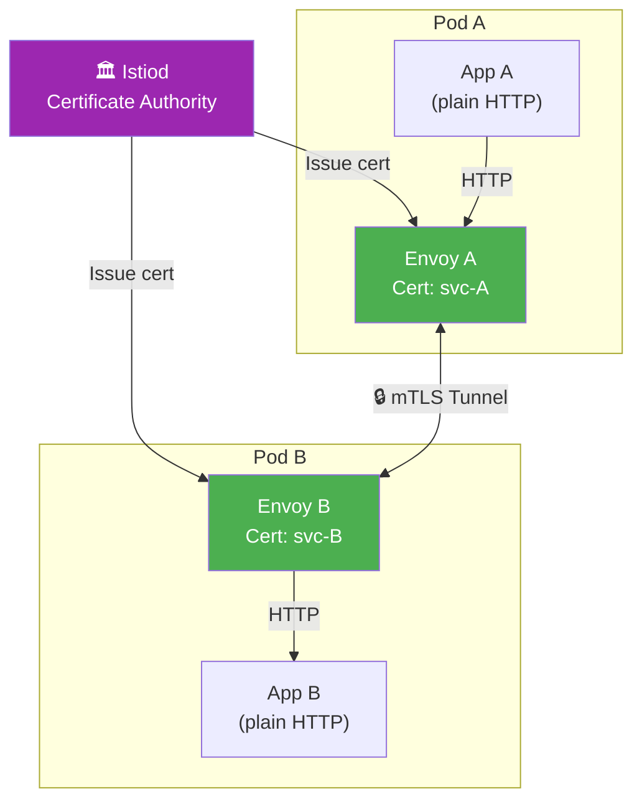
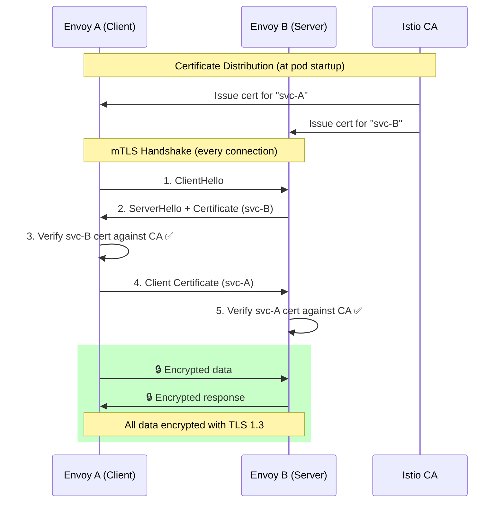
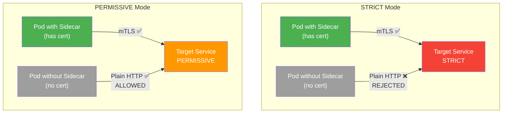
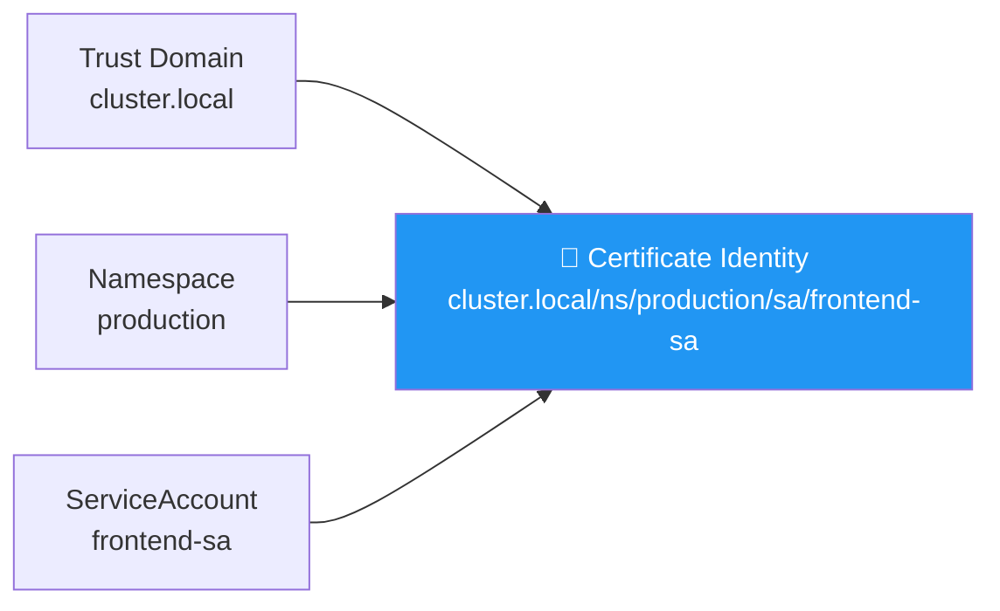
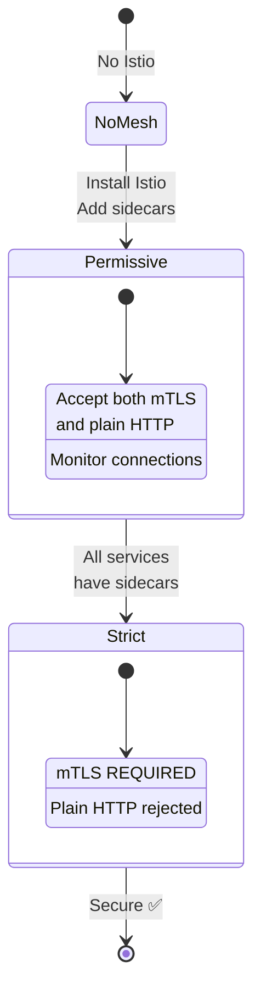
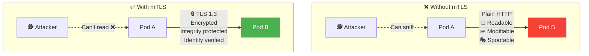
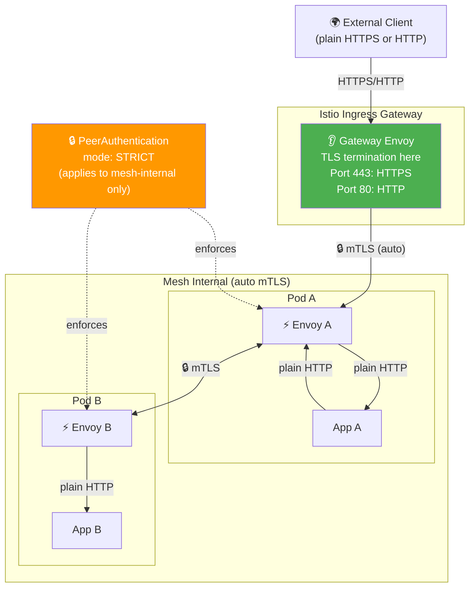
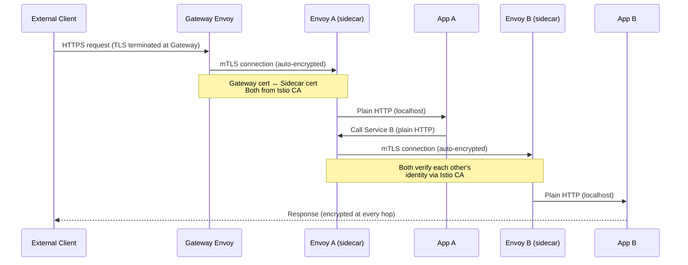

# Mutual TLS (mTLS) — Diagrams

## Overall Architecture

## mTLS Handshake — Sequence

## STRICT vs PERMISSIVE Mode

## Certificate Identity Format

## Migration Path: PERMISSIVE → STRICT

## Without vs With mTLS

## Gateway + mTLS: External vs Internal Traffic

## Full Traffic Path with Gateway + mTLS

