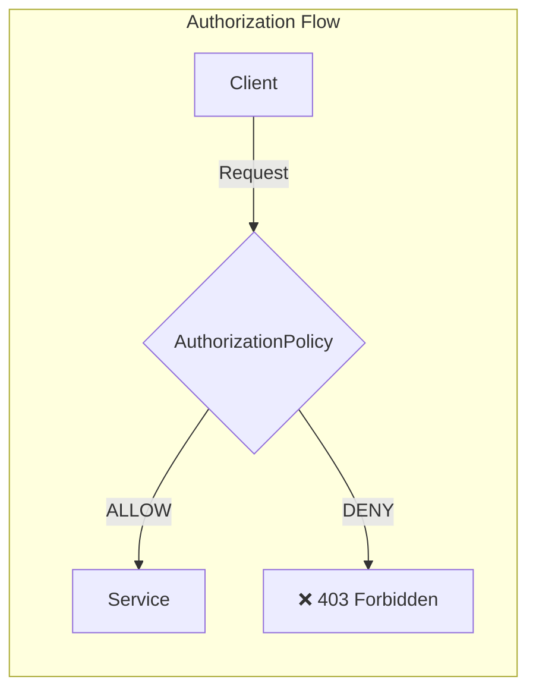

# Authorization Policies with Istio

## Overview
Control which services can communicate with each other using fine-grained access control policies.

## Architecture



## Policy Actions

| Action | Description |
|--------|-------------|
| **ALLOW** | Explicitly allow matching requests |
| **DENY** | Explicitly deny matching requests |
| **CUSTOM** | Delegate to external authorizer |

## Quick Start

```bash
./deploy-all.sh
./test.sh
./cleanup.sh
```

## Configuration Examples

### Deny All (Default Deny)
```yaml
apiVersion: security.istio.io/v1
kind: AuthorizationPolicy
metadata:
  name: deny-all
spec: {}    # Empty spec = deny all
```

### Allow Specific Source
```yaml
apiVersion: security.istio.io/v1
kind: AuthorizationPolicy
metadata:
  name: allow-frontend
spec:
  selector:
    matchLabels:
      app: backend
  rules:
    - from:
        - source:
            principals: ["cluster.local/ns/default/sa/frontend"]
```

### Allow Specific Methods/Paths
```yaml
apiVersion: security.istio.io/v1
kind: AuthorizationPolicy
metadata:
  name: allow-read
spec:
  selector:
    matchLabels:
      app: api
  rules:
    - to:
        - operation:
            methods: ["GET"]
            paths: ["/api/*"]
```

## Policy Evaluation Order

1. **DENY** policies evaluated first
2. If any DENY matches → request denied
3. **ALLOW** policies evaluated
4. If any ALLOW matches → request allowed
5. If no ALLOW matches → request denied (if ALLOW exists)
