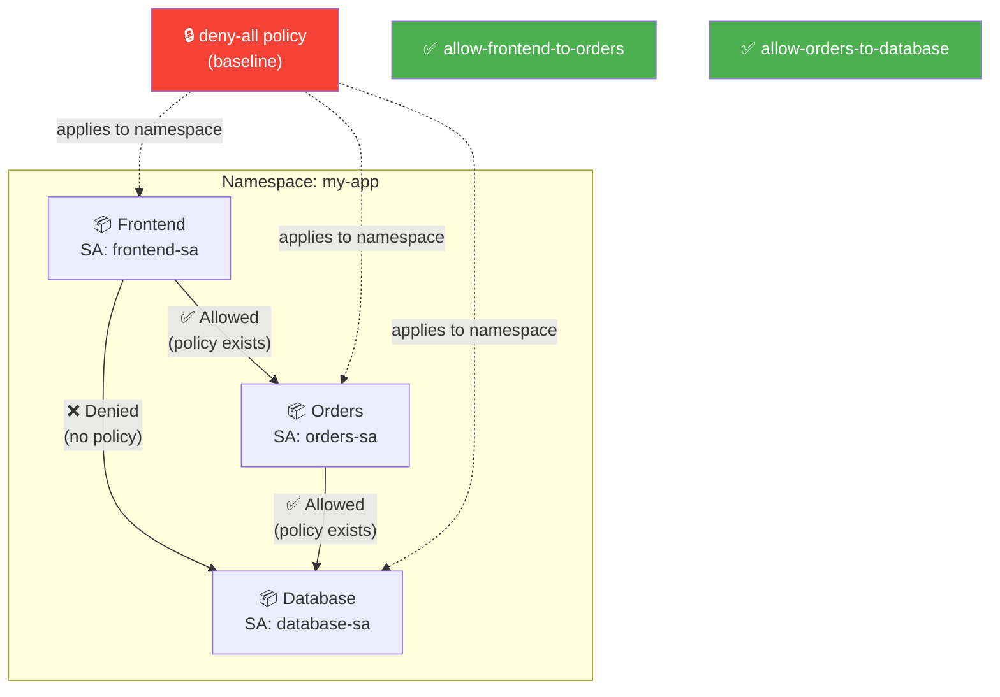
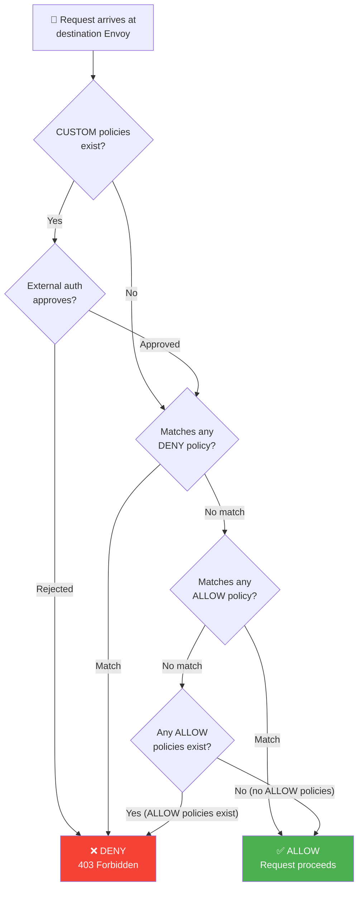
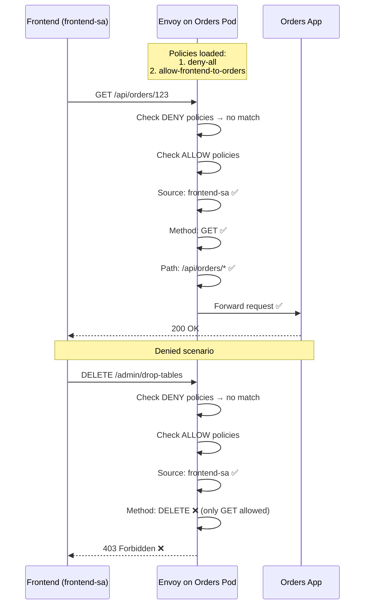
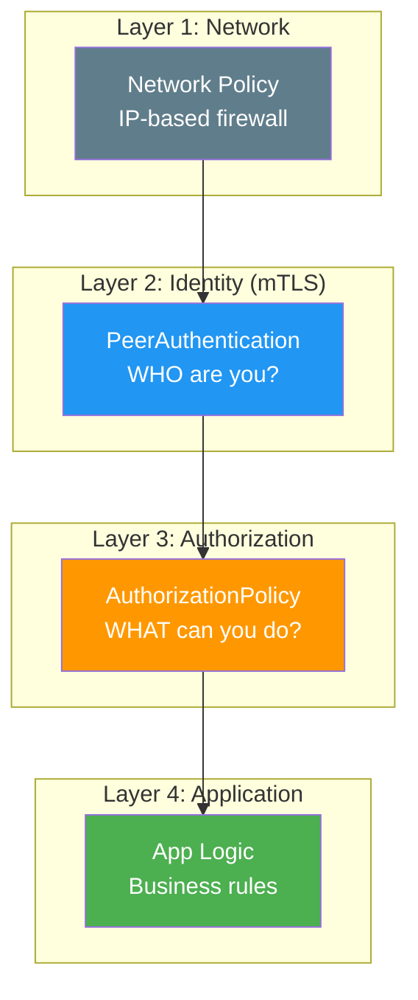
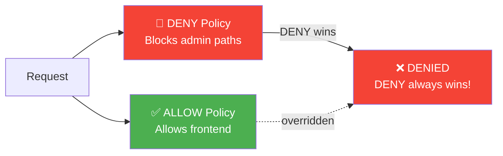
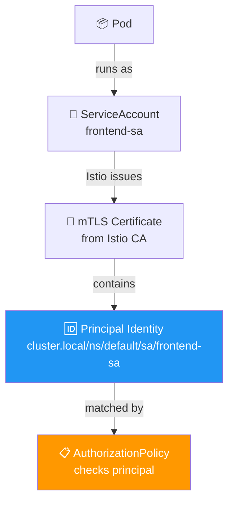
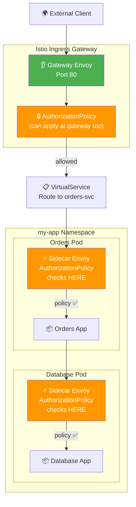
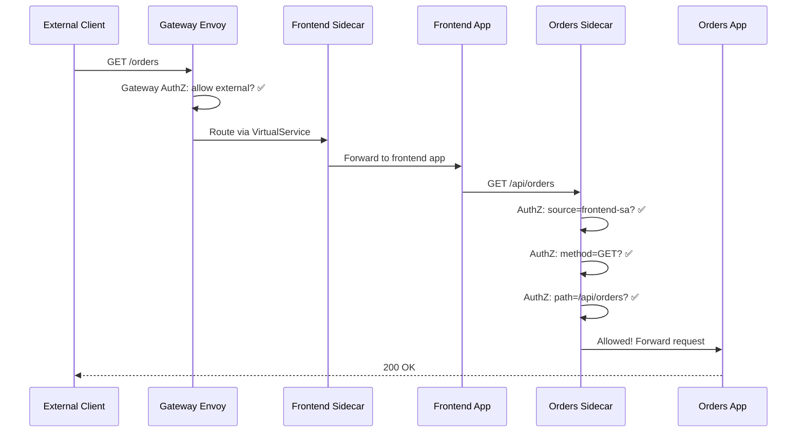

# Authorization Policy — Diagrams

## Overall Architecture

## Authorization Decision Flow

## Policy Evaluation — Sequence

## Zero-Trust Layered Security

## DENY vs ALLOW Priority

## ServiceAccount Identity

## Gateway + Authorization Policy Location

## End-to-End with Gateway + Auth

