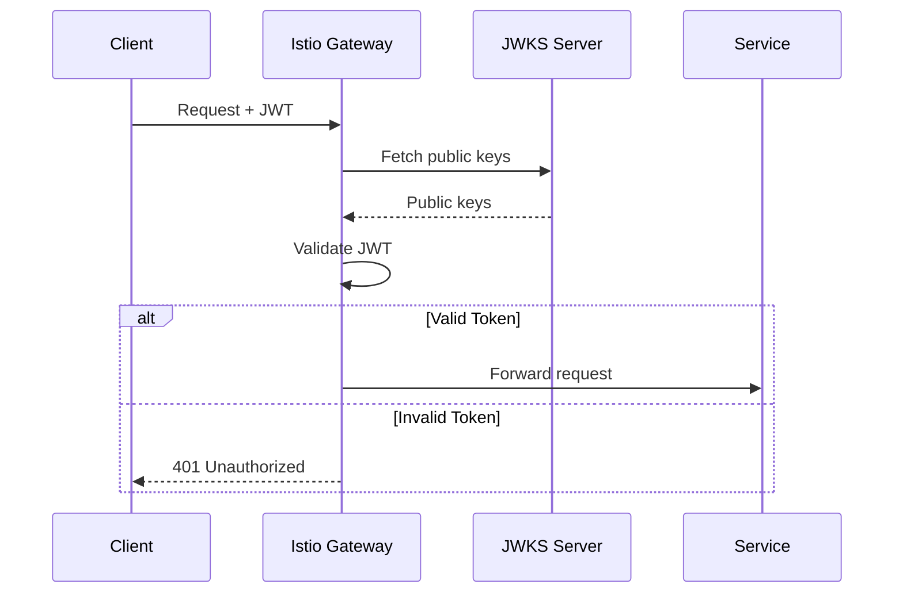

# JWT Authentication with Istio

## Overview
Validate JWT tokens at the mesh edge. Only requests with valid tokens are allowed.

## Architecture



## Quick Start

```bash
./deploy-all.sh
./test.sh
./cleanup.sh
```

## Configuration

### RequestAuthentication (JWT Validation)
```yaml
apiVersion: security.istio.io/v1
kind: RequestAuthentication
metadata:
  name: jwt-auth
spec:
  selector:
    matchLabels:
      app: httpbin
  jwtRules:
    - issuer: "https://example.com"
      jwksUri: "https://example.com/.well-known/jwks.json"
```

### AuthorizationPolicy (Require JWT)
```yaml
apiVersion: security.istio.io/v1
kind: AuthorizationPolicy
metadata:
  name: require-jwt
spec:
  selector:
    matchLabels:
      app: httpbin
  rules:
    - from:
        - source:
            requestPrincipals: ["*"]   # Require any valid JWT
```

## JWT Claims in Authorization
```yaml
rules:
  - when:
      - key: request.auth.claims[groups]
        values: ["admin"]
```

## Key Concepts

| Field | Description |
|-------|-------------|
| `issuer` | Expected `iss` claim in JWT |
| `jwksUri` | URL to fetch public keys |
| `audiences` | Expected `aud` claim |
| `forwardOriginalToken` | Pass JWT to upstream |
