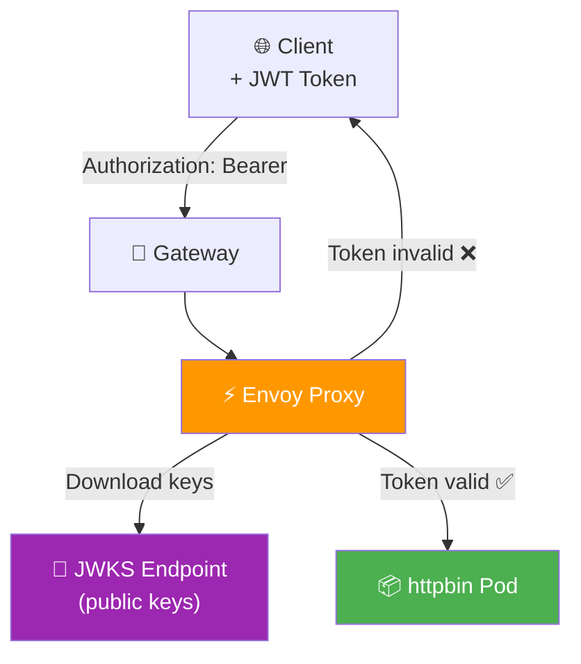
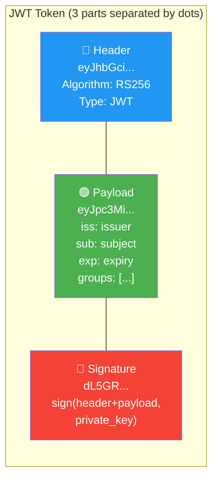
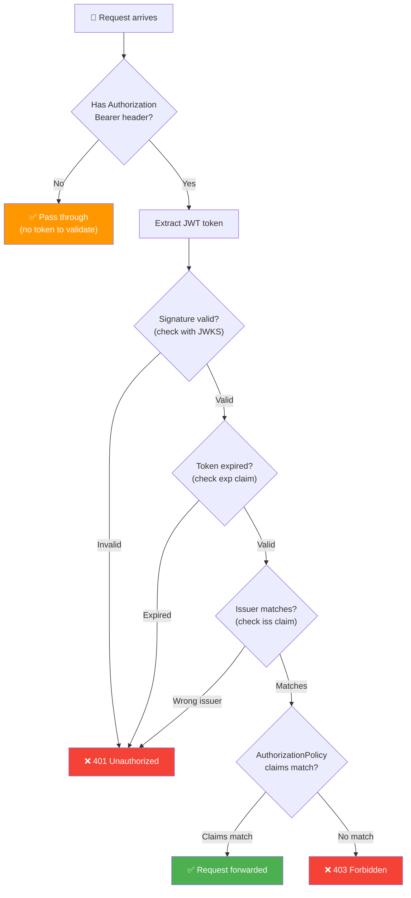
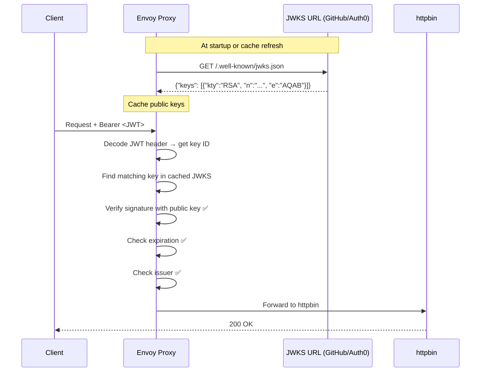
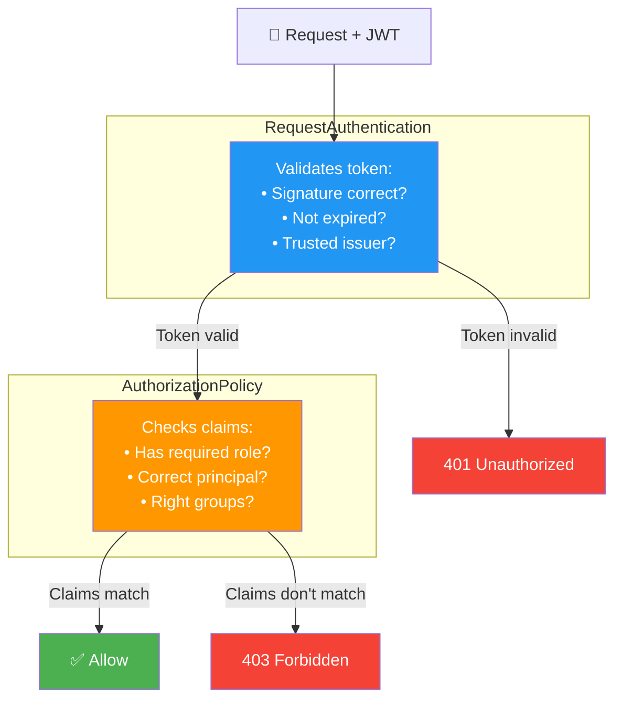
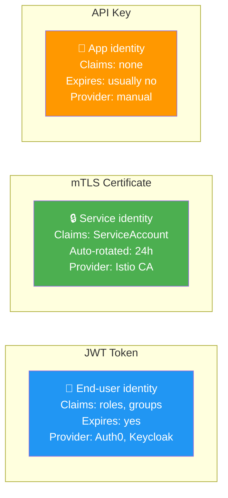
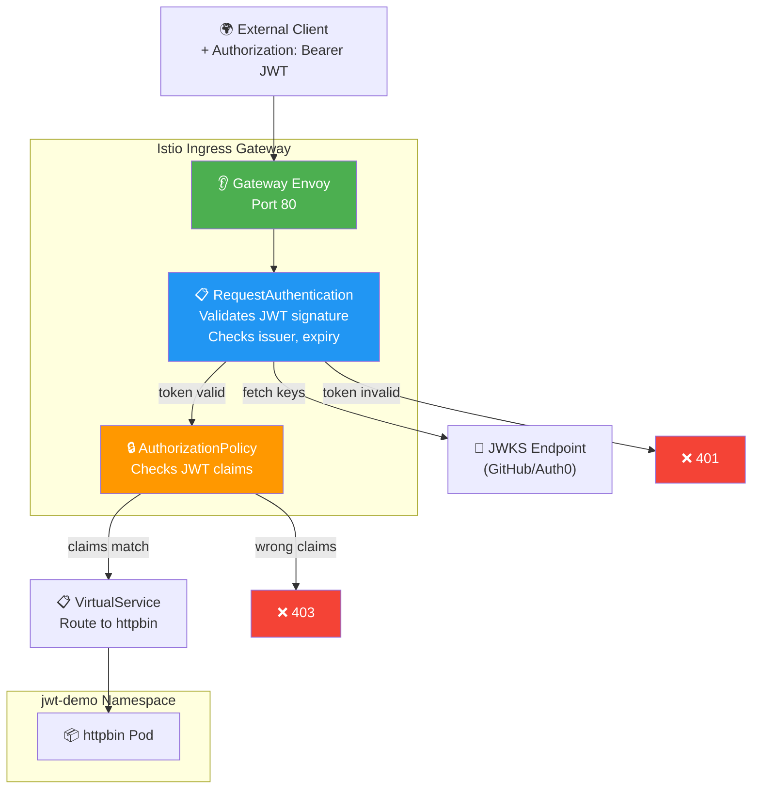
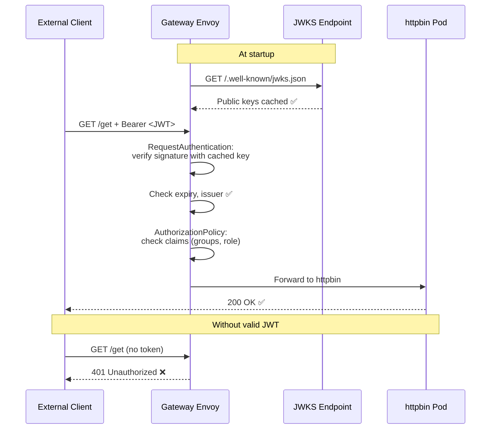

# JWT Authentication — Diagrams

## Overall Architecture

## JWT Token Structure

## JWT Validation Flow

## JWKS Key Verification

## Two Resources Working Together

## JWT vs mTLS vs API Key

## Gateway + JWT Authentication Path

## End-to-End with Gateway + JWT

