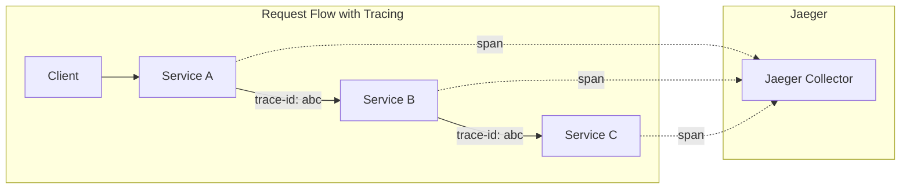

# Distributed Tracing with Istio and Jaeger

## Overview
Trace requests across microservices to debug latency and understand request flow.

## Architecture



## Quick Start

```bash
./deploy-all.sh

# Access Jaeger UI
kubectl port-forward svc/tracing 16686:80 -n istio-system &
# Open http://localhost:16686

./test.sh
./cleanup.sh
```

## Key Concepts

| Term | Description |
|------|-------------|
| **Trace** | End-to-end request journey |
| **Span** | Single operation in a trace |
| **Trace ID** | Unique identifier linking all spans |
| **Context Propagation** | Passing trace headers between services |

## Header Propagation

Apps must propagate these headers for tracing to work:
- `x-request-id`
- `x-b3-traceid`
- `x-b3-spanid`
- `x-b3-parentspanid`
- `x-b3-sampled`
- `x-b3-flags`

## Installing Jaeger

```bash
# Install Jaeger addon
kubectl apply -f https://raw.githubusercontent.com/istio/istio/release-1.20/samples/addons/jaeger.yaml
```

## Sampling Rate

Control trace sampling:
```yaml
# In MeshConfig
defaultConfig:
  tracing:
    sampling: 100.0  # 100% sampling (for dev)
```
