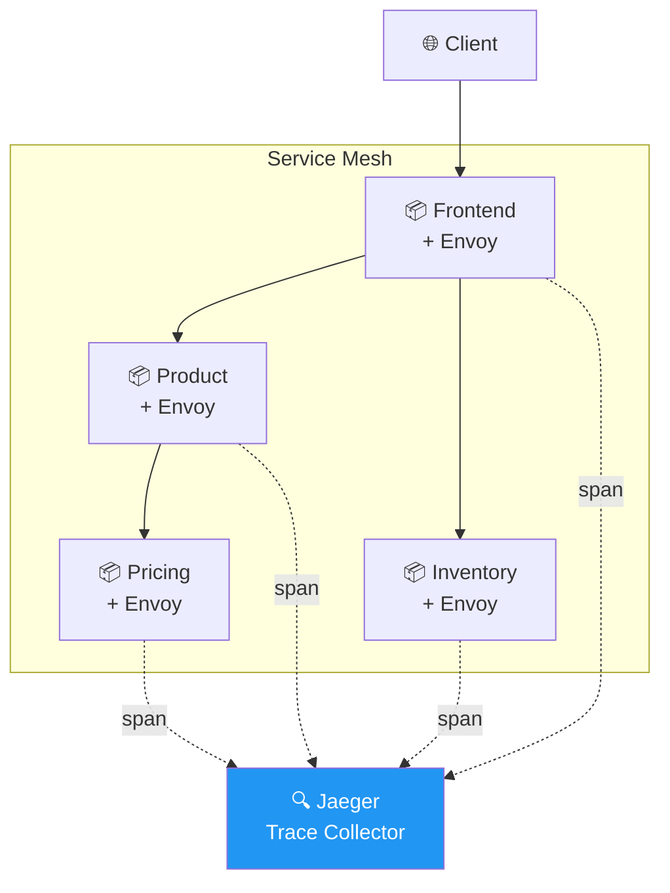
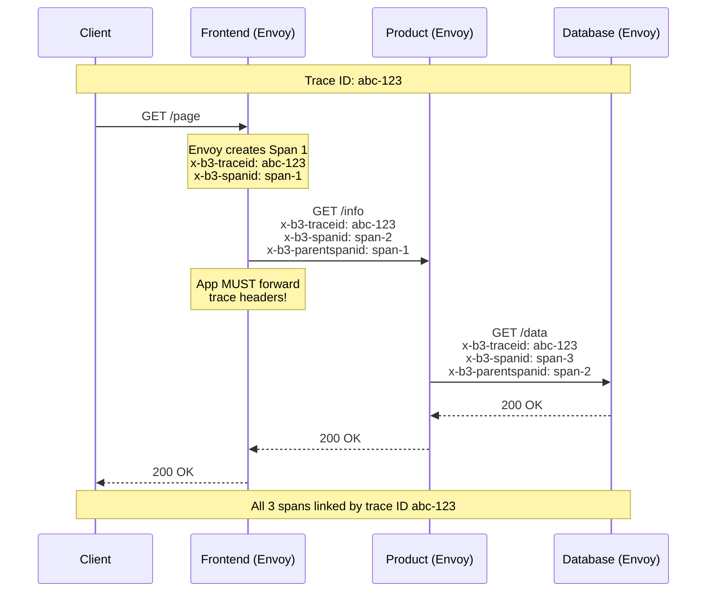
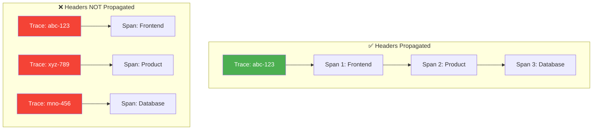
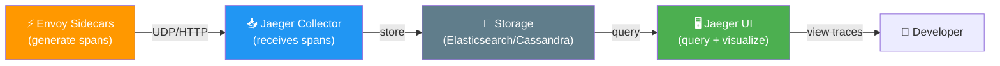
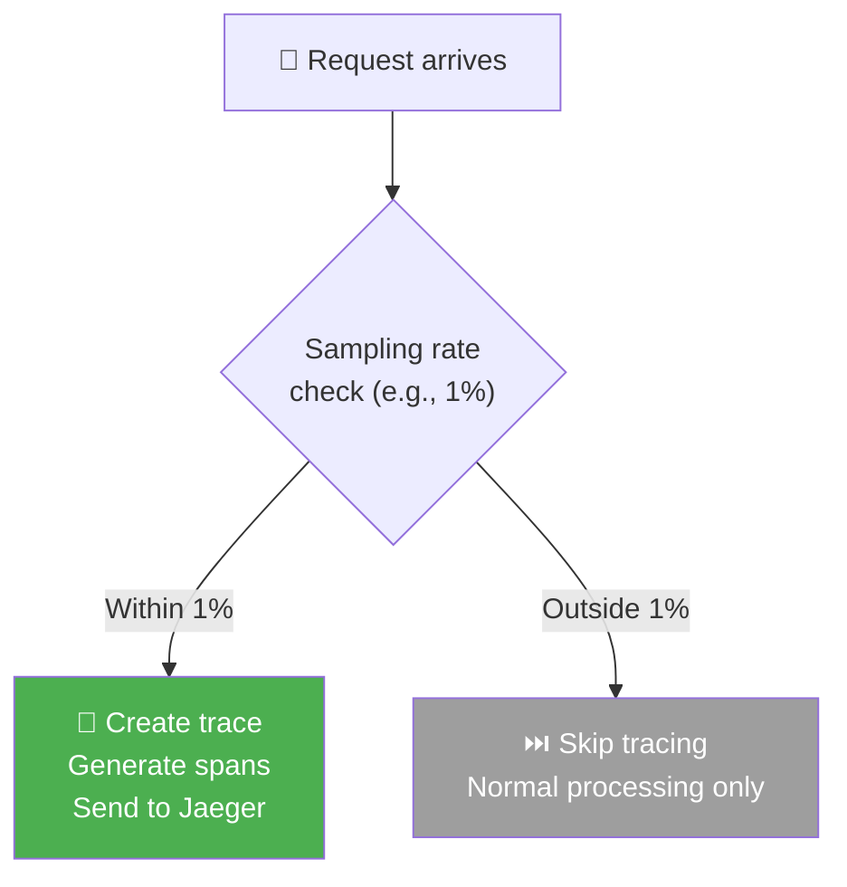

# Distributed Tracing — Diagrams

## Overall Architecture

## Trace and Span Hierarchy

```mermaid
gantt
    title Trace abc-123: Full Request Lifecycle
    dateFormat X
    axisFormat %sms

    section Frontend
    frontend GET /page                :active, fe, 0, 1000

    section Product
    product GET /info                 :prod, 50, 250

    section Inventory
    inventory GET /stock              :crit, inv, 100, 820

    section Pricing
    pricing GET /price                :price, 260, 310
```

## Header Propagation — How Spans Link Together

## With vs Without Header Propagation

## Trace Data Flow

## Sampling Decision

