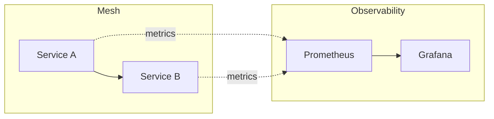

# Metrics with Prometheus and Grafana

## Overview
Collect and visualize Istio metrics using Prometheus and Grafana dashboards.

## Architecture



## Quick Start

```bash
./deploy-all.sh

# Access Prometheus
kubectl port-forward svc/prometheus 9090:9090 -n istio-system &

# Access Grafana
kubectl port-forward svc/grafana 3000:3000 -n istio-system &
# Open http://localhost:3000 (admin/admin)

./cleanup.sh
```

## Key Istio Metrics

| Metric | Description |
|--------|-------------|
| `istio_requests_total` | Total requests |
| `istio_request_duration_milliseconds` | Request latency |
| `istio_request_bytes` | Request size |
| `istio_response_bytes` | Response size |
| `istio_tcp_connections_opened_total` | TCP connections |

## Useful PromQL Queries

### Request Rate
```promql
sum(rate(istio_requests_total{reporter="source"}[5m])) by (destination_service_name)
```

### Error Rate
```promql
sum(rate(istio_requests_total{response_code=~"5.*"}[5m])) / 
sum(rate(istio_requests_total[5m]))
```

### P99 Latency
```promql
histogram_quantile(0.99, sum(rate(istio_request_duration_milliseconds_bucket[5m])) by (le, destination_service_name))
```

## Grafana Dashboards

Pre-built dashboards in Grafana:
- **Istio Mesh Dashboard**: Overview of mesh traffic
- **Istio Service Dashboard**: Per-service metrics
- **Istio Workload Dashboard**: Per-workload metrics
