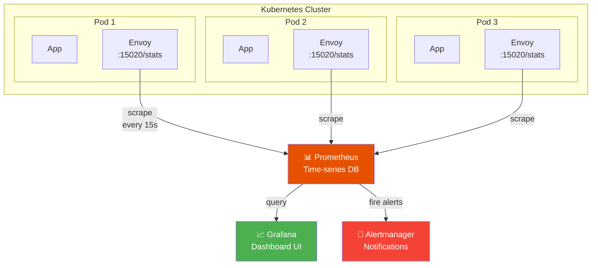
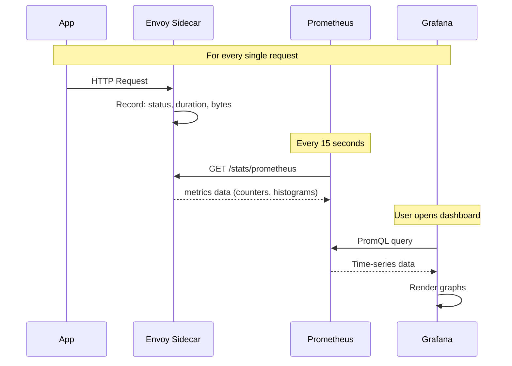
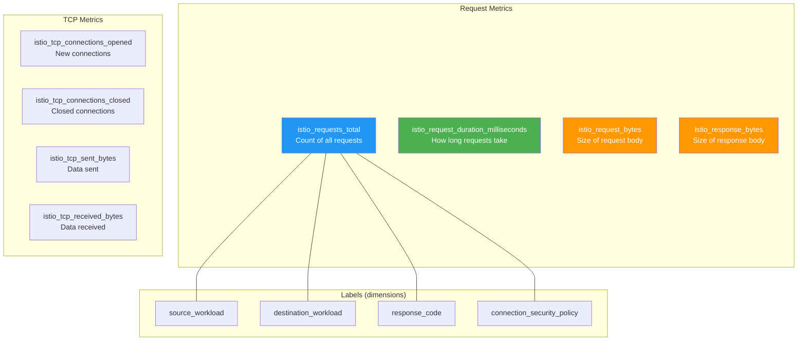
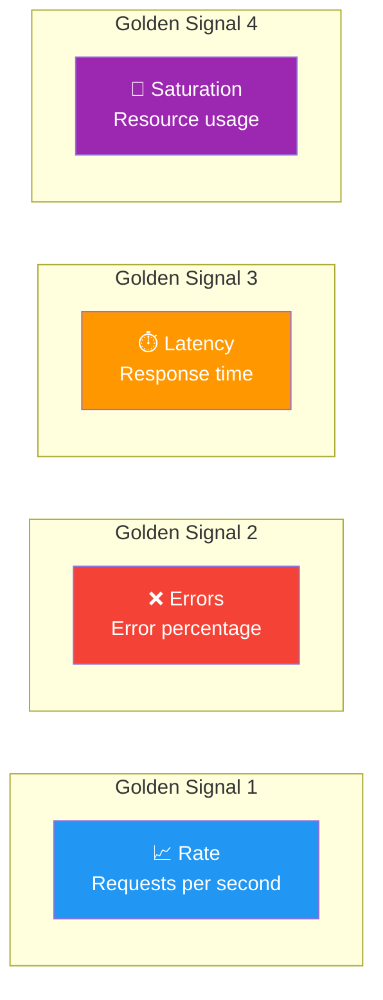
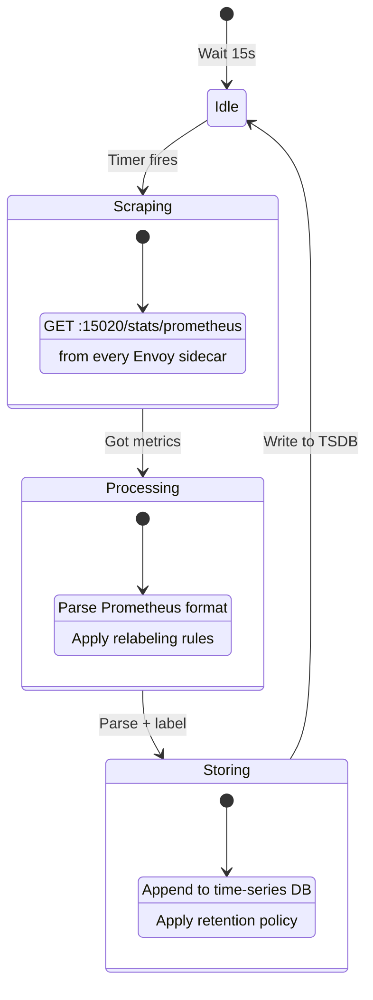

# Metrics & Prometheus — Diagrams

## Overall Architecture

```mermaid
graph TB
    subgraph "Kubernetes Cluster"
        subgraph "Pod 1"
            APP1["App"]
            ENV1["Envoy<br/>:15020/stats"]
        end
        subgraph "Pod 2"
            APP2["App"]
            ENV2["Envoy<br/>:15020/stats"]
        end
        subgraph "Pod 3"
            APP3["App"]
            ENV3["Envoy<br/>:15020/stats"]
        end
    end

    PROM["📊 Prometheus<br/>Time-series DB"]
    GRAF["📈 Grafana<br/>Dashboard UI"]
    ALERT["🔔 Alertmanager<br/>Notifications"]

    ENV1 -->|"scrape<br/>every 15s"| PROM
    ENV2 -->|"scrape"| PROM
    ENV3 -->|"scrape"| PROM
    PROM -->|"query"| GRAF
    PROM -->|"fire alerts"| ALERT

    style PROM fill:#E65100,color:#fff
    style GRAF fill:#4CAF50,color:#fff
    style ALERT fill:#f44336,color:#fff
```

## Metrics Pipeline — Sequence

```mermaid
sequenceDiagram
    participant A as App
    participant E as Envoy Sidecar
    participant P as Prometheus
    participant G as Grafana

    Note over A,G: For every single request
    A->>E: HTTP Request
    E->>E: Record: status, duration, bytes

    Note over P: Every 15 seconds
    P->>E: GET /stats/prometheus
    E-->>P: metrics data (counters, histograms)

    Note over G: User opens dashboard
    G->>P: PromQL query
    P-->>G: Time-series data
    G->>G: Render graphs
```

## Key Metrics — What Envoy Records

```mermaid
graph TD
    subgraph "Request Metrics"
        M1["istio_requests_total<br/>Count of all requests"]
        M2["istio_request_duration_milliseconds<br/>How long requests take"]
        M3["istio_request_bytes<br/>Size of request body"]
        M4["istio_response_bytes<br/>Size of response body"]
    end

    subgraph "TCP Metrics"
        M5["istio_tcp_connections_opened<br/>New connections"]
        M6["istio_tcp_connections_closed<br/>Closed connections"]
        M7["istio_tcp_sent_bytes<br/>Data sent"]
        M8["istio_tcp_received_bytes<br/>Data received"]
    end

    subgraph "Labels (dimensions)"
        L1["source_workload"]
        L2["destination_workload"]
        L3["response_code"]
        L4["connection_security_policy"]
    end

    M1 --- L1
    M1 --- L2
    M1 --- L3
    M1 --- L4

    style M1 fill:#2196F3,color:#fff
    style M2 fill:#4CAF50,color:#fff
    style M3 fill:#FF9800,color:#fff
    style M4 fill:#FF9800,color:#fff
```

## The Four Golden Signals

```mermaid
graph LR
    subgraph "Golden Signal 1"
        RATE["📈 Rate<br/>Requests per second"]
    end
    subgraph "Golden Signal 2"
        ERR["❌ Errors<br/>Error percentage"]
    end
    subgraph "Golden Signal 3"
        LAT["⏱️ Latency<br/>Response time"]
    end
    subgraph "Golden Signal 4"
        SAT["💾 Saturation<br/>Resource usage"]
    end

    style RATE fill:#2196F3,color:#fff
    style ERR fill:#f44336,color:#fff
    style LAT fill:#FF9800,color:#fff
    style SAT fill:#9C27B0,color:#fff
```

## Prometheus Scrape Cycle

```mermaid
stateDiagram-v2
    [*] --> Idle: Wait 15s

    Idle --> Scraping: Timer fires
    Scraping --> Processing: Got metrics
    Processing --> Storing: Parse + label
    Storing --> Idle: Write to TSDB

    state Scraping {
        [*] --> PullMetrics
        PullMetrics: GET :15020/stats/prometheus
        PullMetrics: from every Envoy sidecar
    }

    state Processing {
        [*] --> Parse
        Parse: Parse Prometheus format
        Parse: Apply relabeling rules
    }

    state Storing {
        [*] --> Write
        Write: Append to time-series DB
        Write: Apply retention policy
    }
```
