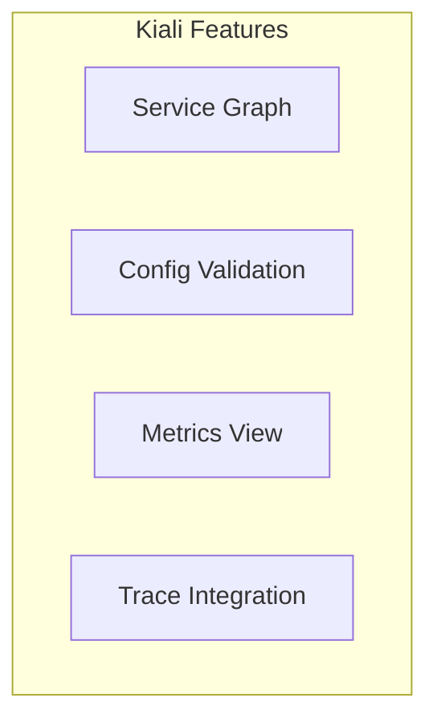

# Kiali - Service Mesh Visualization

## Overview
Kiali provides a visual dashboard to understand and manage your Istio service mesh.

## Architecture



## Quick Start

```bash
./deploy-all.sh

# Access Kiali
kubectl port-forward svc/kiali 20001:20001 -n istio-system &
# Open http://localhost:20001

./cleanup.sh
```

## Key Features

| Feature | Description |
|---------|-------------|
| **Graph** | Visual service topology |
| **Workloads** | Deployment health |
| **Services** | Service configuration |
| **Istio Config** | VirtualService, DestinationRule validation |
| **Traces** | Jaeger trace integration |

## Graph View Options

- **Versioned app graph**: Shows app versions
- **Workload graph**: Shows individual workloads
- **Service graph**: Shows services only

## Traffic Analysis

Kiali shows:
- Request rates (requests/sec)
- Error rates (% of 5xx)
- Response times (latency)
- Connection status (mTLS)
