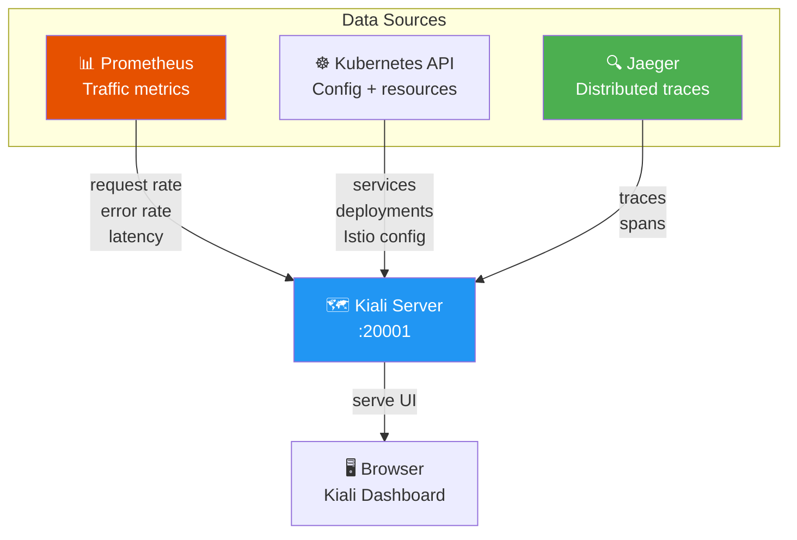
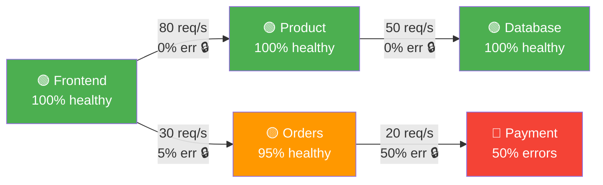
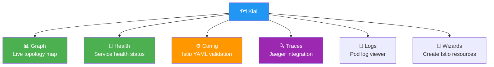
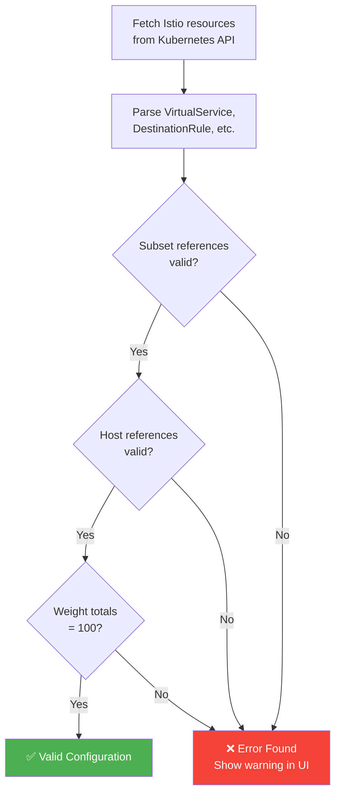
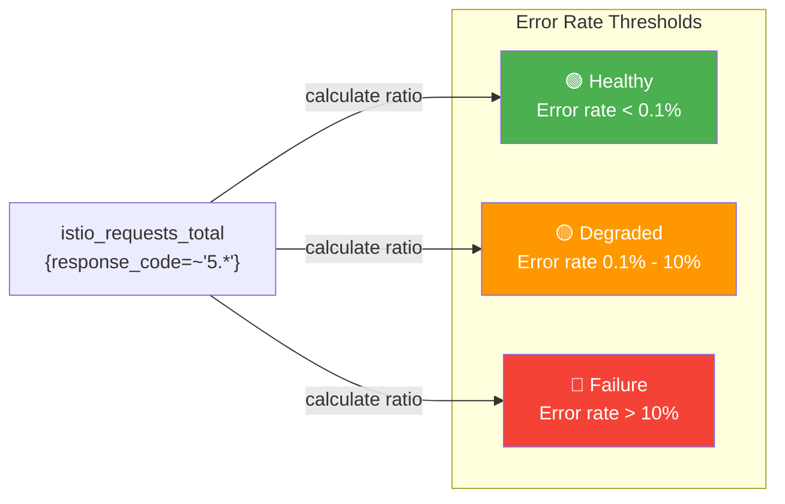
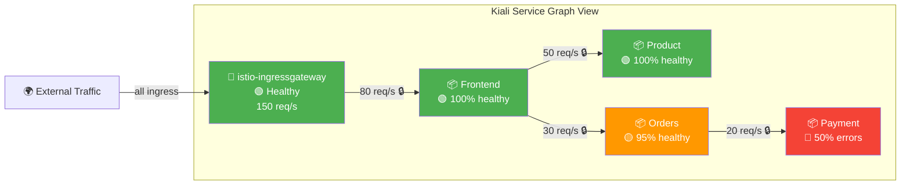
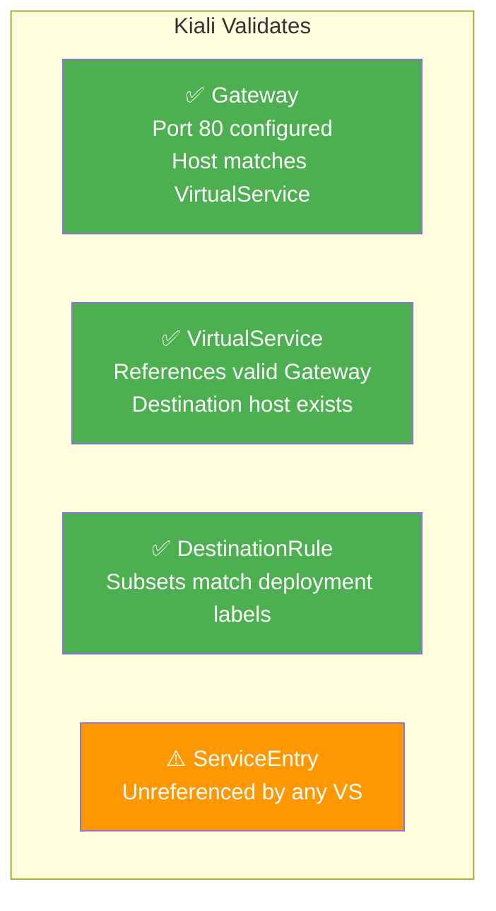

# Kiali Visualization — Diagrams

## Overall Architecture

## Service Graph — What Kiali Draws

## Kiali Features Overview

## Config Validation Flow

## Health Status Calculation

## Gateway in Kiali's Service Graph

## Gateway Config Validation in Kiali

