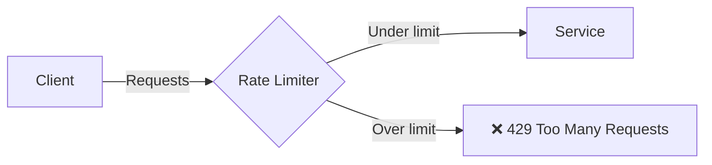

# Rate Limiting with Istio

## Overview
Limit the rate of requests to protect services from overload using Envoy's local rate limiting.

## Architecture



## Quick Start

```bash
./deploy-all.sh
./test.sh
./cleanup.sh
```

## Rate Limiting Types

| Type | Description |
|------|-------------|
| **Local** | Per-pod rate limiting |
| **Global** | Mesh-wide rate limiting (requires external service) |

## Configuration (Local Rate Limiting)

```yaml
apiVersion: networking.istio.io/v1alpha3
kind: EnvoyFilter
metadata:
  name: rate-limit
spec:
  workloadSelector:
    labels:
      app: httpbin
  configPatches:
    - applyTo: HTTP_FILTER
      match:
        context: SIDECAR_INBOUND
      patch:
        operation: INSERT_BEFORE
        value:
          name: envoy.filters.http.local_ratelimit
          typed_config:
            "@type": type.googleapis.com/udpa.type.v1.TypedStruct
            type_url: type.googleapis.com/envoy.extensions.filters.http.local_ratelimit.v3.LocalRateLimit
            value:
              stat_prefix: http_local_rate_limiter
              token_bucket:
                max_tokens: 10
                tokens_per_fill: 10
                fill_interval: 60s
              filter_enabled:
                runtime_key: local_rate_limit_enabled
                default_value:
                  numerator: 100
                  denominator: HUNDRED
```

## Key Parameters

| Parameter | Description |
|-----------|-------------|
| `max_tokens` | Maximum burst size |
| `tokens_per_fill` | Tokens added per interval |
| `fill_interval` | Refill interval |
