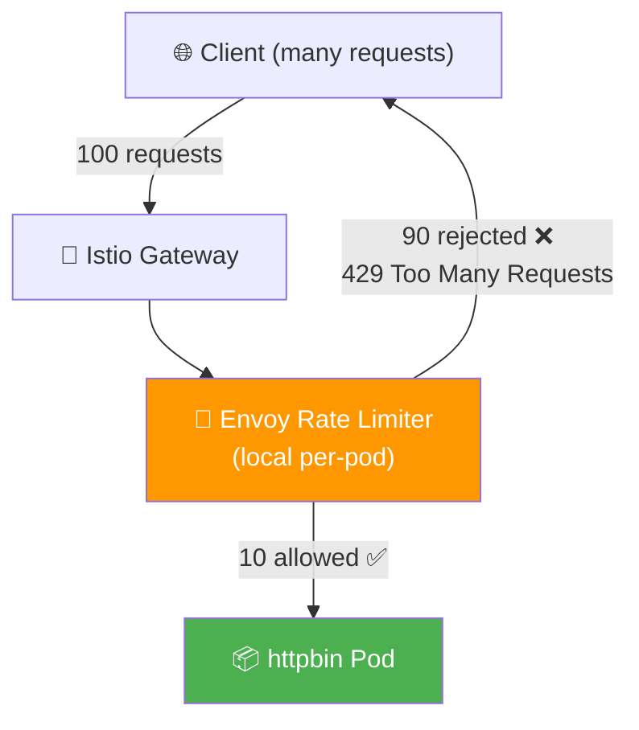
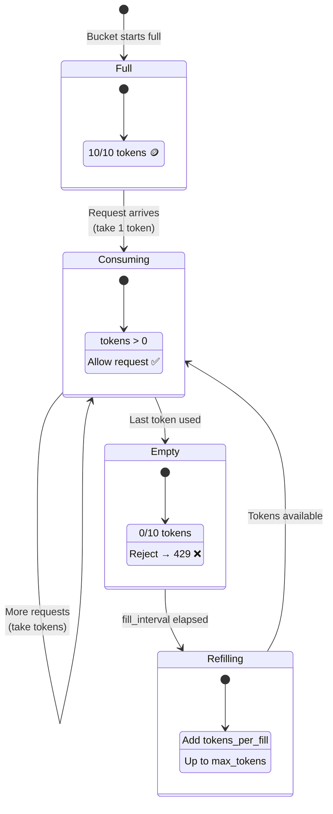
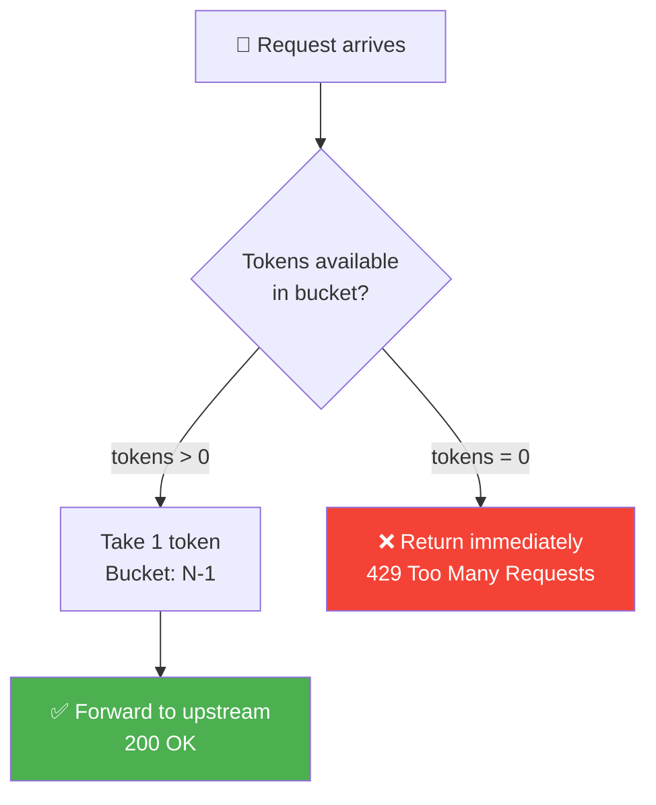
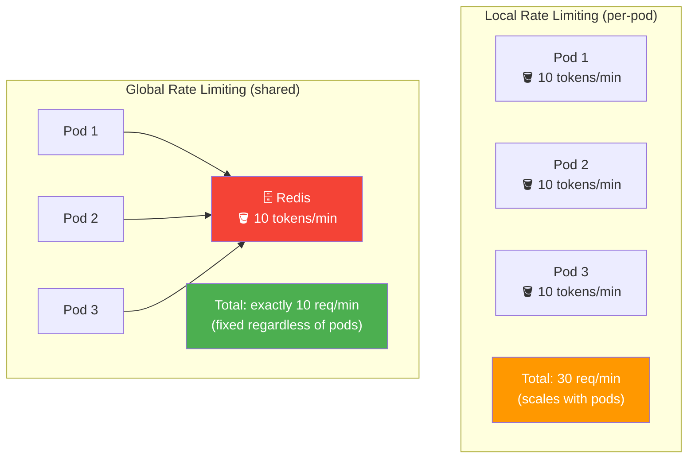
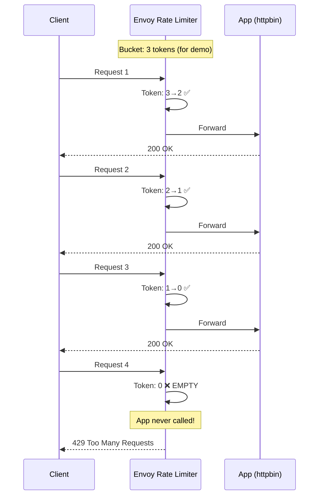
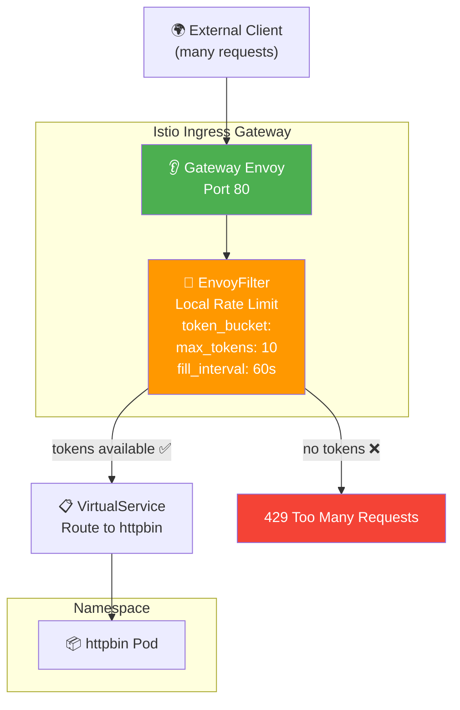
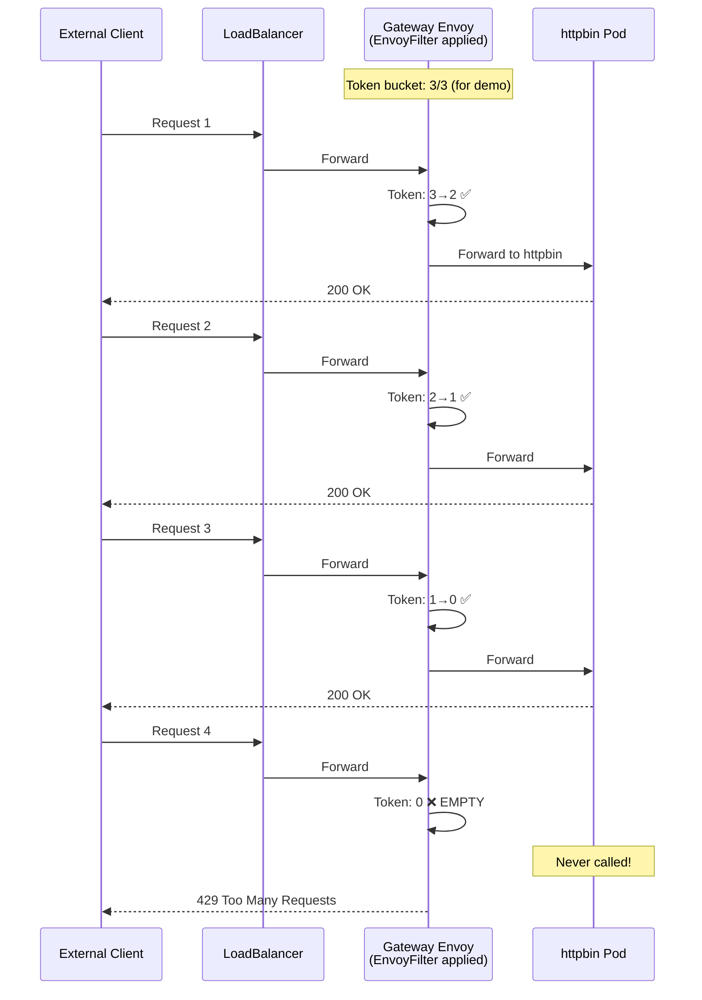

# Rate Limiting — Diagrams

## Overall Architecture



## Token Bucket Algorithm



## Token Bucket Timeline

```mermaid
gantt
    title Token Bucket: 10 tokens, refill 10 every 60s
    dateFormat X
    axisFormat %ss

    section Tokens
    Start: 10 tokens              :active, t1, 0, 1
    After 10 requests: 0 tokens   :crit, t2, 10, 11
    Refill at 60s: 10 tokens      :active, t3, 60, 61

    section Requests
    Requests 1-10: Allowed ✅     :done, r1, 0, 10
    Requests 11-15: Rejected 429  :crit, r2, 10, 15
    Wait for refill               :r3, 15, 60
    Requests 16-25: Allowed ✅    :done, r4, 60, 70
```

## Request Decision Flow



## Local vs Global Rate Limiting



## Rate Limit Response Sequence



## Gateway + Rate Limiting (EnvoyFilter Location)



## End-to-End with Gateway + Rate Limit



