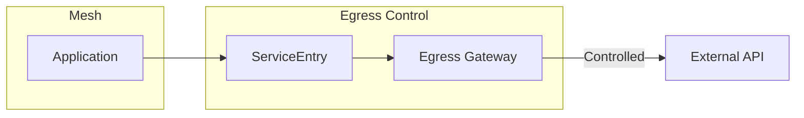

# Egress Traffic Control with Istio

## Overview
Control and monitor outbound traffic from your mesh to external services.

## Architecture



## Quick Start

```bash
./deploy-all.sh
./test.sh
./cleanup.sh
```

## Key Resources

| Resource | Description |
|----------|-------------|
| **ServiceEntry** | Register external service in mesh |
| **VirtualService** | Route egress traffic |
| **DestinationRule** | TLS/connection settings for external |

## Configuration

### Register External Service
```yaml
apiVersion: networking.istio.io/v1
kind: ServiceEntry
metadata:
  name: google
spec:
  hosts:
    - www.google.com
  ports:
    - number: 443
      name: https
      protocol: HTTPS
  resolution: DNS
  location: MESH_EXTERNAL
```

### Route Through Egress Gateway
```yaml
apiVersion: networking.istio.io/v1
kind: VirtualService
metadata:
  name: google-egress
spec:
  hosts:
    - www.google.com
  gateways:
    - mesh
  http:
    - route:
        - destination:
            host: www.google.com
            port:
              number: 443
```

## Egress Modes

| Mode | Description |
|------|-------------|
| **ALLOW_ANY** | Allow all external traffic (default) |
| **REGISTRY_ONLY** | Only allow registered ServiceEntries |
