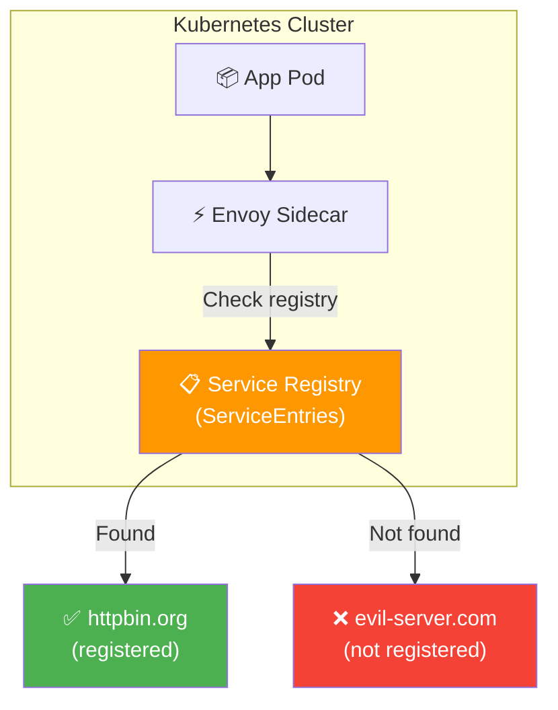
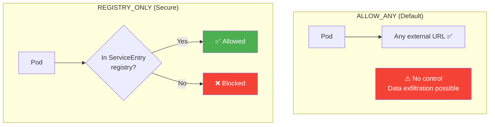
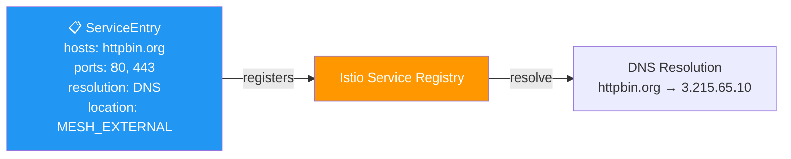
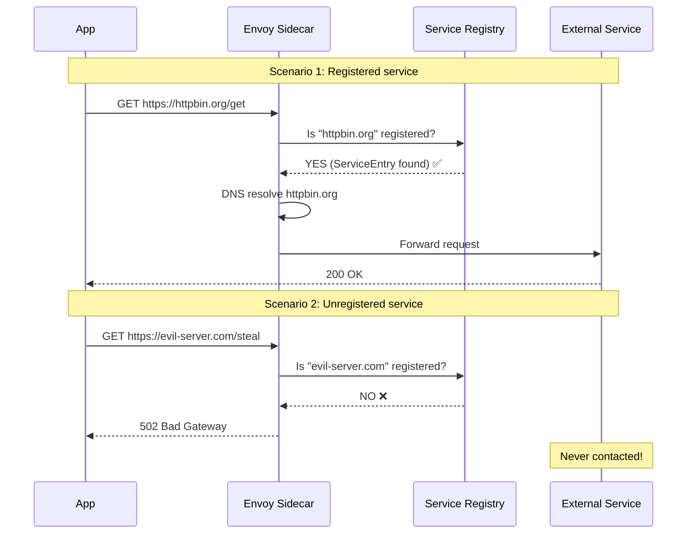
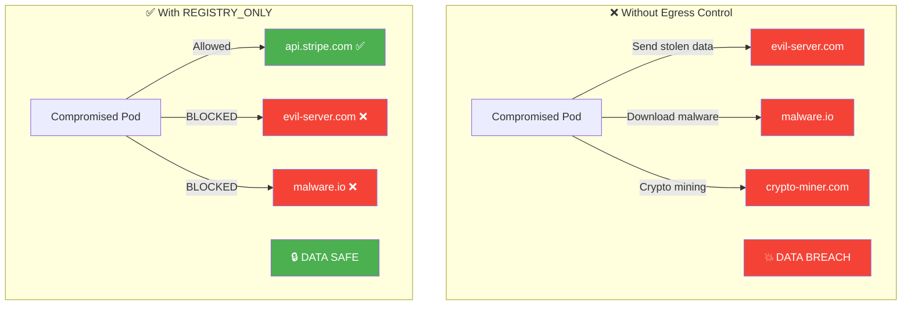
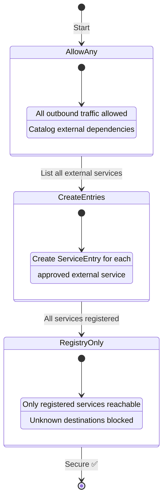
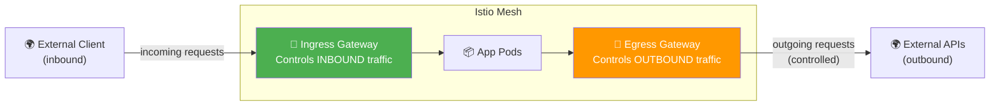
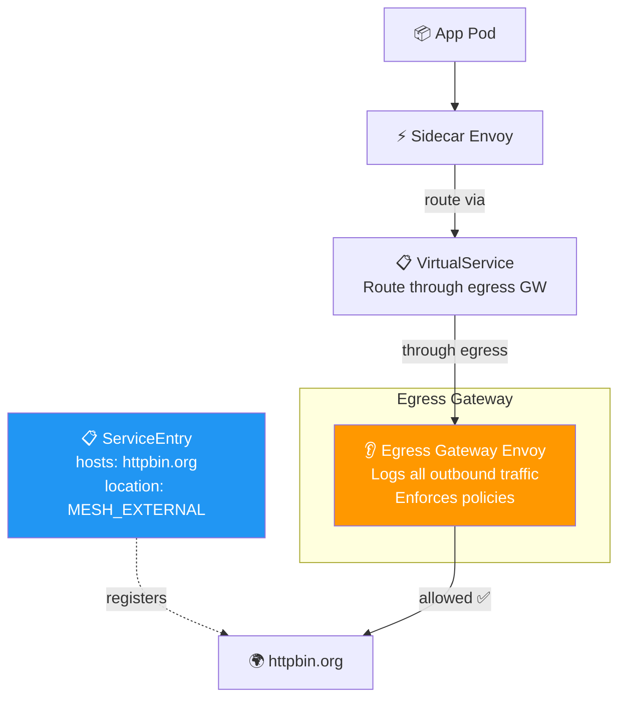
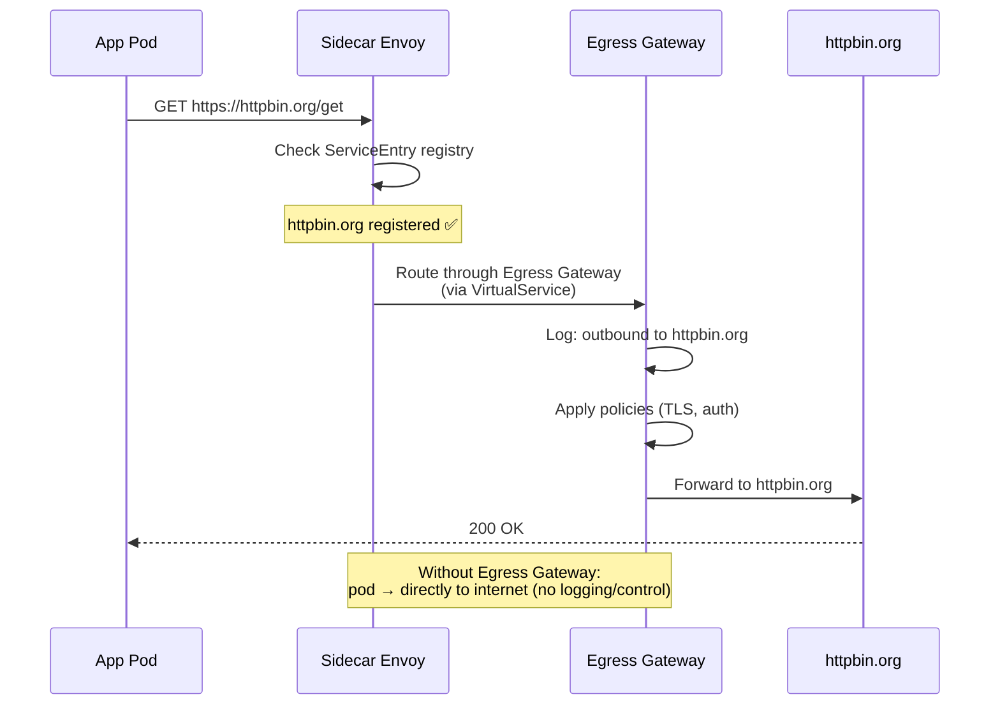

# Egress Traffic — Diagrams

## Overall Architecture

## ALLOW_ANY vs REGISTRY_ONLY

## ServiceEntry — How External Services Are Registered

## Request Flow Decision — Sequence

## Security Comparison

## Migration Strategy

## Ingress vs Egress Gateway

## Egress Gateway Flow

## End-to-End with Egress Gateway

