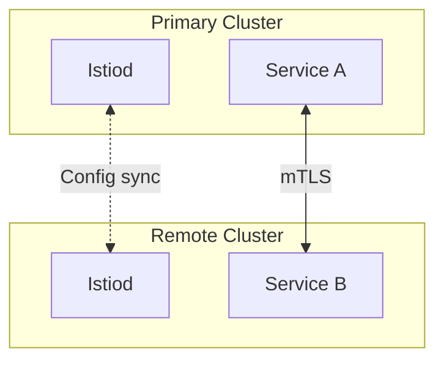

# Multi-Cluster Service Mesh (Concepts)

## Overview
Connect multiple Kubernetes clusters in a unified Istio service mesh.

## Architecture



## Deployment Models

| Model | Description |
|-------|-------------|
| **Primary-Remote** | One control plane, multiple data planes |
| **Multi-Primary** | Each cluster has its own control plane |
| **External Control Plane** | Control plane external to all clusters |

## Prerequisites

1. Multiple Kubernetes clusters
2. Network connectivity between clusters
3. Shared root CA or cert manager
4. DNS setup for cross-cluster resolution

## Setup Steps (High-Level)

### 1. Install Istio on Primary
```bash
istioctl install --set profile=minimal
```

### 2. Create Remote Cluster Secret
```bash
istioctl x create-remote-secret --name=cluster2 > remote-secret.yaml
kubectl apply -f remote-secret.yaml --context=cluster1
```

### 3. Install Istio on Remote
```bash
istioctl install --set profile=remote --context=cluster2
```

## Key Concepts

| Concept | Description |
|---------|-------------|
| **Endpoint Discovery** | Services discovered across clusters |
| **Locality LB** | Prefer local pods over remote |
| **Failover** | Route to remote if local unavailable |

## Note
This is a conceptual example. Multi-cluster requires actual multi-cluster setup.
See: https://istio.io/docs/setup/install/multicluster/
