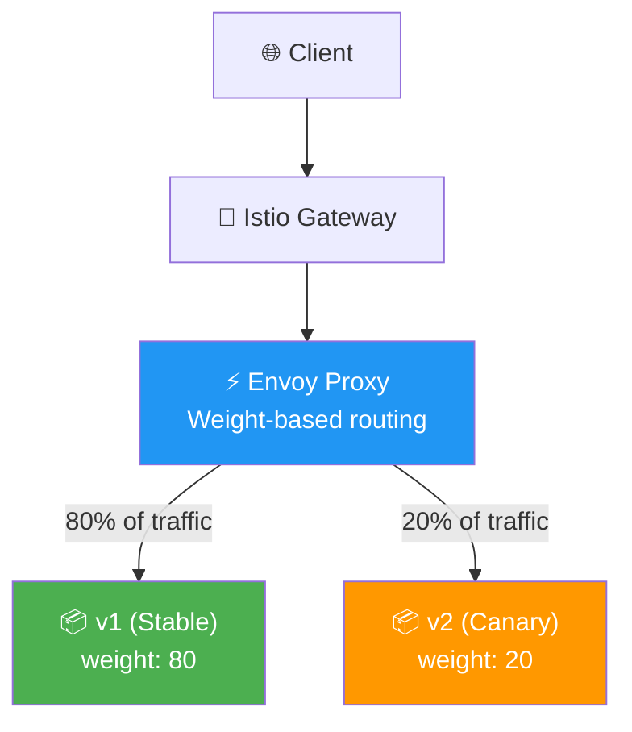
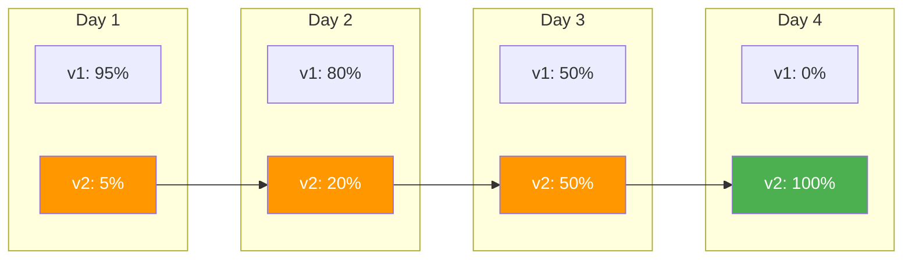
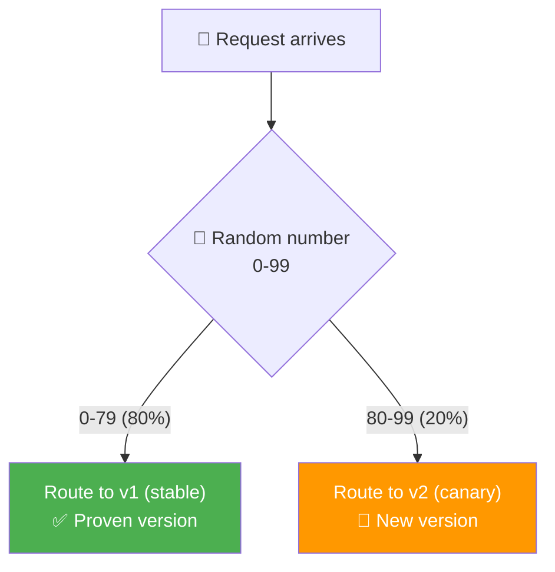
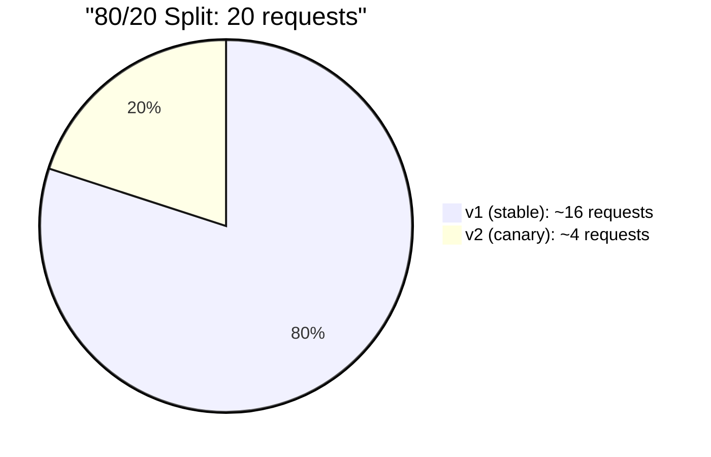
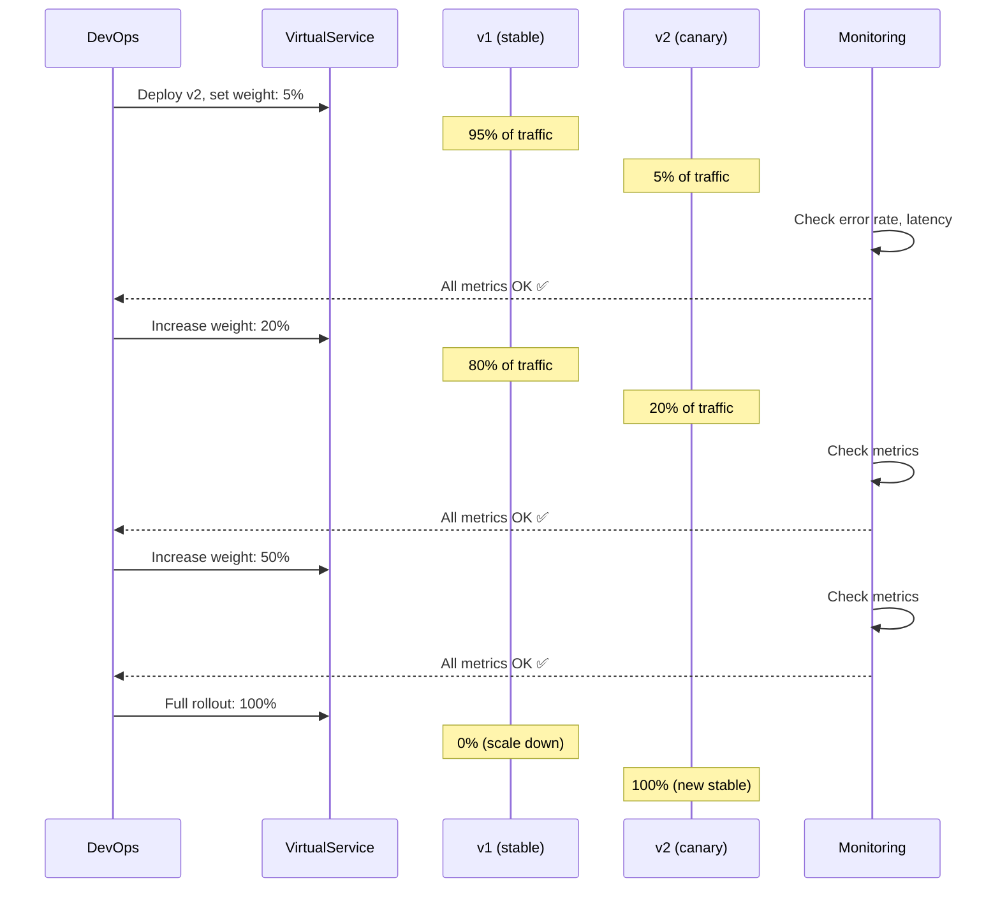
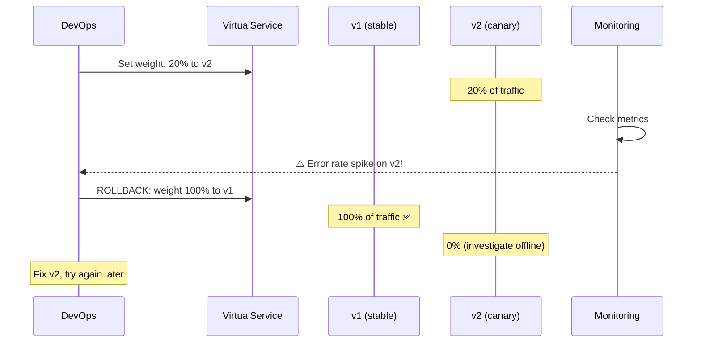
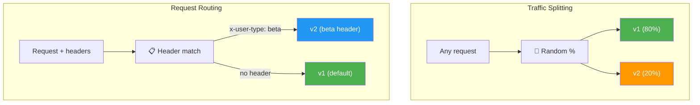
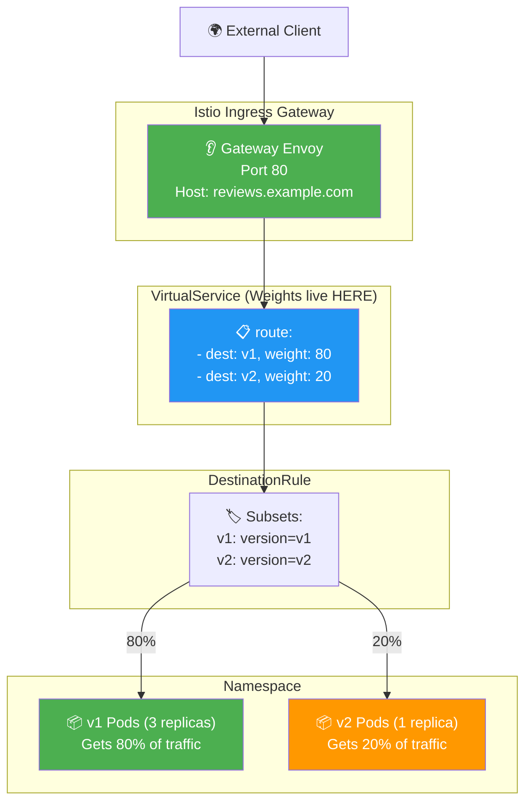
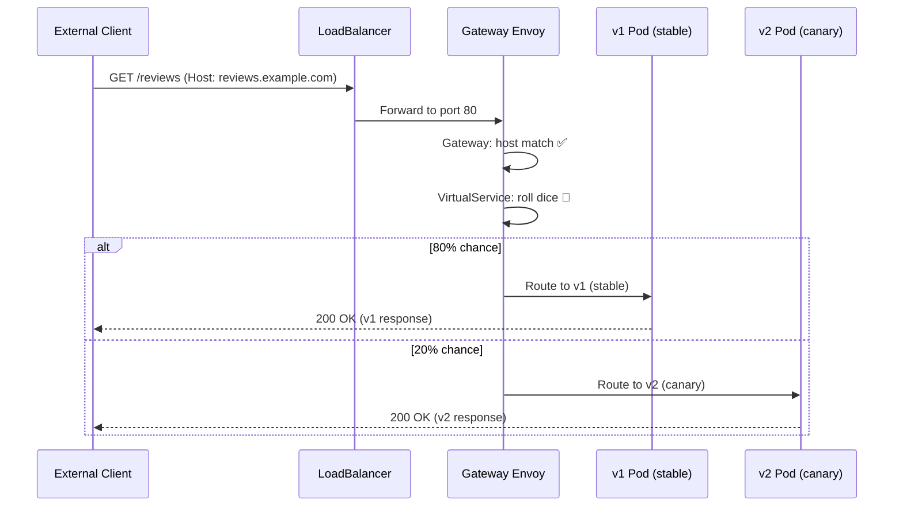

# Traffic Splitting (Canary) — Diagrams

## Overall Architecture

## Gradual Rollout Strategy

## Weight-Based Routing Decision

## Traffic Distribution Over 20 Requests

## Canary Deploy — Sequence

## Rollback Scenario

## Traffic Splitting vs Request Routing

## Gateway + Full Resource Chain

## End-to-End with Gateway

