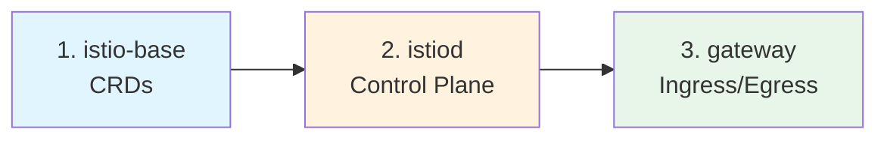
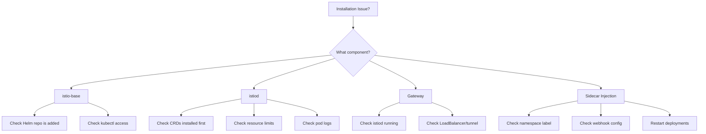
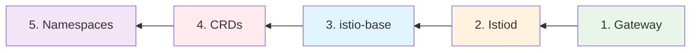

# Istio Installation Guide with Helm

> **Version**: This guide uses **Istio 1.29.0** (Latest as of February 2026)
>
> **Reference**: [Official Istio Helm Installation Documentation](https://istio.io/latest/docs/setup/install/helm/)

## 📋 Table of Contents

1. [Introduction to Istio](#introduction-to-istio)
2. [Prerequisites](#prerequisites)
3. [Installation Steps](#installation-steps)
4. [Verification](#verification)
5. [Enabling Sidecar Injection](#enabling-sidecar-injection)
6. [Troubleshooting](#troubleshooting)
7. [Uninstallation](#uninstallation)
8. [Configuration Options](#configuration-options)

---

## Introduction to Istio

### What is Istio?

**Istio** is an open-source **service mesh** that provides a uniform way to secure, connect, and observe microservices. It works by deploying a small proxy (called **Envoy**) alongside each of your application pods, forming a mesh of interconnected proxies that handle all network communication.

### Why Use Istio?

| Challenge Without Istio | Solution With Istio |
|------------------------|---------------------|
| Manual load balancing between services | Automatic, intelligent load balancing |
| No visibility into service-to-service traffic | Full observability with metrics, traces, logs |
| Complex mTLS setup between services | Automatic mutual TLS encryption |
| Manual retry/timeout logic in code | Configurable retries, timeouts, circuit breakers |
| Difficult A/B testing and canary deployments | Traffic splitting and routing rules |
| No rate limiting or access control | Built-in authorization policies |

### How Does Istio Work?

```
┌─────────────────────────────────────────────────────────────────────────────┐
│                        Istio Service Mesh Architecture                       │
├─────────────────────────────────────────────────────────────────────────────┤
│                                                                             │
│   ┌─────────────────────────────────────────────────────────────────────┐   │
│   │                     CONTROL PLANE (istiod)                          │   │
│   │                                                                     │   │
│   │  ┌──────────┐   ┌──────────┐   ┌──────────┐   ┌──────────┐          │   │
│   │  │  Pilot   │   │ Citadel  │   │  Galley  │   │   Mixer  │          │   │
│   │  │(Traffic) │   │(Security)│   │ (Config) │   │(Telemetry│          │   │
│   │  └────┬─────┘   └────┬─────┘   └────┬─────┘   └────┬─────┘          │   │
│   │       │              │              │              │                │   │
│   └───────┼──────────────┼──────────────┼──────────────┼────────────────┘   │
│           │              │              │              │                    │
│           └──────────────┴──────┬───────┴──────────────┘                    │
│                                 │ xDS API (Config Updates)                  │
│                                 ▼                                           │
│   ┌─────────────────────────────────────────────────────────────────────┐   │
│   │                      DATA PLANE (Envoy Proxies)                     │   │
│   │                                                                     │   │
│   │  ┌──────────────────┐     ┌──────────────────┐                      │   │
│   │  │     Pod A        │     │     Pod B        │                      │   │
│   │  │  ┌───────────┐   │     │  ┌───────────┐   │                      │   │
│   │  │  │ Your App  │   │     │  │ Your App  │   │                      │   │
│   │  │  └─────┬─────┘   │     │  └─────┬─────┘   │                      │   │
│   │  │        │         │     │        │         │                      │   │
│   │  │  ┌─────▼─────┐   │     │  ┌─────▼─────┐   │                      │   │
│   │  │  │  Envoy    │◄──┼─────┼──►  Envoy    │   │                      │   │
│   │  │  │ (sidecar) │   │     │  │ (sidecar) │   │                      │   │
│   │  │  └───────────┘   │     │  └───────────┘   │                      │   │
│   │  └──────────────────┘     └──────────────────┘                      │   │
│   │                                                                     │   │
│   └─────────────────────────────────────────────────────────────────────┘   │
│                                                                             │
└─────────────────────────────────────────────────────────────────────────────┘
```

### Key Concepts Explained

| Concept | Description |
|---------|-------------|
| **Service Mesh** | A dedicated infrastructure layer that handles service-to-service communication, providing features like load balancing, authentication, and observability without changing application code. |
| **Sidecar Proxy** | An Envoy proxy container automatically injected into each pod. It intercepts all network traffic to/from the application container. |
| **Control Plane** | The brain of Istio (`istiod`) that manages and configures all the sidecar proxies in the mesh. |
| **Data Plane** | The collection of Envoy sidecar proxies that handle actual network traffic between services. |
| **CRDs** | Custom Resource Definitions that extend Kubernetes with Istio-specific resources like `VirtualService`, `Gateway`, and `DestinationRule`. |

---

## Prerequisites

Before installing Istio, ensure you have the following components properly configured:

### 1. Kubernetes Cluster

A running Kubernetes cluster is the foundation for Istio. Istio runs as a set of Kubernetes resources and requires a functional cluster.

```bash
# Verify your cluster is running and accessible
kubectl cluster-info

# Check Kubernetes version (Istio 1.29 supports K8s 1.29-1.32)
kubectl version --short
```

> [!NOTE]
> **Why version compatibility matters**: Istio uses Kubernetes APIs that may change between versions. Running an unsupported Kubernetes version can lead to unexpected behavior or failed installations.

**Common Kubernetes Environments:**

| Environment | Best For | Setup Command |
|------------|----------|---------------|
| Minikube | Local development | `minikube start --memory=4096 --cpus=2` |
| Kind | CI/CD pipelines | `kind create cluster` |
| Docker Desktop | Windows/Mac development | Enable in Docker Desktop settings |
| GKE/EKS/AKS | Production | Cloud provider console or CLI |

> [!TIP]
> For local development, allocate at least **4GB RAM** and **2 CPUs** to your cluster. Istio's control plane needs resources to run smoothly.

### 2. Helm 4.x Installed

**Helm** is a package manager for Kubernetes that simplifies deploying complex applications. We use Helm because it:
- Manages installation order and dependencies
- Provides easy upgrades and rollbacks
- Allows configuration customization via values

```bash
# Check Helm version (requires Helm 4.x)
helm version

# Expected: version.BuildInfo{Version:"v4.1.0", ...}
```

**If Helm is not installed:**
```bash
# Linux/macOS - Install via script
curl https://raw.githubusercontent.com/helm/helm/main/scripts/get-helm-3 | bash

# Or download from: https://github.com/helm/helm/releases
```

### 3. Add Istio Helm Repository

Helm repositories are like package registries. We need to add Istio's official repository to access their Helm charts.

```bash
# Add the official Istio Helm repository
helm repo add istio https://istio-release.storage.googleapis.com/charts
```

**Command Breakdown:**
| Part | Meaning |
|------|---------|
| `helm repo add` | Add a new Helm repository |
| `istio` | Local alias name for this repository |
| `https://istio-release...` | URL where the Helm charts are hosted |

```bash
# Update repository cache to fetch latest chart information
helm repo update

# Verify available charts
helm search repo istio
```

**Expected output:**
```
NAME                    CHART VERSION   APP VERSION     DESCRIPTION
istio/base              1.29.0          1.29.0          Helm chart for deploying Istio cluster resources...
istio/istiod            1.29.0          1.29.0          Helm chart for istio control plane
istio/gateway           1.29.0          1.29.0          Helm chart for deploying Istio gateways
istio/cni               1.29.0          1.29.0          Helm chart for istio-cni components
istio/ztunnel           1.29.0          1.29.0          Helm chart for istio ztunnel components
```

**Understanding the Helm Charts:**

| Chart | Purpose | Required? |
|-------|---------|-----------|
| `istio/base` | Installs CRDs (Custom Resource Definitions) | ✅ Yes |
| `istio/istiod` | Installs the control plane (Pilot, Citadel, Galley) | ✅ Yes |
| `istio/gateway` | Installs ingress/egress gateways | ⚠️ Optional (but recommended) |
| `istio/cni` | CNI plugin for sidecar injection | ❌ Optional (advanced) |
| `istio/ztunnel` | For Ambient mesh mode (L4 only) | ❌ Optional (alternative to sidecar) |

---

## Installation Steps

### Installation Order (Important!)

> [!CAUTION]
> **Order matters!** You must install components in this sequence:
> 1. **istio-base** → CRDs must exist before other components reference them
> 2. **istiod** → Control plane needs CRDs to be installed
> 3. **gateway** → Needs istiod to configure it



### Architecture Overview

Istio installation consists of three main components:

```
┌─────────────────────────────────────────────────────────────────────────┐
│                           Istio Components                               │
├─────────────────────────────────────────────────────────────────────────┤
│                                                                         │
│   1. istio-base (CRDs)                                                  │
│      └── Custom Resource Definitions (VirtualService, Gateway, etc.)   │
│      └── Installed in: istio-system namespace                          │
│      └── No pods - just Kubernetes API extensions                      │
│                                                                         │
│   2. istiod (Control Plane)                                             │
│      └── Pilot: Traffic management & service discovery                 │
│      └── Citadel: Certificate management & mTLS                        │
│      └── Galley: Configuration validation                              │
│      └── Installed in: istio-system namespace                          │
│                                                                         │
│   3. istio-gateway (Data Plane - Optional)                              │
│      └── Ingress Gateway: Routes external traffic into the mesh        │
│      └── Egress Gateway: Controls/monitors outgoing traffic            │
│      └── Installed in: istio-ingress namespace (recommended)           │
│                                                                         │
└─────────────────────────────────────────────────────────────────────────┘
```

---

### Step 1: Create the istio-system Namespace

```bash
kubectl create namespace istio-system
```

**Why a dedicated namespace?**
- **Isolation**: Keeps Istio components separate from your applications
- **RBAC**: Easier to define access controls for Istio resources
- **Resource Quotas**: Can limit resources used by the service mesh
- **Visibility**: Clear separation in monitoring and logging tools

---

### Step 2: Install Istio Base (CRDs)

**What are CRDs?**

CRDs (Custom Resource Definitions) extend Kubernetes with new resource types. After installing `istio-base`, you can create resources like:

| CRD | Purpose | Example Use Case |
|-----|---------|-----------------|
| `VirtualService` | Define traffic routing rules | Route 90% traffic to v1, 10% to v2 |
| `DestinationRule` | Configure load balancing & connection pools | Set circuit breaker limits |
| `Gateway` | Configure external entry points | Expose a service via HTTPS |
| `ServiceEntry` | Add external services to mesh | Include external database in mesh |
| `PeerAuthentication` | Configure mTLS policies | Require mutual TLS for namespace |
| `AuthorizationPolicy` | Define access control rules | Allow only specific services to call API |

**Installation Command:**

```bash
helm install istio-base istio/base \
  -n istio-system \
  --version 1.29.0 \
  --set defaultRevision=default \
  --wait
```

**Command Breakdown:**

| Flag | Purpose | Why It's Used |
|------|---------|--------------|
| `helm install` | Install a new Helm release | Creates resources in the cluster |
| `istio-base` | Release name | Used for `helm ls`, upgrades, uninstalls |
| `istio/base` | Chart name | From the `istio` repository we added |
| `-n istio-system` | Target namespace | Where resources will be created |
| `--version 1.29.0` | Chart version | Ensures reproducible installations |
| `--set defaultRevision=default` | Set the default revision | Required for webhook configuration |
| `--wait` | Wait for completion | Command blocks until resources are ready |

> [!IMPORTANT]
> The `--set defaultRevision=default` flag is **required** since Istio 1.17. Without it, the validating webhook won't be configured correctly, and you may see errors when creating Istio resources.

**Verify installation:**
```bash
helm ls -n istio-system

# Expected output:
# NAME        NAMESPACE     REVISION  STATUS    CHART         APP VERSION
# istio-base  istio-system  1         deployed  base-1.29.0   1.29.0
```

**Check CRDs are installed:**
```bash
kubectl get crd | grep istio

# Expected: You should see CRDs like:
# authorizationpolicies.security.istio.io
# destinationrules.networking.istio.io
# envoyfilters.networking.istio.io
# gateways.networking.istio.io
# peerauthentications.security.istio.io
# proxyconfigs.networking.istio.io
# requestauthentications.security.istio.io
# serviceentries.networking.istio.io
# sidecars.networking.istio.io
# telemetries.telemetry.istio.io
# virtualservices.networking.istio.io
# wasmplugins.extensions.istio.io
# workloadentries.networking.istio.io
# workloadgroups.networking.istio.io
```

> [!NOTE]
> The `istio-base` chart doesn't create any pods. It only registers CRDs and a validating webhook with Kubernetes.

---

### Step 3: Install Istiod (Control Plane)

**What is Istiod?**

`istiod` is the unified control plane for Istio. It consolidates multiple components that were previously separate:

```
┌─────────────────────────────────────────────────────────────────┐
│                        istiod Pod                                │
├─────────────────────────────────────────────────────────────────┤
│                                                                 │
│  ┌─────────────┐  ┌─────────────┐  ┌─────────────┐              │
│  │   Pilot     │  │   Citadel   │  │   Galley    │              │
│  │             │  │             │  │             │              │
│  │ • Service   │  │ • CA for    │  │ • Config    │              │
│  │   discovery │  │   mTLS certs│  │   validation│              │
│  │ • Traffic   │  │ • Certificate│ │ • Schema    │              │
│  │   management│  │   rotation  │  │   validation│              │
│  │ • xDS config│  │ • Workload  │  │             │              │
│  │   to Envoy  │  │   identity  │  │             │              │
│  └─────────────┘  └─────────────┘  └─────────────┘              │
│                                                                 │
└─────────────────────────────────────────────────────────────────┘
```

**Key Functions:**

| Component | Responsibility | In Practice |
|-----------|---------------|-------------|
| **Pilot** | Configures Envoy proxies | Translates your VirtualService YAML into Envoy xDS configuration |
| **Citadel** | Issues and rotates certificates | Every sidecar gets a certificate for mTLS automatically |
| **Galley** | Validates configuration | Rejects invalid VirtualService definitions before they cause problems |

**Installation Command:**

```bash
helm install istiod istio/istiod \
  -n istio-system \
  --version 1.29.0 \
  --wait
```

**Command Breakdown:**

| Flag | Purpose | Why It's Used |
|------|---------|--------------|
| `helm install` | Install a new Helm release | Creates resources in the cluster |
| `istiod` | Release name | Used for `helm ls`, upgrades, uninstalls |
| `istio/istiod` | Chart name | The control plane chart |
| `-n istio-system` | Target namespace | Same namespace as istio-base |
| `--version 1.29.0` | Chart version | Match the same version as istio-base |
| `--wait` | Wait for completion | Ensures istiod is running before continuing |

**Verify installation:**
```bash
# Check Helm release
helm ls -n istio-system

# Check istiod pod is running
kubectl get pods -n istio-system

# Expected output:
# NAME                      READY   STATUS    RESTARTS   AGE
# istiod-xxxxxxxxxx-xxxxx   1/1     Running   0          2m
```

**Get detailed status:**
```bash
helm status istiod -n istio-system
```

> [!TIP]
> **What does istiod actually create?**
> - A Deployment with the istiod pod
> - A Service for sidecar proxies to communicate with the control plane
> - ServiceAccount, ClusterRole, and ClusterRoleBinding for RBAC
> - A MutatingWebhookConfiguration for automatic sidecar injection

---

### Step 4: Install Istio Ingress Gateway (Optional but Recommended)

**What is the Ingress Gateway?**

The Ingress Gateway is the entry point for external traffic into your service mesh. Without it, external users cannot reach your services through Istio.

```
┌────────────────────────────────────────────────────────────────────────┐
│                     Traffic Flow with Ingress Gateway                   │
├────────────────────────────────────────────────────────────────────────┤
│                                                                        │
│   Internet                                                             │
│      │                                                                 │
│      ▼                                                                 │
│   ┌──────────────────────┐                                             │
│   │ Load Balancer        │  ← Cloud provider's load balancer           │
│   │ (External IP)        │                                             │
│   └──────────┬───────────┘                                             │
│              │                                                         │
│              ▼                                                         │
│   ┌──────────────────────┐                                             │
│   │ Istio Ingress Gateway│  ← Envoy proxy that routes based on        │
│   │ (istio-ingress ns)   │    Host, Path, Headers, etc.               │
│   └──────────┬───────────┘                                             │
│              │ Uses Gateway + VirtualService rules                     │
│              ▼                                                         │
│   ┌──────────────────────┐                                             │
│   │ Service A (with      │  ← Your application pods                    │
│   │ Envoy sidecar)       │    with sidecar proxies                     │
│   └──────────────────────┘                                             │
│                                                                        │
└────────────────────────────────────────────────────────────────────────┘
```

**Why use a separate namespace?**

| Reason | Explanation |
|--------|-------------|
| **Security** | Different security policies for public-facing vs internal components |
| **Resource Isolation** | Don't let control plane issues affect traffic routing |
| **Multiple Gateways** | Can have different gateways for different purposes (internal, external) |
| **Lifecycle Management** | Upgrade gateways independently of the control plane |

**Installation Commands:**

```bash
# Create dedicated namespace for ingress
kubectl create namespace istio-ingress
```

```bash
# Label namespace for sidecar injection (recommended)
kubectl label namespace istio-ingress istio-injection=enabled
```

> [!NOTE]
> **Why label the ingress namespace?** Although the gateway itself is an Envoy proxy, enabling injection ensures any future pods in this namespace will also be part of the mesh.

```bash
# Install the gateway
helm install istio-ingressgateway istio/gateway \
  -n istio-ingress \
  --version 1.29.0 \
  --wait
```

**Command Breakdown:**

| Flag | Purpose | Why It's Used |
|------|---------|--------------|
| `helm install` | Install a new Helm release | Creates resources in the cluster |
| `istio-ingressgateway` | Release name | Descriptive name for this gateway |
| `istio/gateway` | Chart name | Generic gateway chart (can be used for ingress or egress) |
| `-n istio-ingress` | Target namespace | Separate from control plane |
| `--version 1.29.0` | Chart version | Match other Istio components |
| `--wait` | Wait for completion | Ensures gateway is ready before continuing |

**Verify installation:**
```bash
# Check gateway pod
kubectl get pods -n istio-ingress

# Expected output:
# NAME                                    READY   STATUS    RESTARTS   AGE
# istio-ingressgateway-xxxxxxxxxx-xxxxx   1/1     Running   0          1m

# Check gateway service
kubectl get svc -n istio-ingress

# Expected output:
# NAME                   TYPE           CLUSTER-IP      EXTERNAL-IP   PORT(S)
# istio-ingressgateway   LoadBalancer   10.x.x.x        <pending>     15021:xxxxx/TCP,80:xxxxx/TCP,443:xxxxx/TCP
```

**Understanding Gateway Ports:**

| Port | Protocol | Purpose |
|------|----------|---------|
| 15021 | HTTP | Health check endpoint for load balancers |
| 80 | HTTP | Standard HTTP traffic |
| 443 | HTTPS | TLS-encrypted traffic |

> [!TIP]
> **Minikube Users**: The EXTERNAL-IP will show `<pending>` because Minikube doesn't have a cloud load balancer. Run `minikube tunnel` in a separate terminal to allocate an IP, or access via NodePort.

---

## Verification

### Verify All Components

Run this comprehensive verification script to ensure everything is properly installed:

```bash
echo "=== Helm Releases ==="
helm ls -n istio-system
helm ls -n istio-ingress

echo "=== Istio Pods ==="
kubectl get pods -n istio-system
kubectl get pods -n istio-ingress

echo "=== Istio Services ==="
kubectl get svc -n istio-system
kubectl get svc -n istio-ingress

echo "=== Istio CRDs ==="
kubectl get crd | grep istio | wc -l
echo "Istio CRDs installed"
```

### Expected Final State

| Component | Namespace | Pods | Status | What It Does |
|-----------|-----------|------|--------|--------------|
| istio-base | istio-system | (CRDs only) | deployed | Extends Kubernetes API |
| istiod | istio-system | 1/1 Running | deployed | Controls the mesh |
| istio-ingressgateway | istio-ingress | 1/1 Running | deployed | Routes external traffic |

### Quick Health Check

```bash
# One-line health check
kubectl get pods -n istio-system -o wide && \
kubectl get pods -n istio-ingress -o wide && \
echo "✅ All Istio components are running!"
```

---

## Enabling Sidecar Injection

### What is Sidecar Injection?

**Sidecar injection** is the process of adding an Envoy proxy container to your application pods. This proxy intercepts all network traffic and enables Istio features.

```
┌──────────────────────────────────────────────────────────────────────────┐
│                    Pod Before vs After Sidecar Injection                  │
├──────────────────────────────────────────────────────────────────────────┤
│                                                                          │
│   BEFORE (1 container)              AFTER (2 containers)                 │
│   ┌─────────────────┐               ┌─────────────────────────────────┐  │
│   │     Pod         │               │            Pod                  │  │
│   │  ┌───────────┐  │               │  ┌───────────┐  ┌────────────┐  │  │
│   │  │ Your App  │  │      →→→      │  │ Your App  │  │   Envoy    │  │  │
│   │  │           │  │               │  │           │  │  (sidecar) │  │  │
│   │  └───────────┘  │               │  └─────┬─────┘  └──────┬─────┘  │  │
│   │                 │               │        │                │       │  │
│   └─────────────────┘               │        └────────┬───────┘       │  │
│                                     │                 │               │  │
│   All traffic goes                  └─────────────────┼───────────────┘  │
│   directly out                                        │                  │
│                                     All traffic flows through Envoy      │
│                                     (mTLS, metrics, routing applied)     │
│                                                                          │
└──────────────────────────────────────────────────────────────────────────┘
```

**What Happens During Injection:**

1. You deploy a pod (via Deployment, StatefulSet, etc.)
2. Kubernetes API calls the Istio mutating webhook
3. Istiod modifies the pod spec to add:
   - **init container** (`istio-init`): Sets up iptables rules to redirect traffic
   - **sidecar container** (`istio-proxy`): The Envoy proxy
4. Pod starts with both your application and the sidecar

### Method 1: Namespace Label (Recommended)

This is the easiest and most common approach. All pods in a labeled namespace automatically get sidecars.

```bash
# Enable automatic injection for a namespace
kubectl label namespace <your-namespace> istio-injection=enabled

# Verify the label was applied
kubectl get namespace -L istio-injection
```

**Example Output:**
```
NAME              STATUS   AGE   ISTIO-INJECTION
default           Active   10d   
istio-system      Active   1h    
istio-ingress     Active   1h    enabled
my-app            Active   5m    enabled
```

> [!NOTE]
> **Already running pods won't get sidecars!** You need to restart them:
> ```bash
> kubectl rollout restart deployment <deployment-name> -n <namespace>
> ```

### Method 2: Pod Annotation

For fine-grained control, you can enable/disable injection per pod using annotations:

**Enable injection for a specific pod:**
```yaml
apiVersion: v1
kind: Pod
metadata:
  name: my-app
  annotations:
    sidecar.istio.io/inject: "true"    # Inject sidecar even if namespace is not labeled
spec:
  containers:
    - name: my-app
      image: my-app:latest
```

**Disable injection for a specific pod:**
```yaml
metadata:
  annotations:
    sidecar.istio.io/inject: "false"   # Skip injection even if namespace is labeled
```

### Method 3: Revision-Based Injection (Advanced)

For canary upgrades of Istio itself, you can use revision labels:

```bash
# Label namespace for a specific Istio revision
kubectl label namespace <namespace> istio.io/rev=1-28
```

### Verify Injection is Working

```bash
# Deploy a test pod
kubectl run test-pod --image=nginx -n <your-namespace>

# Check if sidecar was injected (should show 2/2 containers)
kubectl get pods -n <your-namespace>

# Expected: 2/2 READY means sidecar was injected
# NAME       READY   STATUS    RESTARTS   AGE
# test-pod   2/2     Running   0          30s
```

---

## Troubleshooting

This section covers common issues you may encounter during Istio installation and operation, with root cause analysis and solutions.

### Troubleshooting Decision Tree



### Issue: Istiod Not Starting

**Symptoms:**
- `istiod` pod stuck in `Pending`, `CrashLoopBackOff`, or `Error` state
- Helm install command hangs

**Diagnostic Commands:**

```bash
# Check pod status and events
kubectl describe pod -n istio-system -l app=istiod

# Check logs for errors
kubectl logs -n istio-system -l app=istiod

# Check if istiod deployment exists
kubectl get deployment -n istio-system istiod
```

**Common Causes and Solutions:**

| Cause | Symptoms | Solution |
|-------|----------|----------|
| **CRDs not installed** | Error about missing CRD types | Install `istio-base` first |
| **Insufficient resources** | Pod stuck in `Pending` | Increase node resources or reduce istiod limits |
| **Network policies** | Pod starts but logs show connection errors | Check/adjust network policies |
| **Wrong namespace** | Deployment not found | Ensure using `-n istio-system` |
| **Image pull error** | `ImagePullBackOff` status | Check internet connectivity and registry access |

> [!TIP]
> **Quick Fix for Resource Issues:**
> ```bash
> # Check node resources
> kubectl top nodes
> 
> # Deploy istiod with reduced resources
> helm install istiod istio/istiod -n istio-system \
>   --set pilot.resources.requests.memory=256Mi \
>   --set pilot.resources.requests.cpu=100m
> ```

### Issue: Sidecar Not Injecting

**Symptoms:**
- Pods show `1/1` containers instead of `2/2`
- No Envoy proxy in pod

**Diagnostic Commands:**

```bash
# Verify namespace label
kubectl get namespace <namespace> -o yaml | grep istio-injection

# Check if MutatingWebhookConfiguration exists
kubectl get mutatingwebhookconfiguration | grep istio

# Verify webhook is targeting the right namespace
kubectl get mutatingwebhookconfiguration istio-sidecar-injector -o yaml
```

**Common Causes and Solutions:**

| Cause | Check | Solution |
|-------|-------|----------|
| **Namespace not labeled** | `kubectl get ns -L istio-injection` | `kubectl label ns <ns> istio-injection=enabled` |
| **Pod annotation blocks injection** | Check for `sidecar.istio.io/inject: "false"` | Remove the annotation |
| **Istiod not running** | `kubectl get pods -n istio-system` | Fix istiod first |
| **Webhook not registered** | `kubectl get mutatingwebhookconfiguration` | Reinstall istiod |
| **Pod created before labeling** | Check pod creation time | `kubectl rollout restart deployment <name>` |

> [!IMPORTANT]
> **Existing pods don't automatically get sidecars!** After labeling a namespace, you must restart pods:
> ```bash
> # Restart all deployments in a namespace
> kubectl rollout restart deployment -n <namespace>
> ```

### Issue: CRD Version Mismatch

**Symptoms:**
- Errors like `no matches for kind "VirtualService" in version "networking.istio.io/v1alpha3"`
- Helm upgrade fails with CRD conflicts

**Solution:**

```bash
# Upgrade istio-base to match istiod version
helm upgrade istio-base istio/base -n istio-system --version 1.29.0

# If upgrade fails due to ownership issues, clean and reinstall:
# WARNING: This deletes all Istio resources!
helm uninstall istiod -n istio-system
helm uninstall istio-base -n istio-system
kubectl get crd | grep istio | awk '{print $1}' | xargs kubectl delete crd
# Then reinstall from Step 2
```

### Issue: Gateway External-IP Pending (Minikube)

**Symptoms:**
- Gateway service shows `<pending>` for `EXTERNAL-IP`
- Cannot access services externally

**Why This Happens:**

Minikube doesn't have a cloud load balancer. The `LoadBalancer` service type needs cloud infrastructure to provision an external IP.

**Solutions:**

```bash
# Option 1: Use minikube tunnel (recommended)
# Run in a separate terminal - this creates a network route
minikube tunnel
```

```bash
# Option 2: Access via NodePort
minikube service istio-ingressgateway -n istio-ingress --url
```

```bash
# Option 3: Install with NodePort type instead
helm install istio-ingressgateway istio/gateway \
  -n istio-ingress \
  --set service.type=NodePort
```

### Issue: Services Not Accessible Through Gateway

**Symptoms:**
- Gateway and pods are running, but requests return 404 or timeout
- VirtualService exists but traffic doesn't route

**Diagnostic Commands:**

```bash
# Check if Gateway resource is configured
kubectl get gateway -A

# Check if VirtualService points to correct hosts
kubectl get virtualservice -A -o yaml

# Check istio-proxy logs in the gateway
kubectl logs -n istio-ingress -l app=istio-ingressgateway -c istio-proxy
```

**Common Causes:**

| Cause | Solution |
|-------|----------|
| Gateway and VirtualService don't match | Ensure `gateways` field in VirtualService matches Gateway name |
| Wrong port specified | Check service ports and Gateway port configuration |
| Host mismatch | Verify `hosts` field matches incoming request Host header |
| Service in different namespace | Use full service name: `service.namespace.svc.cluster.local` |

---

## Uninstallation

**Order matters!** Uninstall components in reverse order of installation to avoid orphaned resources.



### Step 1: Uninstall Gateway (if installed)

```bash
helm uninstall istio-ingressgateway -n istio-ingress
kubectl delete namespace istio-ingress
```

> [!NOTE]
> If you have other services in the `istio-ingress` namespace, delete only the Helm release and leave the namespace.

### Step 2: Uninstall Istiod

```bash
helm uninstall istiod -n istio-system
```

**What this removes:**
- The istiod Deployment and Service
- MutatingWebhookConfiguration (no new sidecars will be injected)
- RBAC resources (ServiceAccount, ClusterRole, ClusterRoleBinding)

> [!WARNING]
> After uninstalling istiod, existing sidecars will continue to run but won't receive configuration updates. This can cause issues with service discovery.

### Step 3: Uninstall Istio Base

```bash
helm uninstall istio-base -n istio-system
```

**What this removes:**
- ValidatingWebhookConfiguration
- Some cluster-level resources

### Step 4: Delete CRDs (Optional)

> [!CAUTION]
> **This will delete ALL Istio custom resources!** Including:
> - All VirtualServices
> - All DestinationRules
> - All Gateways
> - All AuthorizationPolicies
> - All PeerAuthentications
> 
> **This action is irreversible!**

```bash
kubectl get crd | grep istio | awk '{print $1}' | xargs kubectl delete crd
```

### Step 5: Delete Namespace

```bash
kubectl delete namespace istio-system
```

### Complete Uninstallation Script

```bash
#!/bin/bash
# Complete Istio uninstallation script

echo "🚀 Starting Istio uninstallation..."

echo "Step 1: Uninstalling gateway..."
helm uninstall istio-ingressgateway -n istio-ingress 2>/dev/null || echo "Gateway not found, skipping"

echo "Step 2: Uninstalling istiod..."
helm uninstall istiod -n istio-system 2>/dev/null || echo "Istiod not found, skipping"

echo "Step 3: Uninstalling istio-base..."
helm uninstall istio-base -n istio-system 2>/dev/null || echo "istio-base not found, skipping"

echo "Step 4: Deleting namespaces..."
kubectl delete namespace istio-ingress 2>/dev/null || echo "istio-ingress namespace not found"
kubectl delete namespace istio-system 2>/dev/null || echo "istio-system namespace not found"

echo "Step 5: Deleting CRDs..."
kubectl get crd | grep istio | awk '{print $1}' | xargs kubectl delete crd 2>/dev/null

echo "✅ Istio uninstallation complete!"
```

---

## Configuration Options

### Understanding Helm Values

Helm charts are configured using **values**. You can override default values in several ways:

| Method | Use Case | Example |
|--------|----------|---------|
| `--set key=value` | Quick, single values | `--set pilot.replicas=2` |
| `-f values.yaml` | Complex, multiple values | `-f production-values.yaml` |
| Combining both | Override file values | `-f values.yaml --set pilot.replicas=3` |

### View Available Configuration

```bash
# Show all configurable values for istiod (very long output!)
helm show values istio/istiod

# Save to file for easier reading
helm show values istio/istiod > istiod-values-reference.yaml

# Show all configurable values for gateway
helm show values istio/gateway
```

> [!TIP]
> The output of `helm show values` shows all configurable options with their defaults. Use this as a reference when customizing.

### Common Customizations

#### Custom Resource Limits for Istiod

**Why customize resources?**
- **Development/Testing**: Reduce resources to run on smaller clusters
- **Production**: Increase resources for high traffic or many services

```bash
helm install istiod istio/istiod -n istio-system \
  --set pilot.resources.requests.cpu=500m \
  --set pilot.resources.requests.memory=512Mi \
  --set pilot.resources.limits.cpu=1000m \
  --set pilot.resources.limits.memory=1Gi \
  --wait
```

**Understanding the values:**

| Setting | Description | Default |
|---------|-------------|---------|
| `pilot.resources.requests.cpu` | Minimum CPU guaranteed | 500m |
| `pilot.resources.requests.memory` | Minimum memory guaranteed | 2Gi |
| `pilot.resources.limits.cpu` | Maximum CPU allowed | — |
| `pilot.resources.limits.memory` | Maximum memory allowed | — |

#### Custom Gateway Service Type

```bash
# Use NodePort instead of LoadBalancer (useful for on-prem or local dev)
helm install istio-ingressgateway istio/gateway -n istio-ingress \
  --set service.type=NodePort \
  --wait
```

**When to use each service type:**

| Type | Use Case | Access Method |
|------|----------|---------------|
| `LoadBalancer` | Cloud environments (GKE, EKS, AKS) | External IP from cloud |
| `NodePort` | On-premises, Minikube | `<NodeIP>:<NodePort>` |
| `ClusterIP` | Internal-only gateway | Only from within cluster |

#### High Availability Configuration

For production environments, enable autoscaling:

```bash
helm install istiod istio/istiod -n istio-system \
  --set pilot.autoscaleEnabled=true \
  --set pilot.autoscaleMin=2 \
  --set pilot.autoscaleMax=5 \
  --wait
```

#### Enable Access Logging

Access logs are useful for debugging but can be verbose:

```bash
helm install istiod istio/istiod -n istio-system \
  --set meshConfig.accessLogFile=/dev/stdout \
  --wait
```

### Using Values File (Recommended for Production)

For complex configurations, use a values file:

**Create `istiod-values.yaml`:**
```yaml
# Production configuration for istiod
pilot:
  # Resource configuration
  resources:
    requests:
      cpu: 500m
      memory: 512Mi
    limits:
      cpu: 1000m
      memory: 1Gi
  
  # Enable autoscaling for high availability
  autoscaleEnabled: true
  autoscaleMin: 2    # Always run at least 2 replicas
  autoscaleMax: 5    # Scale up to 5 under load

# Global settings affect all Istio components
global:
  # Sidecar proxy configuration (affects all injected pods)
  proxy:
    resources:
      requests:
        cpu: 100m
        memory: 128Mi
      limits:
        cpu: 200m
        memory: 256Mi

# Mesh-wide configuration
meshConfig:
  # Enable metrics for all services
  enablePrometheusMerge: true
  
  # Default timeout for services
  defaultConfig:
    connectTimeout: 10s
    holdApplicationUntilProxyStarts: true
```

**Install with values file:**
```bash
helm install istiod istio/istiod -n istio-system -f istiod-values.yaml --wait
```

**Create `gateway-values.yaml`:**
```yaml
# Production configuration for gateway
service:
  type: LoadBalancer
  
  # Cloud provider annotations (example for AWS)
  annotations:
    service.beta.kubernetes.io/aws-load-balancer-type: nlb

# Run multiple replicas for high availability
replicaCount: 2

resources:
  requests:
    cpu: 100m
    memory: 128Mi
  limits:
    cpu: 2000m
    memory: 1Gi
```

---

## Quick Reference

### One-Line Installation

```bash
# Complete installation in one go (Istio 1.29.0)
kubectl create namespace istio-system && \
helm install istio-base istio/base -n istio-system --version 1.29.0 --set defaultRevision=default --wait && \
helm install istiod istio/istiod -n istio-system --version 1.29.0 --wait && \
kubectl create namespace istio-ingress && \
kubectl label namespace istio-ingress istio-injection=enabled && \
helm install istio-ingressgateway istio/gateway -n istio-ingress --version 1.29.0 --wait
```

### One-Line Uninstallation

```bash
# Complete uninstallation
helm uninstall istio-ingressgateway -n istio-ingress 2>/dev/null; \
helm uninstall istiod -n istio-system 2>/dev/null; \
helm uninstall istio-base -n istio-system 2>/dev/null; \
kubectl delete namespace istio-ingress istio-system 2>/dev/null; \
kubectl get crd | grep istio | awk '{print $1}' | xargs kubectl delete crd 2>/dev/null
```

---

## Official References

- [Istio Helm Installation Guide](https://istio.io/latest/docs/setup/install/helm/)
- [Gateway Installation](https://istio.io/latest/docs/setup/additional-setup/gateway/)
- [Sidecar Injection](https://istio.io/latest/docs/setup/additional-setup/sidecar-injection/)
- [Istio Configuration Reference](https://istio.io/latest/docs/reference/config/)
- [Helm Chart Values (ArtifactHub)](https://artifacthub.io/packages/helm/istio-official/istiod)
- [Supported Kubernetes Versions](https://istio.io/latest/docs/releases/supported-releases/)
