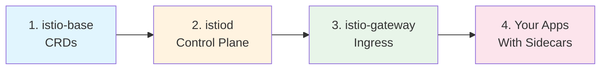

# Istio Service Mesh with Helm: Complete Beginner's Guide

## 🚀 Quick Start Guide for Installing Istio on Kubernetes

---

## 📋 What is This Guide?

This comprehensive guide teaches you how to install and configure **Istio Service Mesh** using **Helm** on Kubernetes. It's designed for beginners with step-by-step instructions, visual diagrams, and practical examples.

### Who is This For?

- ✅ Kubernetes users new to Istio
- ✅ DevOps engineers learning service mesh
- ✅ Developers who want to understand Istio architecture
- ✅ Anyone who prefers Helm over `istioctl`

---

## 📚 Guide Structure

This guide is divided into 3 parts:

| Part | Title | Topics Covered |
|------|-------|----------------|
| **Part 1** | [Introduction & Base](part1-istio-helm-architecture-base.md) | Service mesh concepts, Istio architecture, CRDs installation |
| **Part 2** | [Istiod Control Plane](part2-istio-helm-istiod-control-plane.md) | Control plane, sidecar injection, configuration |
| **Part 3** | [Gateway & Applications](part3-istio-helm-gateway-applications.md) | Ingress gateway, traffic management, sample app |

---

## 🏗️ Istio Architecture Overview

```
┌─────────────────────────────────────────────────────────────────────────┐
│                        ISTIO ARCHITECTURE                                │
└─────────────────────────────────────────────────────────────────────────┘

  EXTERNAL TRAFFIC
        │
        ▼
  ┌───────────────────────────────────────────────────────────────────────┐
  │                    ISTIO INGRESS GATEWAY                               │
  │                  (LoadBalancer Service)                                │
  └────────────────────────────┬──────────────────────────────────────────┘
                               │
                               ▼
  ┌───────────────────────────────────────────────────────────────────────┐
  │                         SERVICE MESH                                   │
  │                                                                        │
  │   ┌─────────────────────────────────────────────────────────────────┐ │
  │   │                    CONTROL PLANE                                 │ │
  │   │  ┌──────────────────────────────────────────────────────────┐   │ │
  │   │  │                    ISTIOD                                 │   │ │
  │   │  │   ┌─────────┐   ┌─────────┐   ┌─────────┐                │   │ │
  │   │  │   │ Pilot   │   │ Citadel │   │ Galley  │                │   │ │
  │   │  │   │Discovery│   │Security │   │ Config  │                │   │ │
  │   │  │   └─────────┘   └─────────┘   └─────────┘                │   │ │
  │   │  └──────────────────────────────────────────────────────────┘   │ │
  │   └─────────────────────────────────────────────────────────────────┘ │
  │                                │                                       │
  │                           xDS API                                      │
  │                                │                                       │
  │   ┌────────────────────────────┼────────────────────────────────────┐ │
  │   │                    DATA PLANE                                    │ │
  │   │                                                                  │ │
  │   │   ┌─────────────┐   ┌─────────────┐   ┌─────────────┐          │ │
  │   │   │  App Pod A  │   │  App Pod B  │   │  App Pod C  │          │ │
  │   │   │ ┌─────────┐ │   │ ┌─────────┐ │   │ ┌─────────┐ │          │ │
  │   │   │ │   App   │ │   │ │   App   │ │   │ │   App   │ │          │ │
  │   │   │ └─────────┘ │   │ └─────────┘ │   │ └─────────┘ │          │ │
  │   │   │ ┌─────────┐ │   │ ┌─────────┐ │   │ ┌─────────┐ │          │ │
  │   │   │ │ Sidecar │ │◀─▶│ │ Sidecar │ │◀─▶│ │ Sidecar │ │ ◀─mTLS  │ │
  │   │   │ │ (Envoy) │ │   │ │ (Envoy) │ │   │ │ (Envoy) │ │          │ │
  │   │   │ └─────────┘ │   │ └─────────┘ │   │ └─────────┘ │          │ │
  │   │   └─────────────┘   └─────────────┘   └─────────────┘          │ │
  │   │                                                                  │ │
  │   └──────────────────────────────────────────────────────────────────┘ │
  │                                                                        │
  └────────────────────────────────────────────────────────────────────────┘
```

---

## ⚡ Quick Installation (5 Minutes)

### Prerequisites

```bash
# Check kubectl
kubectl version --client

# Check Helm
helm version

# Start Minikube (if using)
minikube start --memory=8192 --cpus=4
```

### Installation Commands

```bash
# 1. Add Istio Helm repository
helm repo add istio https://istio-release.storage.googleapis.com/charts
helm repo update

# 2. Install Istio Base (CRDs)
helm install istio-base istio/base \
  --namespace istio-system \
  --create-namespace \
  --version 1.21.0

# 3. Install Istiod (Control Plane)
helm install istiod istio/istiod \
  --namespace istio-system \
  --version 1.21.0 \
  --wait

# 4. Install Ingress Gateway
helm install istio-ingressgateway istio/gateway \
  --namespace istio-ingress \
  --create-namespace \
  --version 1.21.0

# 5. Verify Installation
kubectl get pods -n istio-system
kubectl get pods -n istio-ingress
```

### Enable Sidecar Injection

```bash
# Enable for a namespace
kubectl label namespace <your-namespace> istio-injection=enabled
```

---

## 📊 Installation Order



---

## 🔑 Key Concepts at a Glance

### Istio Components

| Component | Helm Chart | Purpose |
|-----------|------------|---------|
| **istio-base** | `istio/base` | Custom Resource Definitions (CRDs) |
| **istiod** | `istio/istiod` | Control plane (Pilot, Citadel, Galley) |
| **gateway** | `istio/gateway` | Ingress/Egress traffic management |

### Important CRDs

| CRD | Purpose | Example Use |
|-----|---------|-------------|
| **VirtualService** | Traffic routing | Route 90% to v1, 10% to v2 |
| **DestinationRule** | Service policies | Load balancing, circuit breaking |
| **Gateway** | Edge traffic | Entry point configuration |
| **PeerAuthentication** | Security | Enable strict mTLS |

### Traffic Flow

```
              ┌──────────────────┐
              │  External Client │
              └────────┬─────────┘
                       ▼
         ┌─────────────────────────┐
         │  Gateway Resource       │◀── What hosts/ports to accept
         └────────────┬────────────┘
                      ▼
         ┌─────────────────────────┐
         │  VirtualService         │◀── Where to route traffic
         └────────────┬────────────┘
                      ▼
         ┌─────────────────────────┐
         │  DestinationRule        │◀── How to handle traffic
         └────────────┬────────────┘
                      ▼
         ┌─────────────────────────┐
         │  Service (Pods)         │
         └─────────────────────────┘
```

---

## 🔗 Detailed Guides

| Part | Link | Description |
|------|------|-------------|
| 1️⃣ | [Part 1: Architecture & Base](part1-istio-helm-architecture-base.md) | Learn Istio architecture and install CRDs |
| 2️⃣ | [Part 2: Control Plane](part2-istio-helm-istiod-control-plane.md) | Install and configure Istiod |
| 3️⃣ | [Part 3: Gateway & Apps](part3-istio-helm-gateway-applications.md) | Deploy gateway and sample application |

---

## 🧹 Cleanup

```bash
# Remove in reverse order
helm uninstall istio-ingressgateway -n istio-ingress
helm uninstall istiod -n istio-system
helm uninstall istio-base -n istio-system

# Delete namespaces
kubectl delete namespace istio-ingress
kubectl delete namespace istio-system
```

---

## 🔧 Common Commands Reference

### Helm Commands

```bash
# List Istio releases
helm list -A | grep istio

# Upgrade component
helm upgrade istiod istio/istiod -n istio-system

# View available values
helm show values istio/istiod
```

### kubectl Commands

```bash
# Check Istio pods
kubectl get pods -n istio-system

# Check sidecar injection
kubectl get namespace -L istio-injection

# View Istio resources
kubectl get virtualservices,destinationrules,gateways -A

# Check CRDs
kubectl get crds | grep istio
```

---

## 📖 Additional Resources

- [Official Istio Documentation](https://istio.io/latest/docs/)
- [Istio Helm Charts](https://github.com/istio/istio/tree/master/manifests/charts)
- [Envoy Proxy Documentation](https://www.envoyproxy.io/docs/envoy/latest/)

---

**🎉 Happy Learning! Start with [Part 1](part1-istio-helm-architecture-base.md) →**