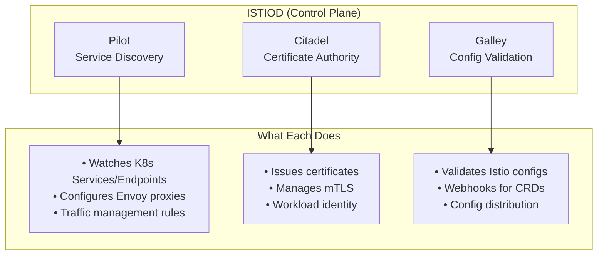
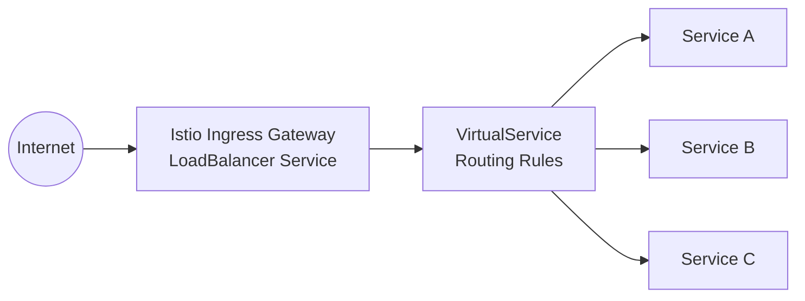
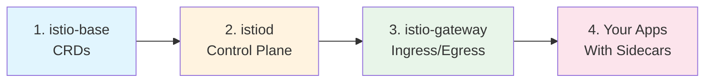
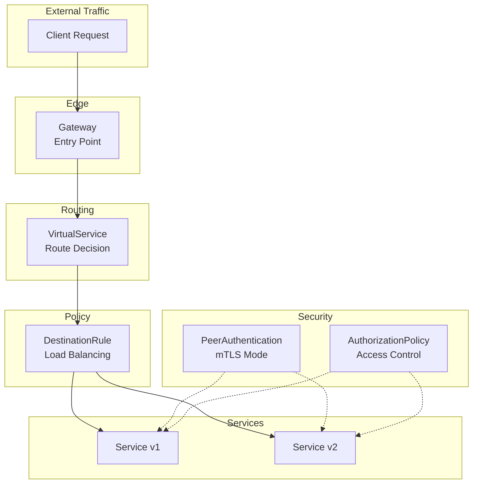

# Istio Service Mesh with Helm: Complete Beginner's Guide
## Part 1: Introduction, Architecture & Base Installation

---

## 📚 Table of Contents

1. [What is a Service Mesh?](#what-is-a-service-mesh)
2. [Understanding Istio](#understanding-istio)
3. [Istio Architecture](#istio-architecture)
4. [Prerequisites](#prerequisites)
5. [Setting Up Your Environment](#setting-up-your-environment)
6. [Installing Istio Base with Helm](#installing-istio-base-with-helm)
7. [Understanding Istio CRDs](#understanding-istio-crds)
8. [Verification](#verification)
9. [Troubleshooting](#troubleshooting)

---

## What is a Service Mesh?

### 🤔 The Problem

Imagine you're building a modern application with multiple microservices. Each service needs to:

- **Find other services** (Service Discovery)
- **Handle failures gracefully** (Retries, Timeouts)
- **Secure communications** (Encryption, Authentication)
- **Monitor traffic** (Metrics, Tracing)

Without a service mesh, you'd need to implement all of this in **every single service**:

```
┌─────────────────────────────────────────────────────────────────────────┐
│                     WITHOUT SERVICE MESH                                 │
│                                                                          │
│   Each service must implement:                                          │
│   ✗ Retry logic                    ✗ Circuit breakers                   │
│   ✗ TLS/mTLS encryption            ✗ Load balancing                     │
│   ✗ Metrics collection             ✗ Authentication                     │
│   ✗ Rate limiting                  ✗ Tracing                            │
│                                                                          │
│   ┌─────────────┐        ┌─────────────┐        ┌─────────────┐         │
│   │  Service A  │───────▶│  Service B  │───────▶│  Service C  │         │
│   │  + Retry    │        │  + Retry    │        │  + Retry    │         │
│   │  + TLS      │        │  + TLS      │        │  + TLS      │         │
│   │  + Metrics  │        │  + Metrics  │        │  + Metrics  │         │
│   │  + ... ❌   │        │  + ... ❌   │        │  + ... ❌   │         │
│   └─────────────┘        └─────────────┘        └─────────────┘         │
│                                                                          │
│   Problem: Code duplication, inconsistent implementations,               │
│            hard to maintain, language-specific solutions                 │
└─────────────────────────────────────────────────────────────────────────┘
```

### ✅ The Solution: Service Mesh

A service mesh adds a **proxy sidecar** next to each service that handles all the networking concerns:

```
┌─────────────────────────────────────────────────────────────────────────┐
│                      WITH SERVICE MESH (ISTIO)                           │
│                                                                          │
│   Services focus ONLY on business logic!                                │
│                                                                          │
│   ┌─────────────────────┐    ┌─────────────────────┐                    │
│   │      Pod A          │    │      Pod B          │                    │
│   │  ┌──────────────┐   │    │  ┌──────────────┐   │                    │
│   │  │  Service A   │   │    │  │  Service B   │   │                    │
│   │  │ (Your Code)  │   │    │  │ (Your Code)  │   │                    │
│   │  └──────┬───────┘   │    │  └──────▲───────┘   │                    │
│   │         │           │    │         │           │                    │
│   │  ┌──────▼───────┐   │    │  ┌──────┴───────┐   │                    │
│   │  │ Envoy Proxy  │───╋────╋──│ Envoy Proxy  │   │                    │
│   │  │  (Sidecar)   │   │    │  │  (Sidecar)   │   │                    │
│   │  │ ✓ mTLS       │   │    │  │ ✓ mTLS       │   │                    │
│   │  │ ✓ Retry      │   │    │  │ ✓ Retry      │   │                    │
│   │  │ ✓ Metrics    │   │    │  │ ✓ Metrics    │   │                    │
│   │  └──────────────┘   │    │  └──────────────┘   │                    │
│   └─────────────────────┘    └─────────────────────┘                    │
│                    ▲                      ▲                              │
│                    │    Configuration     │                              │
│                    └──────────┬───────────┘                              │
│                       ┌───────▼────────┐                                 │
│                       │    ISTIOD      │                                 │
│                       │ Control Plane  │                                 │
│                       └────────────────┘                                 │
└─────────────────────────────────────────────────────────────────────────┘
```

### 🎯 Key Benefits

| Feature | Without Mesh | With Istio |
|---------|-------------|------------|
| **Security (mTLS)** | Manual per-service | Automatic everywhere |
| **Retries/Timeouts** | Code in each service | Configuration only |
| **Traffic Splitting** | Complex code changes | Simple YAML config |
| **Observability** | Different per language | Uniform metrics |
| **No Code Changes** | ❌ | ✅ |

---

## Understanding Istio

### What is Istio?

**Istio** is the most popular open-source service mesh. It provides:

```
┌────────────────────────────────────────────────────────────────┐
│                    ISTIO FEATURES                               │
├────────────────────────────────────────────────────────────────┤
│                                                                 │
│   🔒 SECURITY              🚦 TRAFFIC MANAGEMENT               │
│   ├─ Mutual TLS (mTLS)     ├─ Load Balancing                   │
│   ├─ Authentication        ├─ Traffic Splitting                │
│   ├─ Authorization         ├─ Canary Deployments               │
│   └─ Certificate Mgmt      └─ Circuit Breaking                 │
│                                                                 │
│   📊 OBSERVABILITY         ⚡ RESILIENCE                        │
│   ├─ Distributed Tracing   ├─ Retries                          │
│   ├─ Metrics               ├─ Timeouts                          │
│   ├─ Access Logs           ├─ Fault Injection                   │
│   └─ Service Graph         └─ Rate Limiting                     │
│                                                                 │
└────────────────────────────────────────────────────────────────┘
```

### Why Use Helm for Istio?

**Helm** is the package manager for Kubernetes. Using Helm to install Istio provides:

| Benefit | Description |
|---------|-------------|
| **Easy Installation** | One command: `helm install` |
| **Version Management** | Easy upgrades with `helm upgrade` |
| **Configuration** | Customize with `--set` or values files |
| **Rollback** | Quick rollback with `helm rollback` |
| **Reproducible** | Same configuration across environments |

---

## Istio Architecture

### High-Level Overview

```
┌─────────────────────────────────────────────────────────────────────────┐
│                        ISTIO ARCHITECTURE                                │
└─────────────────────────────────────────────────────────────────────────┘

                            ┌────────────────────┐
                            │   Kubernetes API   │
                            │      Server        │
                            └─────────┬──────────┘
                                      │
         ═══════════════════════════════════════════════ CONTROL PLANE
                                      │
                            ┌─────────▼──────────┐
                            │      ISTIOD        │
                            │  ┌──────────────┐  │
                            │  │    Pilot     │  │ ◀─ Service Discovery
                            │  │  (Discovery) │  │    Traffic Management
                            │  └──────────────┘  │
                            │  ┌──────────────┐  │
                            │  │   Citadel    │  │ ◀─ Security, Certificates
                            │  │  (Security)  │  │    mTLS, Identity
                            │  └──────────────┘  │
                            │  ┌──────────────┐  │
                            │  │   Galley     │  │ ◀─ Configuration
                            │  │   (Config)   │  │    Validation
                            │  └──────────────┘  │
                            └─────────┬──────────┘
                                      │
                               xDS API│(gRPC)
                                      │
         ═══════════════════════════════════════════════ DATA PLANE
                                      │
              ┌───────────────────────┼───────────────────────┐
              │                       │                       │
     ┌────────▼────────┐    ┌────────▼────────┐    ┌────────▼────────┐
     │ Ingress Gateway │    │    App Pod 1    │    │    App Pod 2    │
     │  ┌───────────┐  │    │  ┌───────────┐  │    │  ┌───────────┐  │
     │  │   Envoy   │  │    │  │    App    │  │    │  │    App    │  │
     │  │   Proxy   │  │    │  └─────┬─────┘  │    │  └─────┬─────┘  │
     │  └───────────┘  │    │  ┌─────▼─────┐  │    │  ┌─────▼─────┐  │
     └────────────────-┘    │  │   Envoy   │  │    │  │   Envoy   │  │
                            │  │  Sidecar  │  │    │  │  Sidecar  │  │
                            │  └───────────┘  │    │  └───────────┘  │
                            └─────────────────┘    └─────────────────┘
```

### Component Breakdown

#### 1️⃣ Control Plane: Istiod

Istiod is the brain of Istio. It runs as a single binary but contains three logical components:



| Component | Responsibility |
|-----------|---------------|
| **Pilot** | Service discovery, traffic management, Envoy configuration |
| **Citadel** | Certificate authority, mTLS, workload identity (SPIFFE) |
| **Galley** | Configuration validation, webhook management |

#### 2️⃣ Data Plane: Envoy Proxies

Every application pod gets an **Envoy sidecar** injected:

```
┌───────────────────────────────────────────────────────────────┐
│                    APPLICATION POD                             │
│                                                                │
│   ┌─────────────────┐         ┌─────────────────────────────┐ │
│   │  Your Container │         │      Envoy Sidecar          │ │
│   │                 │         │                             │ │
│   │   App listens   │ ◀ ─ ─ ▶ │  Port 15001 (Outbound)     │ │
│   │   on port 8080  │         │  Port 15006 (Inbound)      │ │
│   │                 │         │  Port 15020 (Stats)        │ │
│   │                 │         │  Port 15090 (Prometheus)   │ │
│   └─────────────────┘         │                             │ │
│                               │  Handles:                   │ │
│                               │  ✓ mTLS termination        │ │
│                               │  ✓ Load balancing          │ │
│                               │  ✓ Retries/Timeouts        │ │
│                               │  ✓ Metrics collection      │ │
│                               └─────────────────────────────┘ │
└───────────────────────────────────────────────────────────────┘
```

#### 3️⃣ Ingress Gateway

The entry point for external traffic:



---

## Prerequisites

Before installing Istio, ensure you have:

### Required Tools

| Tool | Minimum Version | Check Command |
|------|-----------------|---------------|
| Kubernetes Cluster | 1.26+ | `kubectl version` |
| kubectl | 1.26+ | `kubectl version --client` |
| Helm | 3.6+ | `helm version` |
| Minikube (for local) | 1.30+ | `minikube version` |

### Resource Requirements

```
┌──────────────────────────────────────────────────┐
│           MINIMUM RESOURCES                       │
├──────────────┬───────────────────────────────────┤
│ Component    │ Resources                          │
├──────────────┼───────────────────────────────────┤
│ Istiod       │ 500m CPU, 2Gi Memory              │
│ Each Sidecar │ 100m CPU, 128Mi Memory            │
│ Gateway      │ 500m CPU, 512Mi Memory            │
├──────────────┼───────────────────────────────────┤
│ MINIKUBE     │ 4 CPUs, 8GB RAM (recommended)     │
└──────────────┴───────────────────────────────────┘
```

---

## Setting Up Your Environment

### Step 1: Start Minikube

```bash
# Start Minikube with sufficient resources
minikube start \
  --memory=8192 \
  --cpus=4 \
  --kubernetes-version=v1.28.0 \
  --driver=docker

# Verify the cluster is running
kubectl cluster-info
```

**Expected Output:**
```
Kubernetes control plane is running at https://192.168.49.2:8443
CoreDNS is running at https://192.168.49.2:8443/api/v1/namespaces/kube-system/services/kube-dns:dns/proxy
```

### Step 2: Install Helm (if not installed)

```bash
# Linux/macOS
curl https://raw.githubusercontent.com/helm/helm/main/scripts/get-helm-3 | bash

# Verify installation
helm version
```

**Expected Output:**
```
version.BuildInfo{Version:"v3.14.0", GitCommit:"..."}
```

### Step 3: Add Istio Helm Repository

```bash
# Add the official Istio Helm repository
helm repo add istio https://istio-release.storage.googleapis.com/charts

# Update repository cache
helm repo update

# Verify repository is added
helm search repo istio
```

**Expected Output:**
```
NAME                    CHART VERSION   APP VERSION     DESCRIPTION
istio/base              1.21.0          1.21.0          Istio Base Chart...
istio/cni               1.21.0          1.21.0          Istio CNI...
istio/gateway           1.21.0          1.21.0          Istio Gateway...
istio/istiod            1.21.0          1.21.0          Istiod Chart...
istio/ztunnel           1.21.0          1.21.0          Ztunnel Chart...
```

---

## Installing Istio Base with Helm

### Understanding the Installation Order

Istio must be installed in a specific order:



### Step 1: Create the Istio Namespace

```bash
# Create the namespace for Istio components
kubectl create namespace istio-system

# Verify namespace was created
kubectl get namespace istio-system
```

**Expected Output:**
```
NAME           STATUS   AGE
istio-system   Active   5s
```

### Step 2: Install Istio Base (CRDs)

The `istio-base` chart installs Custom Resource Definitions (CRDs):

```bash
# Install istio-base
helm install istio-base istio/base \
  --namespace istio-system \
  --version 1.21.0 \
  --wait

# Verify installation
helm status istio-base -n istio-system
```

**Expected Output:**
```
NAME: istio-base
LAST DEPLOYED: Sat Feb  8 10:00:00 2026
NAMESPACE: istio-system
STATUS: deployed
```

### Step 3: Verify CRDs are Installed

```bash
# List all Istio CRDs
kubectl get crds | grep istio

# Count total Istio CRDs (should be ~25+)
kubectl get crds | grep -c istio
```

**Expected Output:**
```
authorizationpolicies.security.istio.io          2026-02-08T10:00:00Z
destinationrules.networking.istio.io             2026-02-08T10:00:00Z
envoyfilters.networking.istio.io                 2026-02-08T10:00:00Z
gateways.networking.istio.io                     2026-02-08T10:00:00Z
peerauthentications.security.istio.io            2026-02-08T10:00:00Z
requestauthentications.security.istio.io         2026-02-08T10:00:00Z
serviceentries.networking.istio.io               2026-02-08T10:00:00Z
sidecars.networking.istio.io                     2026-02-08T10:00:00Z
telemetries.telemetry.istio.io                   2026-02-08T10:00:00Z
virtualservices.networking.istio.io              2026-02-08T10:00:00Z
wasmplugins.extensions.istio.io                  2026-02-08T10:00:00Z
workloadentries.networking.istio.io              2026-02-08T10:00:00Z
workloadgroups.networking.istio.io               2026-02-08T10:00:00Z
```

---

## Understanding Istio CRDs

### What are CRDs?

**Custom Resource Definitions (CRDs)** extend Kubernetes with new resource types. Istio adds several CRDs for traffic management and security:

```
┌─────────────────────────────────────────────────────────────────────────┐
│                          ISTIO CRDs                                      │
├─────────────────────────────────────────────────────────────────────────┤
│                                                                          │
│   🚦 TRAFFIC MANAGEMENT                    🔒 SECURITY                   │
│   ├─ VirtualService                        ├─ PeerAuthentication        │
│   ├─ DestinationRule                       ├─ RequestAuthentication     │
│   ├─ Gateway                               └─ AuthorizationPolicy       │
│   ├─ ServiceEntry                                                       │
│   └─ Sidecar                              📊 EXTENSIBILITY              │
│                                           ├─ EnvoyFilter                │
│   📈 OBSERVABILITY                        ├─ WasmPlugin                 │
│   └─ Telemetry                            └─ WorkloadEntry              │
│                                                                          │
└─────────────────────────────────────────────────────────────────────────┘
```

### Key CRDs Explained

#### 1. VirtualService - Traffic Routing

Controls how requests are routed to services:

```yaml
# Example: Route 80% traffic to v1, 20% to v2
apiVersion: networking.istio.io/v1beta1
kind: VirtualService
metadata:
  name: reviews-route
spec:
  hosts:
    - reviews
  http:
    - route:
        - destination:
            host: reviews
            subset: v1
          weight: 80
        - destination:
            host: reviews
            subset: v2
          weight: 20
```

```
  Incoming Request
        │
        ▼
  ┌─────────────────┐
  │ VirtualService  │
  │ (Traffic Split) │
  └────────┬────────┘
           │
     ┌─────┴─────┐
     │           │
   80% ▼       20% ▼
  ┌──────┐    ┌──────┐
  │  v1  │    │  v2  │
  └──────┘    └──────┘
```

#### 2. DestinationRule - Service Policies

Defines policies after routing decisions:

```yaml
# Example: Define subsets and load balancing
apiVersion: networking.istio.io/v1beta1
kind: DestinationRule
metadata:
  name: reviews-destination
spec:
  host: reviews
  trafficPolicy:
    loadBalancer:
      simple: ROUND_ROBIN
  subsets:
    - name: v1
      labels:
        version: v1
    - name: v2
      labels:
        version: v2
```

#### 3. Gateway - Entry Point

Manages inbound/outbound traffic at mesh edge:

```yaml
# Example: HTTP Gateway
apiVersion: networking.istio.io/v1beta1
kind: Gateway
metadata:
  name: my-gateway
spec:
  selector:
    istio: ingressgateway
  servers:
    - port:
        number: 80
        name: http
        protocol: HTTP
      hosts:
        - "myapp.example.com"
```

#### 4. PeerAuthentication - mTLS Settings

Controls mutual TLS between services:

```yaml
# Example: Enforce strict mTLS
apiVersion: security.istio.io/v1beta1
kind: PeerAuthentication
metadata:
  name: default
  namespace: my-namespace
spec:
  mtls:
    mode: STRICT  # Options: STRICT, PERMISSIVE, DISABLE
```

### CRD Relationship Diagram



---

## Verification

### Check Installation Status

```bash
# Check Helm releases
helm list -n istio-system

# Expected output:
# NAME        NAMESPACE    REVISION  STATUS    CHART         APP VERSION
# istio-base  istio-system 1         deployed  base-1.21.0   1.21.0
```

### Verify All CRDs

```bash
# List all networking CRDs
kubectl get crds -l app.kubernetes.io/part-of=istio

# Check specific CRD details
kubectl describe crd virtualservices.networking.istio.io
```

### Check for Issues

```bash
# Check for any events or issues
kubectl get events -n istio-system --sort-by='.lastTimestamp'

# Check Helm release details
helm get notes istio-base -n istio-system
```

---

## Troubleshooting

### Common Issues and Solutions

#### Issue 1: CRDs Not Created

**Symptom:** `kubectl get crds | grep istio` returns nothing

**Solution:**
```bash
# Uninstall and reinstall with --wait flag
helm uninstall istio-base -n istio-system
helm install istio-base istio/base -n istio-system --wait
```

#### Issue 2: Namespace Already Exists

**Symptom:** Error creating namespace

**Solution:**
```bash
# Check if istio-system exists
kubectl get ns istio-system

# If it exists with old resources, delete and recreate
kubectl delete namespace istio-system
kubectl create namespace istio-system
```

#### Issue 3: Helm Repository Not Found

**Symptom:** `Error: repo istio not found`

**Solution:**
```bash
# Re-add the repository
helm repo remove istio
helm repo add istio https://istio-release.storage.googleapis.com/charts
helm repo update
```

#### Issue 4: Version Mismatch

**Symptom:** Compatibility issues

**Solution:**
```bash
# Check available versions
helm search repo istio --versions

# Install specific version
helm install istio-base istio/base -n istio-system --version 1.21.0
```

---

## 📝 Summary

In this first part, you learned:

| Topic | What You Learned |
|-------|------------------|
| **Service Mesh** | Why we need it, problems it solves |
| **Istio Overview** | Features and capabilities |
| **Architecture** | Control plane (Istiod) vs Data plane (Envoy) |
| **Prerequisites** | Tools and resources needed |
| **Base Installation** | How to install CRDs with Helm |
| **CRDs** | VirtualService, DestinationRule, Gateway, etc. |

### What's Next?

In **Part 2**, you will:
- Install Istiod (Control Plane)
- Learn about sidecar injection
- Configure mesh-wide settings
- Enable automatic mTLS

---

## 🔗 Quick Reference

### Helm Commands

```bash
# Add Istio repo
helm repo add istio https://istio-release.storage.googleapis.com/charts

# Update repos
helm repo update

# Install istio-base
helm install istio-base istio/base -n istio-system --create-namespace

# Check status
helm status istio-base -n istio-system

# List releases
helm list -n istio-system

# Uninstall (if needed)
helm uninstall istio-base -n istio-system
```

### Verification Commands

```bash
# Check CRDs
kubectl get crds | grep istio

# Check namespace
kubectl get ns istio-system

# Check Helm release
helm list -n istio-system
```

---

**Continue to Part 2: Istiod Control Plane Installation →**
