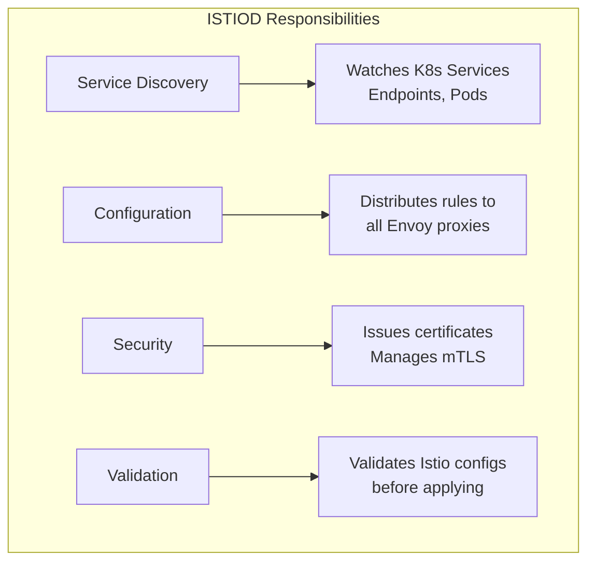
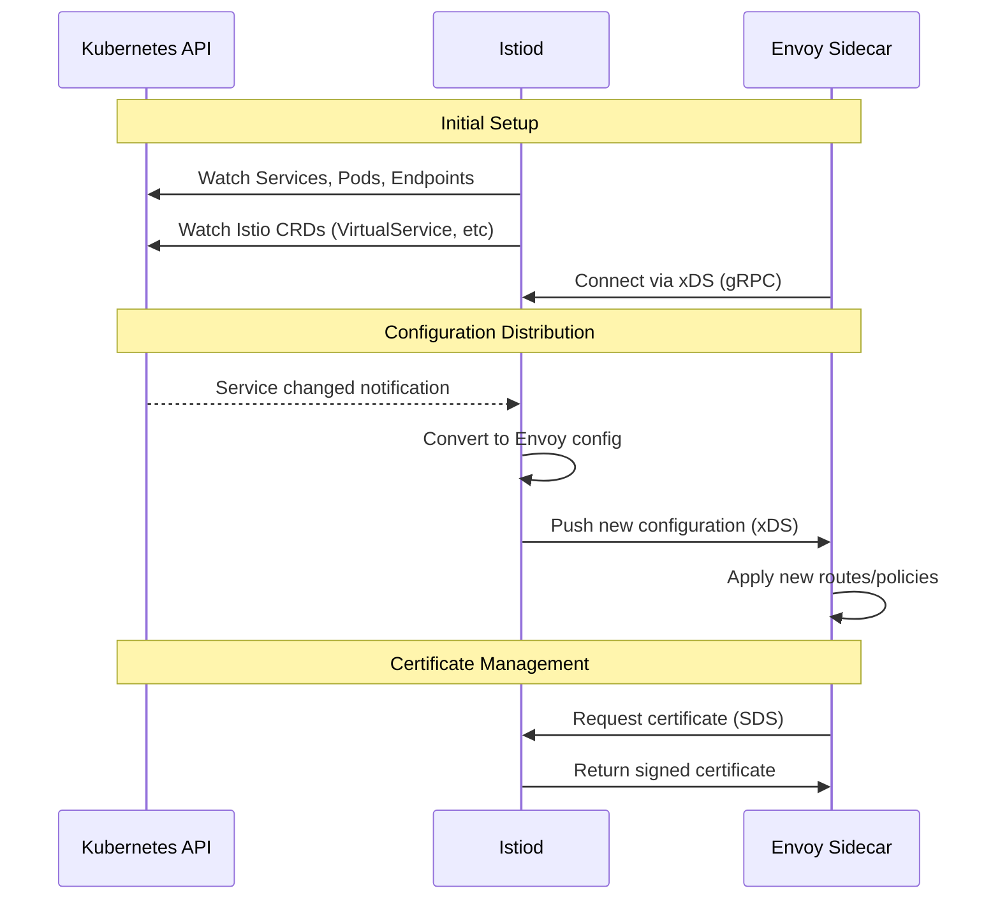
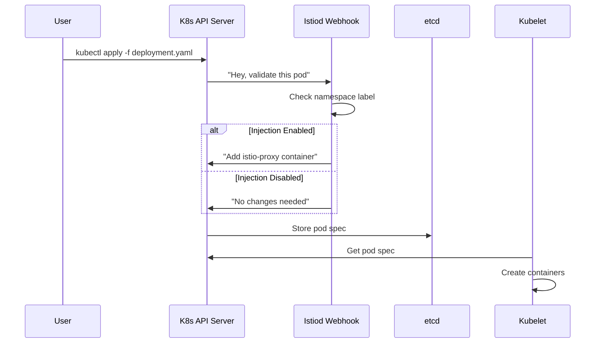

# Istio Service Mesh with Helm: Complete Beginner's Guide
## Part 2: Istiod Control Plane Installation

---

## 📚 Table of Contents

1. [What is Istiod?](#what-is-istiod)
2. [Istiod Components Deep Dive](#istiod-components-deep-dive)
3. [Installing Istiod with Helm](#installing-istiod-with-helm)
4. [Configuration Options](#configuration-options)
5. [Sidecar Injection](#sidecar-injection)
6. [Verification](#verification)
7. [Monitoring Istiod](#monitoring-istiod)
8. [Troubleshooting](#troubleshooting)

---

## What is Istiod?

### Simple Explanation

**Istiod** is the "brain" of Istio. It's a single binary that manages the entire service mesh:

```
┌─────────────────────────────────────────────────────────────────────────┐
│                                                                          │
│   🧠 ISTIOD = "Istio Daemon" = The Brain of the Service Mesh           │
│                                                                          │
│   Think of it like a Traffic Control Center:                            │
│                                                                          │
│   ┌─────────────┐   ┌─────────────┐   ┌─────────────┐                  │
│   │   PILOT     │   │  CITADEL    │   │   GALLEY    │                  │
│   │   🗺️        │   │   🔐        │   │   ✅        │                  │
│   │             │   │             │   │             │                  │
│   │ "Where to   │   │ "Who can    │   │ "Is the     │                  │
│   │  send       │   │  talk to    │   │  config     │                  │
│   │  traffic?"  │   │  whom?"     │   │  valid?"    │                  │
│   └─────────────┘   └─────────────┘   └─────────────┘                  │
│                                                                          │
└─────────────────────────────────────────────────────────────────────────┘
```

### What Does Istiod Do?



| Responsibility | What It Means | Example |
|---------------|---------------|---------|
| **Service Discovery** | Knows where all services are | "Service A has 3 pods at IPs: 10.0.1.5, 10.0.1.6, 10.0.1.7" |
| **Traffic Management** | Tells proxies how to route | "Send 90% to v1, 10% to v2" |
| **Security** | Issues certificates for mTLS | "Here's a certificate for pod-abc" |
| **Configuration** | Pushes config to all proxies | "New retry policy: 3 attempts, 2s timeout" |

---

## Istiod Components Deep Dive

### The Three Logical Components

Although Istiod is ONE binary, it contains three logical parts:

```
┌─────────────────────────────────────────────────────────────────────────┐
│                           ISTIOD INTERNALS                               │
└─────────────────────────────────────────────────────────────────────────┘

┌──────────────────────────────────────────────────────────────────────────┐
│                                                                          │
│  ╔════════════════════════════════════════════════════════════════════╗ │
│  ║                         ISTIOD POD                                  ║ │
│  ╠════════════════════════════════════════════════════════════════════╣ │
│  ║                                                                     ║ │
│  ║  ┌───────────────────────────────────────────────────────────────┐ ║ │
│  ║  │                     PILOT (Discovery)                          │ ║ │
│  ║  │                                                                │ ║ │
│  ║  │  • Watches Kubernetes API for Services, Pods, Endpoints       │ ║ │
│  ║  │  • Watches Istio CRs (VirtualService, DestinationRule, etc)   │ ║ │
│  ║  │  • Converts config to Envoy format (xDS)                      │ ║ │
│  ║  │  • Pushes configuration to all Envoy proxies                  │ ║ │
│  ║  │                                                                │ ║ │
│  ║  │  Ports: 15010 (gRPC), 15012 (secure xDS)                      │ ║ │
│  ║  └───────────────────────────────────────────────────────────────┘ ║ │
│  ║                                                                     ║ │
│  ║  ┌───────────────────────────────────────────────────────────────┐ ║ │
│  ║  │                    CITADEL (Security)                          │ ║ │
│  ║  │                                                                │ ║ │
│  ║  │  • Certificate Authority (CA) for the mesh                    │ ║ │
│  ║  │  • Issues and rotates workload certificates (SPIFFE)         │ ║ │
│  ║  │  • Enables mutual TLS (mTLS) between services                │ ║ │
│  ║  │  • Certificate lifetime: 24 hours (auto-rotated)             │ ║ │
│  ║  └───────────────────────────────────────────────────────────────┘ ║ │
│  ║                                                                     ║ │
│  ║  ┌───────────────────────────────────────────────────────────────┐ ║ │
│  ║  │                    GALLEY (Validation)                         │ ║ │
│  ║  │                                                                │ ║ │
│  ║  │  • Validates Istio configuration before applying              │ ║ │
│  ║  │  • Webhook server for admission control                       │ ║ │
│  ║  │  • Prevents bad configs from entering the mesh                │ ║ │
│  ║  │                                                                │ ║ │
│  ║  │  Port: 15017 (webhook HTTPS)                                  │ ║ │
│  ║  └───────────────────────────────────────────────────────────────┘ ║ │
│  ║                                                                     ║ │
│  ╚════════════════════════════════════════════════════════════════════╝ │
│                                                                          │
└──────────────────────────────────────────────────────────────────────────┘
```

### How Istiod Talks to Envoy Proxies

Istiod uses the **xDS API** to communicate with Envoy proxies:



### xDS API Explained

**xDS** = "x Discovery Service" - A set of APIs for Envoy configuration:

| API | Purpose | What It Configures |
|-----|---------|-------------------|
| **LDS** | Listener Discovery | Which ports to listen on |
| **RDS** | Route Discovery | How to route requests |
| **CDS** | Cluster Discovery | Upstream service endpoints |
| **EDS** | Endpoint Discovery | IP addresses of pods |
| **SDS** | Secret Discovery | Certificates for mTLS |

```
                    Istiod
                       │
         ┌─────────────┼─────────────┐
         │             │             │
    ┌────▼────┐   ┌────▼────┐   ┌────▼────┐
    │   LDS   │   │   CDS   │   │   SDS   │
    │ Listen  │   │ Cluster │   │ Secret  │
    └────┬────┘   └────┬────┘   └────┬────┘
         │             │             │
         └─────────────┼─────────────┘
                       │
                       ▼
                 Envoy Proxy
```

---

## Installing Istiod with Helm

### Prerequisites Check

```bash
# Verify istio-base is installed
helm list -n istio-system

# Expected: istio-base should be listed
```

### Step 1: Install Istiod

```bash
# Install istiod with default settings
helm install istiod istio/istiod \
  --namespace istio-system \
  --version 1.21.0 \
  --wait

# This may take 1-2 minutes
```

**What Happens When You Run This:**

```
┌─────────────────────────────────────────────────────────────────────────┐
│                    helm install istiod ...                               │
├─────────────────────────────────────────────────────────────────────────┤
│                                                                          │
│   1. Creates ServiceAccount        → istiod can access K8s API          │
│   2. Creates ClusterRole           → permissions for istiod             │
│   3. Creates ClusterRoleBinding    → binds role to service account      │
│   4. Creates ConfigMap             → mesh configuration                 │
│   5. Creates Deployment            → runs istiod pods                   │
│   6. Creates Service               → exposes istiod endpoints           │
│   7. Creates MutatingWebhook       → enables sidecar injection          │
│   8. Creates ValidatingWebhook     → validates Istio configs            │
│                                                                          │
└─────────────────────────────────────────────────────────────────────────┘
```

### Step 2: Verify Installation

```bash
# Check istiod pod is running
kubectl get pods -n istio-system

# Expected output:
# NAME                      READY   STATUS    RESTARTS   AGE
# istiod-xxxxx-xxxxx       1/1     Running   0          1m
```

```bash
# Check istiod service
kubectl get svc -n istio-system

# Expected output:
# NAME     TYPE        CLUSTER-IP     EXTERNAL-IP   PORT(S)                         AGE
# istiod   ClusterIP   10.96.xxx.xx   <none>        15010/TCP,15012/TCP,443/TCP...  1m
```

### Step 3: Check Istiod Logs

```bash
# View istiod logs (first few lines)
kubectl logs -n istio-system -l app=istiod --tail=20

# Look for "Serving XDS over" message indicating xDS is ready
```

---

## Configuration Options

### Viewing Default Values

```bash
# See all available configuration options
helm show values istio/istiod > istiod-values.yaml

# Or view directly
helm show values istio/istiod
```

### Important Configuration Options

```yaml
# Custom values-istiod.yaml

# ============================================================
# PILOT (ISTIOD) SETTINGS
# ============================================================
pilot:
  # Number of istiod replicas (2+ for HA)
  replicaCount: 1
  
  # Resource allocation
  resources:
    requests:
      cpu: 500m        # 0.5 CPU cores
      memory: 2Gi      # 2 GB RAM
    limits:
      cpu: 1000m       # Max 1 CPU core
      memory: 4Gi      # Max 4 GB RAM

  # Enable autoscaling
  autoscaleEnabled: false
  autoscaleMin: 1
  autoscaleMax: 5

# ============================================================
# GLOBAL SETTINGS
# ============================================================
global:
  # Istio namespace
  istioNamespace: istio-system
  
  # Proxy (sidecar) default settings
  proxy:
    resources:
      requests:
        cpu: 100m
        memory: 128Mi
      limits:
        cpu: 2000m
        memory: 1024Mi
    
    # Enable access logging
    accessLogFile: "/dev/stdout"
  
  # Tracing configuration
  tracer:
    zipkin:
      address: ""  # Zipkin address if using tracing

# ============================================================
# MESH CONFIGURATION
# ============================================================
meshConfig:
  # Enable Prometheus metrics
  enablePrometheusMerge: true
  
  # Access logging format
  accessLogFile: /dev/stdout
  
  # What to do with traffic to unknown services
  # ALLOW_ANY = allow (default)
  # REGISTRY_ONLY = block unless explicitly allowed
  outboundTrafficPolicy:
    mode: ALLOW_ANY
  
  # Enable automatic mTLS
  enableAutoMtls: true

# ============================================================
# SIDECAR INJECTOR
# ============================================================
sidecarInjectorWebhook:
  # Enable sidecar injection
  enabled: true
  
  # What to do if webhook fails
  # Fail = reject pod creation
  # Ignore = allow pod without sidecar
  failurePolicy: Fail
```

### Installing with Custom Values

```bash
# Create a custom values file
cat > my-istiod-values.yaml << 'EOF'
pilot:
  replicaCount: 2
  resources:
    requests:
      cpu: 500m
      memory: 2Gi

meshConfig:
  accessLogFile: /dev/stdout
  enableAutoMtls: true
EOF

# Install with custom values
helm install istiod istio/istiod \
  --namespace istio-system \
  --version 1.21.0 \
  -f my-istiod-values.yaml \
  --wait
```

---

## Sidecar Injection

### What is Sidecar Injection?

Sidecar injection automatically adds an Envoy proxy container to your pods:

```
┌─────────────────────────────────────────────────────────────────────────┐
│                      SIDECAR INJECTION PROCESS                           │
└─────────────────────────────────────────────────────────────────────────┘

         YOUR YAML                              WHAT GETS DEPLOYED
    ┌─────────────────┐                    ┌─────────────────────────┐
    │  Deployment     │                    │  Pod                    │
    │  ┌───────────┐  │                    │  ┌───────────────────┐  │
    │  │   nginx   │  │                    │  │   nginx           │  │
    │  │ container │  │     INJECTION      │  │   container       │  │
    │  └───────────┘  │  ─────────────▶   │  └───────────────────┘  │
    │                 │                    │  ┌───────────────────┐  │
    │  (1 container)  │                    │  │  istio-proxy      │  │
    │                 │                    │  │  (Envoy sidecar)  │  │
    └─────────────────┘                    │  └───────────────────┘  │
                                           │  (2 containers!)       │
                                           └─────────────────────────┘
```

### How It Works



### Enabling Sidecar Injection

#### Method 1: Namespace Label (Recommended)

```bash
# Enable injection for a namespace
kubectl label namespace default istio-injection=enabled

# Verify label
kubectl get namespace default --show-labels
```

**After labeling:** All new pods in that namespace will get sidecars automatically.

```bash
# Check which namespaces have injection enabled
kubectl get namespace -L istio-injection
```

**Expected Output:**
```
NAME              STATUS   AGE   ISTIO-INJECTION
default           Active   10d   enabled
istio-system      Active   1h    
kube-system       Active   10d   
```

#### Method 2: Pod Annotation

For individual pods (overrides namespace setting):

```yaml
apiVersion: v1
kind: Pod
metadata:
  name: my-pod
  annotations:
    # Force enable injection
    sidecar.istio.io/inject: "true"
    
    # Or disable injection
    # sidecar.istio.io/inject: "false"
spec:
  containers:
  - name: app
    image: nginx
```

### Testing Sidecar Injection

```bash
# Create a test namespace
kubectl create namespace test-injection

# Enable injection
kubectl label namespace test-injection istio-injection=enabled

# Deploy a simple pod
kubectl run nginx --image=nginx -n test-injection

# Check the pod (should have 2/2 containers)
kubectl get pods -n test-injection

# Expected: nginx   2/2   Running   0   30s
#           ^^^^^ 
#           2 containers = app + istio-proxy
```

```bash
# Verify the sidecar is there
kubectl describe pod nginx -n test-injection | grep -A5 "Containers:"
```

---

## Verification

### Complete Verification Checklist

#### 1. Check Istiod Pod

```bash
kubectl get pods -n istio-system -l app=istiod

# Expected: 1/1 Running
```

#### 2. Check Istiod Service

```bash
kubectl get svc istiod -n istio-system

# Expected ports: 15010, 15012, 443, 15014
```

#### 3. Check Webhooks

```bash
# Mutating webhook (for sidecar injection)
kubectl get mutatingwebhookconfigurations | grep istio

# Validating webhook (for config validation)
kubectl get validatingwebhookconfigurations | grep istio
```

#### 4. Check Istiod Health

```bash
# Port-forward to istiod
kubectl port-forward -n istio-system svc/istiod 8080:8080 &

# Check health endpoint
curl http://localhost:8080/ready

# Expected: OK
```

#### 5. Verify with istioctl (Optional)

```bash
# Install istioctl
curl -L https://istio.io/downloadIstio | sh -

# Add to PATH
export PATH=$PWD/istio-*/bin:$PATH

# Check version
istioctl version

# Verify installation
istioctl verify-install
```

### Quick Health Check Script

```bash
#!/bin/bash
echo "=== Istio Health Check ==="

echo -e "\n1. Checking istiod pod..."
kubectl get pods -n istio-system -l app=istiod

echo -e "\n2. Checking istiod service..."
kubectl get svc istiod -n istio-system

echo -e "\n3. Checking webhooks..."
kubectl get mutatingwebhookconfigurations | grep istio
kubectl get validatingwebhookconfigurations | grep istio

echo -e "\n4. Checking for errors in istiod logs..."
kubectl logs -n istio-system -l app=istiod --tail=10 | grep -i error || echo "No errors found"

echo -e "\n=== Health Check Complete ==="
```

---

## Monitoring Istiod

### Key Metrics to Watch

Istiod exposes Prometheus metrics on port 15014:

```bash
# Port-forward to metrics endpoint
kubectl port-forward -n istio-system svc/istiod 15014:15014 &

# View metrics
curl http://localhost:15014/metrics | grep -E "^pilot_"
```

### Important Metrics

| Metric | Description | What to Watch |
|--------|-------------|---------------|
| `pilot_xds_pushes` | Number of config pushes | Spikes indicate changes |
| `pilot_xds_push_time_seconds` | Time to push config | Should be <1 second |
| `pilot_xds_eds_instances` | Number of endpoints | Matches your pod count |
| `pilot_conflict_inbound_listener` | Listener conflicts | Should be 0 |
| `pilot_proxy_convergence_time` | Time to converge | Should be low |

### Viewing Istiod Logs

```bash
# All logs
kubectl logs -n istio-system -l app=istiod

# Follow logs in real-time
kubectl logs -n istio-system -l app=istiod -f

# Filter for errors
kubectl logs -n istio-system -l app=istiod | grep -i error

# Filter for xDS push events
kubectl logs -n istio-system -l app=istiod | grep "Push"
```

---

## Troubleshooting

### Issue 1: Istiod Pod Not Starting

**Symptom:** Pod stuck in `Pending` or `CrashLoopBackOff`

**Check resources:**
```bash
kubectl describe pod -n istio-system -l app=istiod

# Look for events like "Insufficient memory" or "Insufficient cpu"
```

**Solution:** Reduce resource requests or add more cluster resources:
```bash
helm upgrade istiod istio/istiod \
  -n istio-system \
  --set pilot.resources.requests.cpu=250m \
  --set pilot.resources.requests.memory=512Mi
```

### Issue 2: Sidecar Not Injecting

**Symptom:** Pods have 1/1 containers instead of 2/2

**Check 1:** Namespace label
```bash
kubectl get namespace <your-namespace> --show-labels | grep istio-injection
```

**Check 2:** Webhook is working
```bash
kubectl get mutatingwebhookconfigurations istio-sidecar-injector -o yaml
```

**Check 3:** Pod annotation override
```bash
kubectl get pod <pod-name> -o yaml | grep "sidecar.istio.io/inject"
```

### Issue 3: Webhook Connection Failed

**Symptom:** Error "failed calling webhook"

**Solution 1:** Restart istiod
```bash
kubectl rollout restart deployment/istiod -n istio-system
```

**Solution 2:** Check istiod service
```bash
kubectl get endpoints istiod -n istio-system
# Should show IP addresses
```

### Issue 4: xDS Push Errors

**Symptom:** Logs show "xds push failed"

**Check istiod logs:**
```bash
kubectl logs -n istio-system -l app=istiod | grep -i "push failed"
```

**Common causes:**
- Invalid Istio resources (VirtualService, DestinationRule)
- Network connectivity issues between istiod and proxies

### Debug Commands

```bash
# Get detailed istiod status
kubectl exec -n istio-system -it deploy/istiod -- pilot-discovery request GET /debug/syncz

# Check connected proxies
kubectl exec -n istio-system deploy/istiod -- pilot-discovery request GET /debug/connections

# Check proxy config for a specific pod
kubectl exec -n istio-system deploy/istiod -- pilot-discovery request GET /debug/config_dump?proxyid=<pod-name>.<namespace>
```

---

## 📝 Summary

In this part, you learned:

| Topic | What You Learned |
|-------|------------------|
| **Istiod** | The unified control plane (Pilot + Citadel + Galley) |
| **xDS API** | How Istiod communicates with Envoy proxies |
| **Installation** | `helm install istiod istio/istiod -n istio-system` |
| **Configuration** | Key values like replicaCount, resources, meshConfig |
| **Sidecar Injection** | Namespace labels and pod annotations |
| **Verification** | Pod status, webhooks, logs, metrics |
| **Troubleshooting** | Common issues and solutions |

### Current Installation Status

```
┌─────────────────────────────────────────────────────────────┐
│                   INSTALLATION PROGRESS                      │
├─────────────────────────────────────────────────────────────┤
│                                                              │
│   ✅ Step 1: istio-base (CRDs)         ─ COMPLETED          │
│   ✅ Step 2: istiod (Control Plane)    ─ COMPLETED          │
│   ⬜ Step 3: istio-gateway (Ingress)   ─ NEXT               │
│   ⬜ Step 4: Your Application           ─ PENDING            │
│                                                              │
└─────────────────────────────────────────────────────────────┘
```

### What's Next?

In **Part 3**, you will:
- Install the Istio Ingress Gateway
- Create Gateway and VirtualService resources
- Deploy a sample application
- Configure traffic management
- Test the complete setup

---

## 🔗 Quick Reference

### Helm Commands

```bash
# Install istiod
helm install istiod istio/istiod -n istio-system --wait

# Upgrade istiod
helm upgrade istiod istio/istiod -n istio-system

# View values
helm show values istio/istiod

# Check status
helm status istiod -n istio-system

# Uninstall (if needed)
helm uninstall istiod -n istio-system
```

### kubectl Commands

```bash
# Check istiod
kubectl get pods -n istio-system -l app=istiod

# Enable injection
kubectl label namespace <ns> istio-injection=enabled

# Check injection status
kubectl get namespace -L istio-injection

# View istiod logs
kubectl logs -n istio-system -l app=istiod
```

---

**Continue to Part 3: Gateway & Application Deployment →**
