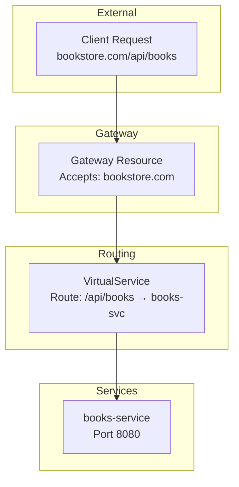
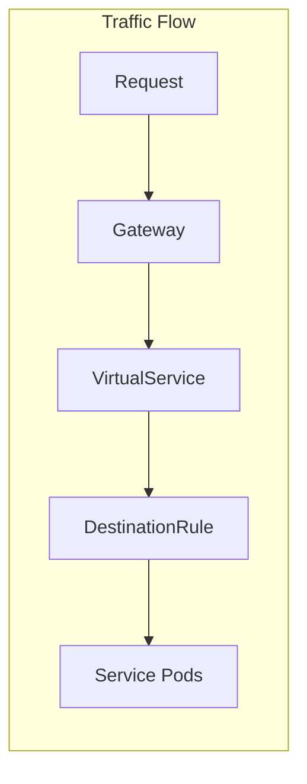

# Istio Service Mesh with Helm: Complete Beginner's Guide
## Part 3: Gateway, Traffic Management & Sample Application

---

## 📚 Table of Contents

1. [Understanding Gateways](#understanding-gateways)
2. [Installing Istio Gateway with Helm](#installing-istio-gateway-with-helm)
3. [Deploying a Sample Application](#deploying-a-sample-application)
4. [Traffic Management](#traffic-management)
5. [Security with mTLS](#security-with-mtls)
6. [Complete Working Example](#complete-working-example)
7. [Verification and Testing](#verification-and-testing)
8. [Cleanup](#cleanup)

---

## Understanding Gateways

### What is an Istio Gateway?

An Istio **Gateway** is the entry point for traffic entering or leaving your service mesh:

```
┌─────────────────────────────────────────────────────────────────────────┐
│                         INTERNET TRAFFIC                                 │
└───────────────────────────────────┬─────────────────────────────────────┘
                                    │
                                    ▼
        ┌───────────────────────────────────────────────────────┐
        │             ISTIO INGRESS GATEWAY                      │
        │                                                        │
        │   🌐 LoadBalancer Service (External IP)               │
        │   📍 Ports: 80 (HTTP), 443 (HTTPS)                    │
        │   🔧 Runs Envoy proxy                                 │
        │                                                        │
        │   Responsibilities:                                    │
        │   ✓ Accepts external traffic                          │
        │   ✓ TLS termination                                   │
        │   ✓ Host-based routing                                │
        │   ✓ Send traffic to VirtualServices                   │
        │                                                        │
        └───────────────────────────────┬───────────────────────┘
                                        │
                                        ▼
        ┌───────────────────────────────────────────────────────┐
        │                   SERVICE MESH                         │
        │                                                        │
        │   ┌─────────┐   ┌─────────┐   ┌─────────┐            │
        │   │ App A   │   │ App B   │   │ App C   │            │
        │   │ +Envoy  │◀─▶│ +Envoy  │◀─▶│ +Envoy  │            │
        │   └─────────┘   └─────────┘   └─────────┘            │
        │                                                        │
        └────────────────────────────────────────────────────────┘
```

### Gateway vs Kubernetes Ingress

| Feature | K8s Ingress | Istio Gateway |
|---------|------------|---------------|
| Layer | L7 only | L4-L7 |
| TLS | Basic | Advanced (mTLS, SNI) |
| Traffic Splitting | Limited | Full control |
| Routing | Path/Host based | + Headers, weights, etc |
| Integration | Ingress Controller | Istio mesh |
| Config Flexibility | Limited | Extensive |

### How Gateway + VirtualService Work Together



**Think of it like:**
- **Gateway** = "What doors are open?" (hosts, ports, TLS)
- **VirtualService** = "Where do visitors go?" (routing rules)

---

## Installing Istio Gateway with Helm

### Prerequisites Check

```bash
# Verify previous components are installed
helm list -n istio-system

# Expected:
# NAME        NAMESPACE     STATUS    CHART           APP VERSION
# istio-base  istio-system  deployed  base-1.21.0     1.21.0
# istiod      istio-system  deployed  istiod-1.21.0   1.21.0
```

### Step 1: Create Gateway Namespace

```bash
# Create namespace for the gateway
kubectl create namespace istio-ingress

# Label for injection (optional but recommended)
kubectl label namespace istio-ingress istio-injection=enabled
```

### Step 2: Install Gateway

```bash
# Install the ingress gateway
helm install istio-ingressgateway istio/gateway \
  --namespace istio-ingress \
  --version 1.21.0 \
  --wait

# Check installation
kubectl get pods -n istio-ingress
```

**Expected Output:**
```
NAME                                    READY   STATUS    RESTARTS   AGE
istio-ingressgateway-xxxxx-xxxxx       1/1     Running   0          30s
```

### Step 3: Check Gateway Service

```bash
# Get the gateway service
kubectl get svc -n istio-ingress

# Expected output (Minikube):
# NAME                   TYPE           CLUSTER-IP      EXTERNAL-IP   PORT(S)
# istio-ingressgateway   LoadBalancer   10.96.xxx.xxx   <pending>     15021,80,443
```

### Step 4: Get Gateway URL (Minikube)

For Minikube, you need to get the gateway URL:

```bash
# Option 1: Use minikube tunnel (recommended)
# Run this in a separate terminal
minikube tunnel

# Then get the external IP
kubectl get svc -n istio-ingress istio-ingressgateway

# Option 2: Use minikube service
minikube service istio-ingressgateway -n istio-ingress --url
```

### Gateway Installation Summary

```
┌─────────────────────────────────────────────────────────────┐
│                   INSTALLATION PROGRESS                      │
├─────────────────────────────────────────────────────────────┤
│                                                              │
│   ✅ Step 1: istio-base (CRDs)         ─ COMPLETED          │
│   ✅ Step 2: istiod (Control Plane)    ─ COMPLETED          │
│   ✅ Step 3: istio-gateway (Ingress)   ─ COMPLETED          │
│   ⬜ Step 4: Your Application           ─ NEXT               │
│                                                              │
└─────────────────────────────────────────────────────────────┘
```

---

## Deploying a Sample Application

### Using Istio's Bookinfo Application

Istio provides a sample "Bookinfo" application that's perfect for learning:

```
┌─────────────────────────────────────────────────────────────────────────┐
│                       BOOKINFO APPLICATION                               │
└─────────────────────────────────────────────────────────────────────────┘

                              ┌──────────────────┐
                              │  Ingress Gateway │
                              └────────┬─────────┘
                                       │
                                       ▼
                              ┌──────────────────┐
                              │   productpage    │
                              │   (Python)       │
                              └────────┬─────────┘
                                       │
                    ┌──────────────────┼──────────────────┐
                    │                  │                  │
                    ▼                  ▼                  ▼
           ┌──────────────┐   ┌──────────────┐   ┌──────────────┐
           │   details    │   │   reviews    │   │   ratings    │
           │   (Ruby)     │   │   (Java)     │   │   (Node.js)  │
           └──────────────┘   │              │   └──────────────┘
                              │  v1 v2 v3    │
                              └──────────────┘
                              
   reviews-v1: No ratings (no stars)
   reviews-v2: Black stars
   reviews-v3: Red stars
```

### Step 1: Create Application Namespace

```bash
# Create namespace
kubectl create namespace bookinfo

# Enable sidecar injection
kubectl label namespace bookinfo istio-injection=enabled

# Verify label
kubectl get namespace bookinfo --show-labels
```

### Step 2: Deploy the Application

```bash
# Download and apply Bookinfo manifests
kubectl apply -f https://raw.githubusercontent.com/istio/istio/release-1.21/samples/bookinfo/platform/kube/bookinfo.yaml -n bookinfo

# Wait for pods to be ready
kubectl get pods -n bookinfo -w
```

**Wait until all pods show `2/2` (app + sidecar):**

```
NAME                              READY   STATUS    RESTARTS   AGE
details-v1-xxxxx-xxxxx           2/2     Running   0          2m
productpage-v1-xxxxx-xxxxx       2/2     Running   0          2m
ratings-v1-xxxxx-xxxxx           2/2     Running   0          2m
reviews-v1-xxxxx-xxxxx           2/2     Running   0          2m
reviews-v2-xxxxx-xxxxx           2/2     Running   0          2m
reviews-v3-xxxxx-xxxxx           2/2     Running   0          2m
```

### Step 3: Create Gateway Resource

```yaml
# Save as bookinfo-gateway.yaml
apiVersion: networking.istio.io/v1beta1
kind: Gateway
metadata:
  name: bookinfo-gateway
  namespace: bookinfo
spec:
  # Select the ingress gateway
  selector:
    istio: ingressgateway
  servers:
    - port:
        number: 80
        name: http
        protocol: HTTP
      hosts:
        - "*"  # Accept all hosts (for demo)
```

```bash
# Apply the gateway
kubectl apply -f bookinfo-gateway.yaml
```

### Step 4: Create VirtualService

```yaml
# Save as bookinfo-virtualservice.yaml
apiVersion: networking.istio.io/v1beta1
kind: VirtualService
metadata:
  name: bookinfo
  namespace: bookinfo
spec:
  # This VirtualService applies to the gateway
  hosts:
    - "*"
  gateways:
    - bookinfo-gateway
  http:
    - match:
        - uri:
            exact: /productpage
        - uri:
            prefix: /static
        - uri:
            exact: /login
        - uri:
            exact: /logout
        - uri:
            prefix: /api/v1/products
      route:
        - destination:
            host: productpage
            port:
              number: 9080
```

```bash
# Apply the VirtualService
kubectl apply -f bookinfo-virtualservice.yaml
```

### Step 5: Test the Application

```bash
# Get the ingress gateway URL
export INGRESS_HOST=$(kubectl get svc istio-ingressgateway -n istio-ingress -o jsonpath='{.status.loadBalancer.ingress[0].ip}')
export INGRESS_PORT=$(kubectl get svc istio-ingressgateway -n istio-ingress -o jsonpath='{.spec.ports[?(@.name=="http2")].port}')
export GATEWAY_URL=$INGRESS_HOST:$INGRESS_PORT

# For Minikube (if no external IP)
export GATEWAY_URL=$(minikube service istio-ingressgateway -n istio-ingress --url | head -n1 | sed 's|http://||')

echo "Gateway URL: http://$GATEWAY_URL"

# Test the product page
curl -s "http://$GATEWAY_URL/productpage" | grep -o "<title>.*</title>"

# Expected: <title>Simple Bookstore App</title>
```

**Open in browser:**
```bash
# Open the product page
echo "http://$GATEWAY_URL/productpage"
# Navigate to this URL in your browser
```

---

## Traffic Management

### Understanding Traffic Flow



### Example 1: Route All Traffic to v1

```yaml
# Save as destination-rule-reviews.yaml
apiVersion: networking.istio.io/v1beta1
kind: DestinationRule
metadata:
  name: reviews
  namespace: bookinfo
spec:
  host: reviews
  subsets:
    - name: v1
      labels:
        version: v1
    - name: v2
      labels:
        version: v2
    - name: v3
      labels:
        version: v3
```

```yaml
# Save as virtualservice-reviews-v1.yaml
apiVersion: networking.istio.io/v1beta1
kind: VirtualService
metadata:
  name: reviews
  namespace: bookinfo
spec:
  hosts:
    - reviews
  http:
    - route:
        - destination:
            host: reviews
            subset: v1
          weight: 100
```

```bash
kubectl apply -f destination-rule-reviews.yaml
kubectl apply -f virtualservice-reviews-v1.yaml
```

**Result:** Refresh the product page multiple times. You should see NO stars (v1 only).

### Example 2: Canary Deployment (90/10 Split)

```yaml
# Save as virtualservice-reviews-canary.yaml
apiVersion: networking.istio.io/v1beta1
kind: VirtualService
metadata:
  name: reviews
  namespace: bookinfo
spec:
  hosts:
    - reviews
  http:
    - route:
        - destination:
            host: reviews
            subset: v1
          weight: 90   # 90% to v1
        - destination:
            host: reviews
            subset: v2
          weight: 10   # 10% to v2 (black stars)
```

```bash
kubectl apply -f virtualservice-reviews-canary.yaml
```

**Result:** 9 out of 10 requests show no stars (v1), 1 shows black stars (v2).

```
      Canary Traffic Splitting
      
      ┌─────────────────────────┐
      │    Incoming Traffic     │
      │        100%             │
      └───────────┬─────────────┘
                  │
         ┌────────┴────────┐
         │                 │
      90% ▼              10% ▼
   ┌──────────┐      ┌──────────┐
   │  v1      │      │  v2      │
   │ No Stars │      │ Black ⭐ │
   └──────────┘      └──────────┘
```

### Example 3: Header-Based Routing

Route based on request headers (useful for testing):

```yaml
# Save as virtualservice-reviews-header.yaml
apiVersion: networking.istio.io/v1beta1
kind: VirtualService
metadata:
  name: reviews
  namespace: bookinfo
spec:
  hosts:
    - reviews
  http:
    # If header "end-user: jason" → v2
    - match:
        - headers:
            end-user:
              exact: jason
      route:
        - destination:
            host: reviews
            subset: v2
    # Default → v1
    - route:
        - destination:
            host: reviews
            subset: v1
```

```bash
kubectl apply -f virtualservice-reviews-header.yaml
```

**Test:** Log in as "jason" on the product page → sees black stars (v2).
Other users → no stars (v1).

### Example 4: Fault Injection (Testing Resilience)

Introduce delays to test how your app handles slow responses:

```yaml
# Save as virtualservice-ratings-delay.yaml
apiVersion: networking.istio.io/v1beta1
kind: VirtualService
metadata:
  name: ratings
  namespace: bookinfo
spec:
  hosts:
    - ratings
  http:
    - fault:
        delay:
          percentage:
            value: 100   # 100% of requests
          fixedDelay: 7s  # 7 second delay
      route:
        - destination:
            host: ratings
            subset: v1
```

**Result:** The ratings service will take 7 seconds to respond.

### Traffic Management Summary

```
┌─────────────────────────────────────────────────────────────────────────┐
│                    TRAFFIC MANAGEMENT OPTIONS                            │
├─────────────────────────────────────────────────────────────────────────┤
│                                                                          │
│   📊 TRAFFIC SPLITTING                                                   │
│   └── Weight-based routing (canary, A/B testing)                        │
│                                                                          │
│   🎯 CONTENT-BASED ROUTING                                               │
│   └── Route by headers, URI, query parameters                           │
│                                                                          │
│   💥 FAULT INJECTION                                                     │
│   └── Delays, aborts (test resilience)                                  │
│                                                                          │
│   🔄 RETRIES & TIMEOUTS                                                  │
│   └── Automatic retry on failure                                        │
│                                                                          │
│   🔌 CIRCUIT BREAKING                                                    │
│   └── Prevent cascade failures                                          │
│                                                                          │
└─────────────────────────────────────────────────────────────────────────┘
```

---

## Security with mTLS

### What is mTLS?

**Mutual TLS (mTLS)** = Both client and server verify each other's certificates:

```
┌─────────────────────────────────────────────────────────────────────────┐
│                           MUTUAL TLS (mTLS)                              │
└─────────────────────────────────────────────────────────────────────────┘

                     Regular TLS (HTTPS)
        ┌─────────┐                      ┌─────────┐
        │ Client  │  ───────────────────▶│ Server  │
        │         │  "Show me your cert" │   🔐    │
        │         │◀───────────────────  │         │
        │         │  "Here's my cert"    └─────────┘
        │   ✓     │  Client verifies server ✓
        └─────────┘
        
                      Mutual TLS (mTLS)
        ┌─────────┐                      ┌─────────┐
        │ Client  │  ───────────────────▶│ Server  │
        │   🔐    │  "Show me your cert" │   🔐    │
        │         │◀───────────────────  │         │
        │         │  "Here's my cert"    │         │
        │         │  ───────────────────▶│         │
        │         │  "Now show me YOURS" │         │
        │         │◀───────────────────  │         │
        │   ✓     │  Both verify each other ✓      │
        └─────────┘                      └─────────┘
```

### Enabling Strict mTLS

By default, Istio uses "PERMISSIVE" mode (accepts both plaintext and mTLS). For production, use STRICT:

```yaml
# Save as peer-authentication.yaml
apiVersion: security.istio.io/v1beta1
kind: PeerAuthentication
metadata:
  name: default
  namespace: bookinfo  # Apply to bookinfo namespace
spec:
  mtls:
    mode: STRICT  # Only allow mTLS connections
```

```bash
kubectl apply -f peer-authentication.yaml
```

### mTLS Modes Explained

| Mode | Description | Use Case |
|------|-------------|----------|
| **PERMISSIVE** | Accept both plaintext and mTLS | Migration, testing |
| **STRICT** | Only accept mTLS | Production |
| **DISABLE** | No mTLS | Debugging |

### Verify mTLS is Working

```bash
# Check if mTLS is enabled between services
kubectl exec -n bookinfo deploy/productpage-v1 -c istio-proxy -- \
  curl -s http://reviews:9080/health | head -c 100

# If STRICT mTLS is enabled and you try without cert, it will fail
```

---

## Complete Working Example

### All-in-One Setup Script

```bash
#!/bin/bash
# complete-istio-setup.sh

echo "=== Complete Istio Setup with Helm ==="

# 1. Add Istio Helm repo
echo "Adding Istio Helm repository..."
helm repo add istio https://istio-release.storage.googleapis.com/charts
helm repo update

# 2. Create namespace
echo "Creating istio-system namespace..."
kubectl create namespace istio-system --dry-run=client -o yaml | kubectl apply -f -

# 3. Install istio-base
echo "Installing istio-base (CRDs)..."
helm install istio-base istio/base \
  --namespace istio-system \
  --version 1.21.0 \
  --wait

# 4. Install istiod
echo "Installing istiod (Control Plane)..."
helm install istiod istio/istiod \
  --namespace istio-system \
  --version 1.21.0 \
  --wait

# 5. Create ingress namespace
echo "Creating istio-ingress namespace..."
kubectl create namespace istio-ingress --dry-run=client -o yaml | kubectl apply -f -

# 6. Install gateway
echo "Installing istio-ingressgateway..."
helm install istio-ingressgateway istio/gateway \
  --namespace istio-ingress \
  --version 1.21.0 \
  --wait

# 7. Verify installation
echo -e "\n=== Installation Complete ==="
echo "Installed Helm releases:"
helm list -n istio-system
helm list -n istio-ingress

echo -e "\nPods:"
kubectl get pods -n istio-system
kubectl get pods -n istio-ingress

echo -e "\n=== Setup Complete ==="
```

### Deploy Sample Application Script

```bash
#!/bin/bash
# deploy-bookinfo.sh

echo "=== Deploying Bookinfo Application ==="

# 1. Create namespace with injection
kubectl create namespace bookinfo --dry-run=client -o yaml | kubectl apply -f -
kubectl label namespace bookinfo istio-injection=enabled --overwrite

# 2. Deploy application
echo "Deploying Bookinfo..."
kubectl apply -f https://raw.githubusercontent.com/istio/istio/release-1.21/samples/bookinfo/platform/kube/bookinfo.yaml -n bookinfo

# 3. Wait for pods
echo "Waiting for pods to be ready..."
kubectl wait --for=condition=Ready pods --all -n bookinfo --timeout=120s

# 4. Create Gateway and VirtualService
cat <<EOF | kubectl apply -f -
apiVersion: networking.istio.io/v1beta1
kind: Gateway
metadata:
  name: bookinfo-gateway
  namespace: bookinfo
spec:
  selector:
    istio: ingressgateway
  servers:
    - port:
        number: 80
        name: http
        protocol: HTTP
      hosts:
        - "*"
---
apiVersion: networking.istio.io/v1beta1
kind: VirtualService
metadata:
  name: bookinfo
  namespace: bookinfo
spec:
  hosts:
    - "*"
  gateways:
    - bookinfo-gateway
  http:
    - match:
        - uri:
            exact: /productpage
        - uri:
            prefix: /static
        - uri:
            exact: /login
        - uri:
            exact: /logout
        - uri:
            prefix: /api/v1/products
      route:
        - destination:
            host: productpage
            port:
              number: 9080
EOF

# 5. Get access URL
echo -e "\n=== Application Deployed ==="
echo "Pods:"
kubectl get pods -n bookinfo

echo -e "\nAccess URL:"
echo "Run: minikube service istio-ingressgateway -n istio-ingress --url"
echo "Then visit: <URL>/productpage"
```

---

## Verification and Testing

### Complete Verification Checklist

```bash
#!/bin/bash
# verify-istio.sh

echo "=== Istio Verification ==="

echo -e "\n1. Helm Releases:"
helm list -A | grep istio

echo -e "\n2. Istio Pods:"
kubectl get pods -n istio-system
kubectl get pods -n istio-ingress

echo -e "\n3. Istio CRDs:"
kubectl get crds | grep -c istio
echo "Total Istio CRDs installed"

echo -e "\n4. Webhooks:"
kubectl get mutatingwebhookconfigurations | grep istio
kubectl get validatingwebhookconfigurations | grep istio

echo -e "\n5. Gateway Service:"
kubectl get svc -n istio-ingress

echo -e "\n6. Sample Application (if deployed):"
kubectl get pods -n bookinfo 2>/dev/null || echo "Bookinfo not deployed"

echo -e "\n=== Verification Complete ==="
```

### Testing Traffic Management

```bash
# Send 100 requests and count responses
for i in {1..100}; do
  curl -s "http://$GATEWAY_URL/productpage" | grep -o "reviews-v[0-9]" || echo "no-version"
done | sort | uniq -c | sort -rn
```

---

## Cleanup

### Remove Bookinfo Application

```bash
# Delete the application
kubectl delete namespace bookinfo

# Verify
kubectl get pods -n bookinfo
```

### Remove Istio Gateway

```bash
# Uninstall gateway
helm uninstall istio-ingressgateway -n istio-ingress

# Delete namespace
kubectl delete namespace istio-ingress
```

### Remove Istio Completely

```bash
# Uninstall in reverse order
helm uninstall istiod -n istio-system
helm uninstall istio-base -n istio-system

# Delete namespace
kubectl delete namespace istio-system

# Verify CRDs are removed
kubectl get crds | grep istio
```

### Quick Cleanup Script

```bash
#!/bin/bash
# cleanup-istio.sh

echo "=== Cleaning Up Istio ==="

# Delete Bookinfo
kubectl delete namespace bookinfo --ignore-not-found

# Uninstall Helm releases
helm uninstall istio-ingressgateway -n istio-ingress 2>/dev/null
helm uninstall istiod -n istio-system 2>/dev/null
helm uninstall istio-base -n istio-system 2>/dev/null

# Delete namespaces
kubectl delete namespace istio-ingress --ignore-not-found
kubectl delete namespace istio-system --ignore-not-found

echo "=== Cleanup Complete ==="
```

---

## 📝 Summary

### What You Learned in This Guide

| Part | Topics Covered |
|------|---------------|
| **Part 1** | Service mesh concepts, Istio architecture, istio-base CRDs |
| **Part 2** | Istiod control plane, sidecar injection, xDS API |
| **Part 3** | Gateway, traffic management, mTLS, sample application |

### Complete Installation Commands Reference

```bash
# Add repo
helm repo add istio https://istio-release.storage.googleapis.com/charts
helm repo update

# Install (in order)
helm install istio-base istio/base -n istio-system --create-namespace
helm install istiod istio/istiod -n istio-system --wait
helm install istio-ingressgateway istio/gateway -n istio-ingress --create-namespace

# Verify
kubectl get pods -n istio-system
kubectl get pods -n istio-ingress

# Enable injection
kubectl label namespace <your-ns> istio-injection=enabled
```

### Key Resources Reference

| Resource | Purpose |
|----------|---------|
| **Gateway** | Define entry points (hosts, ports, TLS) |
| **VirtualService** | Define routing rules |
| **DestinationRule** | Define subsets and policies |
| **PeerAuthentication** | Configure mTLS mode |
| **AuthorizationPolicy** | Define access control |

### Architecture Summary

```
┌─────────────────────────────────────────────────────────────────────────┐
│                      ISTIO ARCHITECTURE SUMMARY                          │
└─────────────────────────────────────────────────────────────────────────┘

  EXTERNAL TRAFFIC
        │
        ▼
  ┌─────────────────────────────────────────────────────────────────────┐
  │  ISTIO INGRESS GATEWAY                                              │
  │  helm install istio-ingressgateway istio/gateway                    │
  └──────────────────────────────┬──────────────────────────────────────┘
                                 │
                                 │ Gateway + VirtualService
                                 ▼
  ┌─────────────────────────────────────────────────────────────────────┐
  │  SERVICE MESH                                                        │
  │                                                                      │
  │   ┌──────────────┐                                                  │
  │   │   ISTIOD     │◀── helm install istiod istio/istiod              │
  │   │ Control Plane│                                                  │
  │   └──────┬───────┘                                                  │
  │          │ xDS                                                      │
  │          ▼                                                          │
  │   ┌─────────────┐  ┌─────────────┐  ┌─────────────┐                │
  │   │   Pod A     │  │   Pod B     │  │   Pod C     │                │
  │   │ ┌─────────┐ │  │ ┌─────────┐ │  │ ┌─────────┐ │                │
  │   │ │  App    │ │  │ │  App    │ │  │ │  App    │ │                │
  │   │ └─────────┘ │  │ └─────────┘ │  │ └─────────┘ │                │
  │   │ ┌─────────┐ │  │ ┌─────────┐ │  │ ┌─────────┐ │                │
  │   │ │ Sidecar │ │◀▶│ │ Sidecar │ │◀▶│ │ Sidecar │ │ ◀── mTLS      │
  │   │ └─────────┘ │  │ └─────────┘ │  │ └─────────┘ │                │
  │   └─────────────┘  └─────────────┘  └─────────────┘                │
  │                                                                      │
  │   helm install istio-base istio/base (CRDs)                         │
  └─────────────────────────────────────────────────────────────────────┘
```

---

## 🔗 Quick Reference

### Helm Commands

```bash
# Install Istio
helm repo add istio https://istio-release.storage.googleapis.com/charts
helm install istio-base istio/base -n istio-system --create-namespace
helm install istiod istio/istiod -n istio-system
helm install istio-ingressgateway istio/gateway -n istio-ingress --create-namespace

# Upgrade
helm upgrade istiod istio/istiod -n istio-system

# Uninstall (reverse order)
helm uninstall istio-ingressgateway -n istio-ingress
helm uninstall istiod -n istio-system
helm uninstall istio-base -n istio-system
```

### kubectl Commands

```bash
# Check Istio
kubectl get pods -n istio-system
kubectl get pods -n istio-ingress
kubectl get crds | grep istio

# Enable injection
kubectl label namespace <ns> istio-injection=enabled

# Check injection
kubectl get namespace -L istio-injection

# View configs
kubectl get virtualservices,destinationrules,gateways -A
```

---

**🎉 Congratulations! You have completed the Istio Helm installation guide!**
